**Date:** 13th June, 2026
**Lab Environment:** FortiGate 7.6.6 VM | GNS3 + VMware | Windows Host Machine

---

## Objective

Configure and test allow and deny firewall policies on FortiGate 7.6.6 to observe policy matching behavior, traffic logging, and first match logic in action. Extend findings to proxy policy configuration when standard firewall policies revealed a fundamental routing limitation in the home lab environment.

---

## Tools Used

- FortiGate 7.6.6 VM (GNS3 running on VMware)
- FortiGate GUI (web based management interface)
- Windows Host Machine (physical client and traffic source)
- Firefox Browser (proxy client and application layer test endpoint)
- FortiGate Log & Report module (traffic and violation log review)

---

## Topology

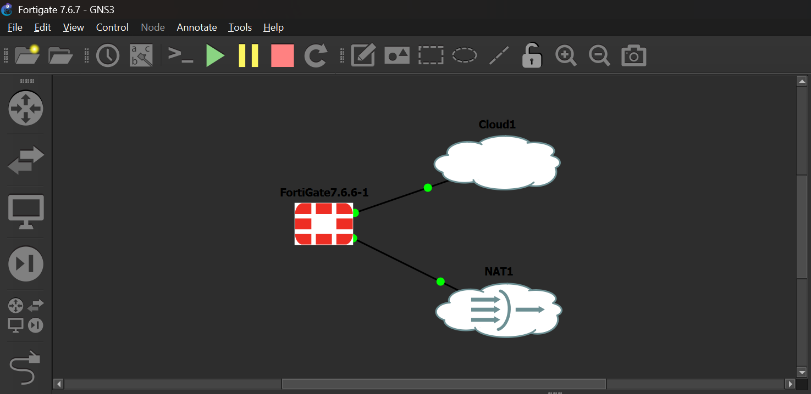

- **Port 1 (LAN):** Static IP 192.168.126.132 — Host-Only cloud, management access and client facing interface
- **Port 2 (WAN):** DHCP via GNS3 NAT cloud — outbound internet connectivity

**Traffic flow:**
Windows Host → port1 (192.168.126.132) → FortiGate → port2 (NAT/DHCP) → Internet

---

## Original Plan vs What Actually Happened

### What I Originally Planned

The original objective for this lab was to use standard FortiGate firewall policies to create two rules:

1. A broad LAN-to-WAN allow policy permitting all traffic from port1 to port2
2. A specific deny policy blocking 8.8.8.8 (Google DNS) to test  first match logic and observe denied traffic in the forward traffic logs

The test was going to be straightforward: run `ping 8.8.8.8` from Windows CMD, observe the block in logs, then flip the policy order and observe the allow. A clean demonstration of top-down policy evaluation.

### The Roadblock

After configuring the allow policy and testing with a browser, traffic flowed to the internet but no log entries appeared in Log & Report > Forward Traffic.

**Root cause identified through troubleshooting:**

My Windows host is a physical machine with its own direct internet connection via home Wi-Fi. When I opened a browser or ran a ping, Windows consulted its own routing table, found a default gateway pointing to my home router, and sent traffic there directly. The traffic never entered GNS3 or touched FortiGate at all. FortiGate had nothing to log because it never saw the packets.

This is a fundamental home lab architecture limitation: a physical host with its own internet connection will not automatically route traffic through a virtual firewall unless explicitly told to do so at the routing or application layer.

### How I Solved It

Rather than modifying system level routing tables (which would affect all traffic on the host), I chose the application layer approach: i configured FortiGate as an explicit web proxy and point Firefox at it manually. This forces browser traffic through FortiGate's proxy on port 8080, giving FortiGate full visibility into web requests without touching the host's default gateway.

This troubleshooting process led directly to hands-on experience with proxy policies, a feature that goes beyond the basic firewall policy scope of this lesson and adds real depth to the portfolio.

---

## Steps Taken

### Phase 1: Standard Firewall Policy (Initial Attempt)

**Step 1: Created allow firewall policy**

I Navigated to Policy & Objects > Firewall Policy > Create New

Configuration:
- Name: LAN-to-WAN-Allow
- Incoming Interface: port1
- Outgoing Interface: port2
- Source: all
- Destination: all
- Service: ALL
- Schedule: Always
- Action: ACCEPT
- Inspection Mode: Proxy-Based
- NAT: Enabled
- Log Allowed Traffic: All Sessions

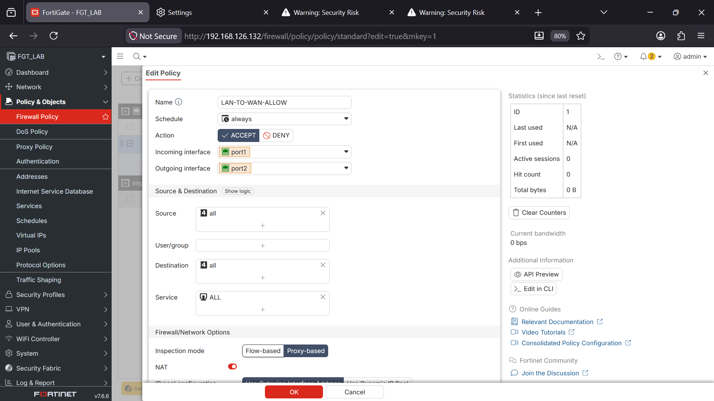

**Result:** Browser traffic reached the internet but zero log entries appeared in Forward Traffic logs. 

---

### Phase 2: Explicit Proxy Configuration (Solution)

**Step 2: Enabled Explicit Web Proxy feature**

I Navigated to System > Feature Visibility
- Turned on: Explicit Web Proxy
- Clicked Apply

I Navigated to Network > Explicit Proxy
- Enabled Explicit Web Proxy: On
- Listening Interface: port1
- Listening Port: 8080

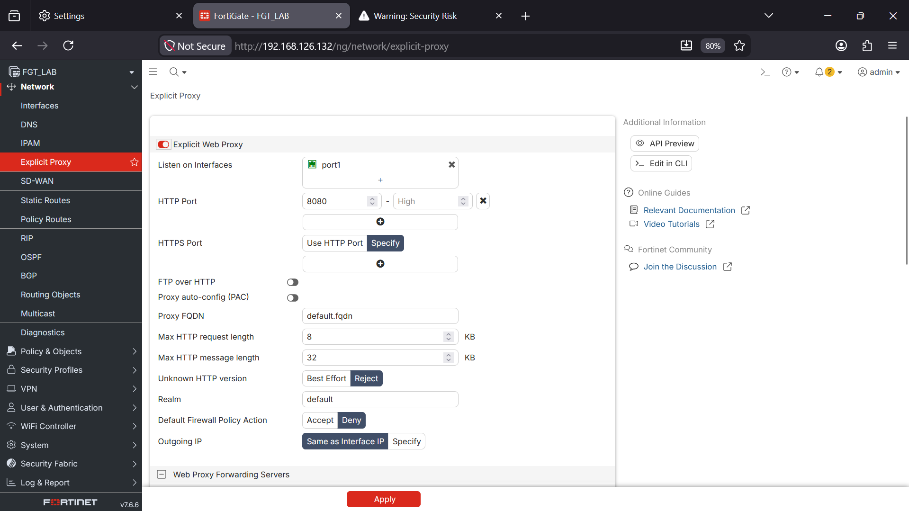

**Step 3: Configured Firefox as proxy client**

Firefox > Settings > Network Settings > Manual Proxy Configuration
- HTTP Proxy: 192.168.126.132
- Port: 8080
- Also use this proxy for HTTPS: Enabled
- No Proxy For: 127.0.0.1, localhost, 192.168.126.132

The No Proxy exception for 192.168.126.132 is critical, without it Firefox would route FortiGate management GUI traffic through the proxy itself, potentially causing a management lockout.

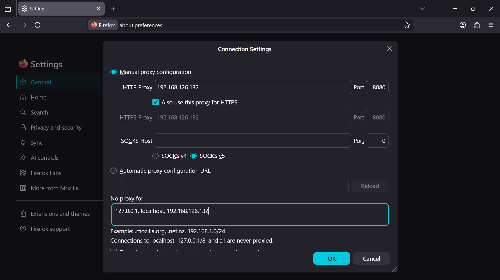

---

### Phase 3: Proxy Policy — Allow Rule

**Step 4: Created proxy allow rule**

I Navigated to Policy & Objects > Proxy Policy > Create New

Configuration:
- Proxy Name: Proxy-LAN-to-WAN
- Proxy Type: Explicit Web Proxy
- Incoming Interface: port1
- Outgoing Interface: port2
- Source: all
- Destination: all
- Schedule: Always
- Service: webproxy
- Action: ACCEPT
- NAT: Enabled

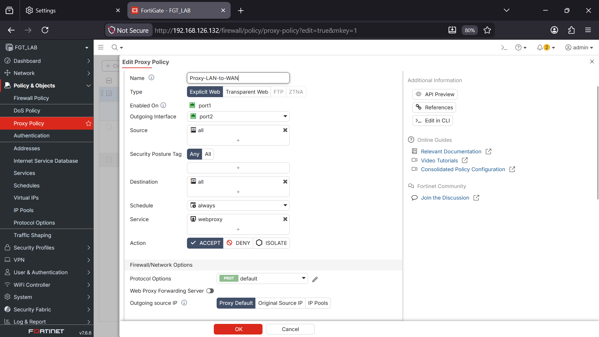

**Result:** Log entries immediately appeared in Log & Report showing date/time, source IP, destination, application name, result (Accept) and Policy ID (Proxy-LAN-to-WAN (1))

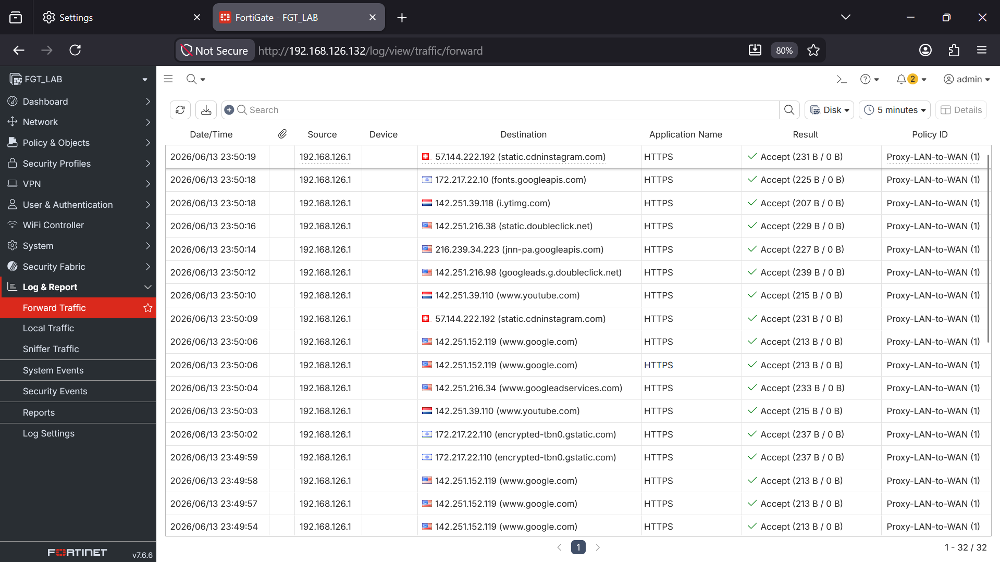

---

### Phase 4: Proxy Policy — Deny Rule (First-Match Logic Test)

**Step 5: Created address objects for blocked destinations**

I Navigated to Policy & Objects > Addresses > Create New

Three address objects created:
- Blocked-Social-Media: FQDN — *.instagram.com
- Facebook-Deny: FQDN — www.facebook.com
- Gmail-Deny: FQDN — gmail.com

**Step 6: Created proxy deny rule**

I Navigated to Policy & Objects > Proxy Policy > Create New

Configuration:
- Proxy Name: Proxy-Deny
- Proxy Type: Explicit Web Proxy
- Incoming Interface: port1
- Outgoing Interface: port2
- Source: all
- Destination: Blocked-Social-Media, Facebook-Deny, Gmail-Deny
- Service: webproxy
- Action: DENY
- Log Violation Traffic: Enabled

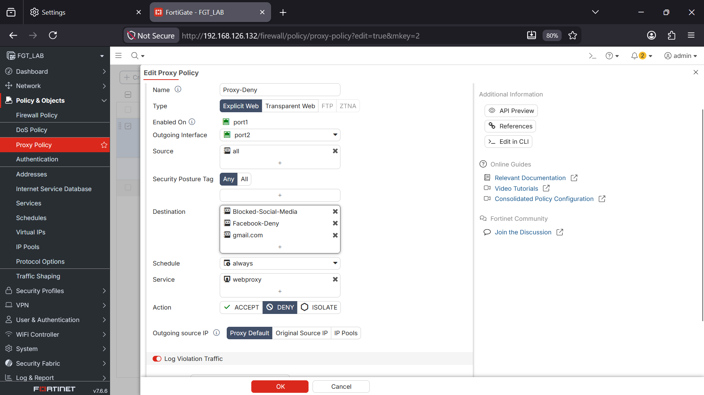

**Step 7: Set policy order — Deny above Allow**

I Dragged Proxy-Deny rule above Proxy-LAN-to-WAN in the policy list.

Reason: FortiGate evaluates proxy policies top-down, first match wins. If the allow rule sits above the deny rule, all traffic matches the allow rule immediately and the deny rule is never reached.

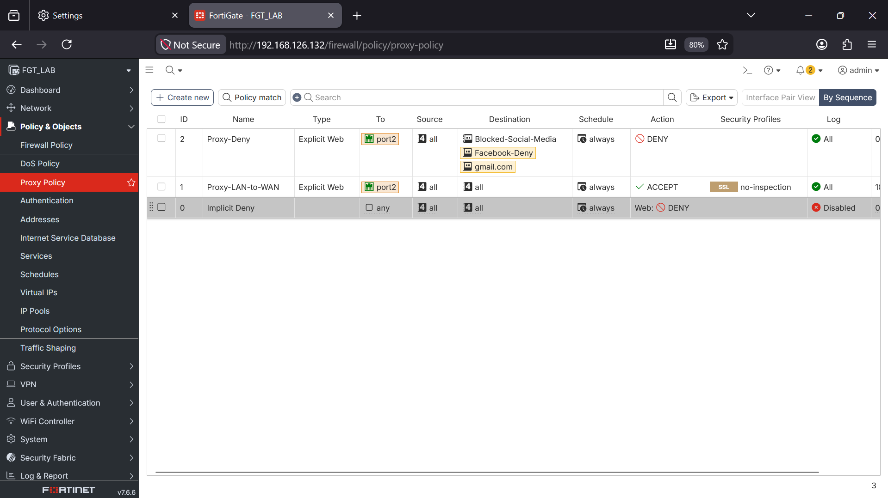

---

## Observations

### Test 1: Deny rule above Allow rule

Attempted to access instagram.com, facebook.com, and gmail.com in Firefox. All three returned "Secure Connection Failed" in the browser.

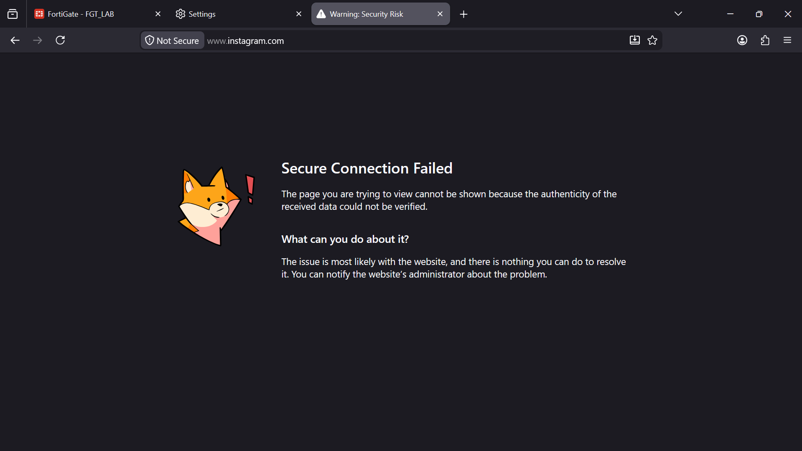

Log entries confirmed violation:

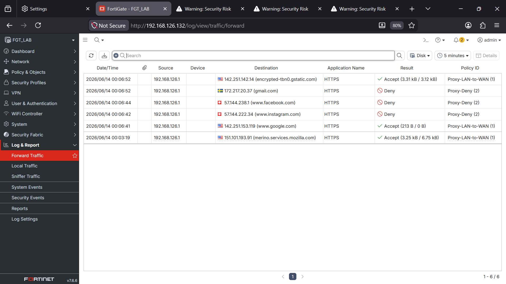

Log fields observed:
- Date/Time of access attempt
- Source IP (Windows host)
- Destination (instagram.com / facebook.com / gmail.com)
- Action: DENY
- Policy ID: Proxy-Deny

### Test 2: Allow rule above Deny rule (policy order reversed)

Moved Proxy-LAN-to-WAN above Proxy-Deny. Refreshed browser. All 
three sites loaded successfully.

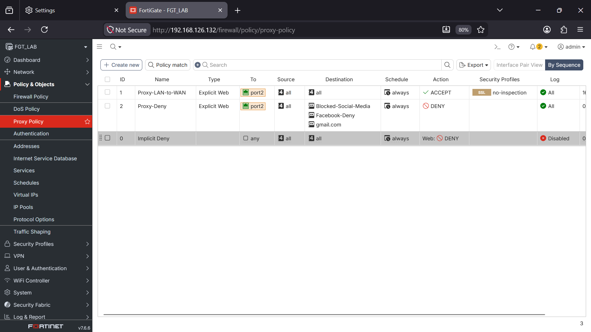

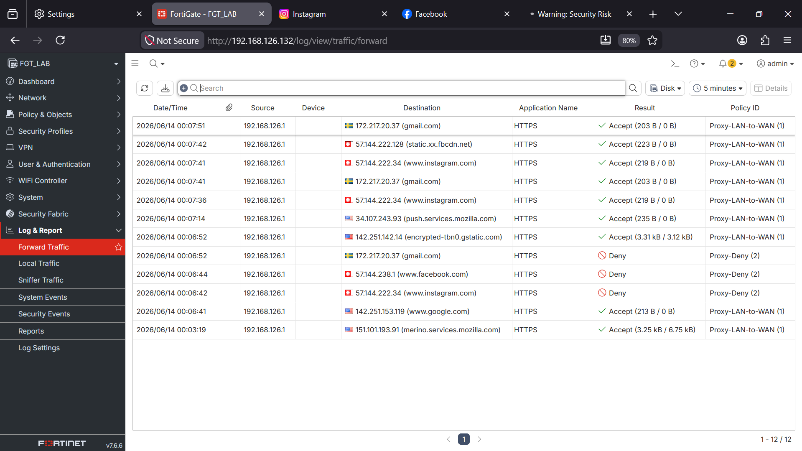

**This directly validated first-match logic.** The same traffic, the same destination, two completely different outcomes based solely on policy order.

---

## Key Findings

**Finding 1: Physical hosts do not automatically route through virtual firewalls**

In a home lab where the client machine is also the physical host, traffic will follow the host's own routing table and default gateway. The virtual firewall is invisible to the OS unless you either modify routing tables (route add command) or redirect application traffic through a proxy. 

This is not a FortiGate limitation, it is a fundamental networking concept about how routing decisions are made at the OS level.

**Finding 2: Standard firewall policies and proxy policies are separate pipelines**

Traffic directed at an explicit proxy port (8080) terminates on FortiGate's proxy and does not enter the standard firewall policy evaluation pipeline. Standard firewall policies will not log or process this traffic. Proxy policies are required. This is a distinction that catches many junior engineers off guard when troubleshooting missing log entries.

**Finding 3: Policy order is not a configuration detail — it is the security logic**

Reversing the order of two policies with identical match criteria produced opposite outcomes. A misconfigured policy order in a production environment means security controls can be bypassed 
entirely without any error or alert. This is why policy review and audit are real SOC tasks, not just administrative housekeeping.

**Finding 4: policyid=0 indicates implicit deny**

Any traffic that matches no configured policy is silently dropped by FortiGate's implicit deny rule and logged with policyid=0. This is the catch-all at the bottom of every policy list.

---

## What an Analyst Would Do Next

In a real SOC environment, the denied traffic entries observed in this lab would trigger the following actions:

1. **Review source IPs** generating blocked requests, are they known internal users or unexpected hosts?
2. **Check timing patterns** — a single user hitting facebook.com once is policy enforcement working correctly; repeated attempts across many users may indicate a miscommunication about policy or an automated process trying to reach a blocked destination
3. **Verify policy intent** — confirm the deny rule reflects current organizational policy and has not been misconfigured or left over from a previous rule set
4. **Audit policy order regularly** — in environments with many policies, shadow rules (rules that can never be reached because a broader rule above always matches first) are a common source of security gaps

---

