**Date:** July 11, 2026
**Lab Environment:** FortiGate 7.6.6 VM | GNS3 + VMware | Kali Linux (192.168.126.50) | Windows Host

---

## Objective

Apply SSL deep inspection to the Kali to Internet firewall policy and document what FortiGate actually does at each stage. The goal was not to make deep inspection work end to end on this eval license since that has a known ceiling. The goal was to understand what happens at each step, see where the license limits things, and document each finding with real evidence from the browser, the GUI, and the logs.

---

## Tools Used

- FortiGate 7.6.6 VM (GNS3 running on VMware)
- FortiGate GUI (accessed from Kali Firefox at https://192.168.126.132:8443)
- Kali Linux Firefox (browser and test client, 192.168.126.50)
- FortiGate Log and Report module (Forward Traffic and Security Events)

---

## Lab Architecture

Same setup as the earlier labs in this series. Kali (192.168.126.50) is a genuine LAN client with FortiGate as its default gateway. All traffic from Kali goes through FortiGate before reaching the internet.

---

## Phase 1: Baseline Check — What a Normal Certificate Looks Like

Before changing anything on the policy, I wanted to capture what a normal HTTPS connection looks like from Kali with no FortiGate interception involved.

Opened Firefox on Kali and navigated to:
```
https://kali.org
```

The page loaded normally. Clicked the padlock in the address bar, then Connection Secure, then More Information, then View Certificate.

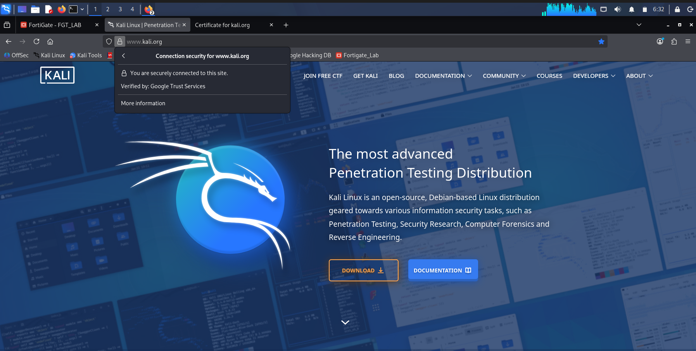

The issuer showed Google Trust Services, which is a real public certificate authority. This is the actual certificate from kali.org with no FortiGate involvement. Every certificate result in the later phases gets compared against this baseline.

Forward Traffic showed a plain Accept with no UTM action, confirming nothing was inspecting the session.

---

## Phase 2: Apply Deep Inspection to the Policy

Navigated to Policy and Objects > Firewall Policy. Edited the Kali to Internet policy. Set SSL Inspection to custom-deep-inspection. Saved.

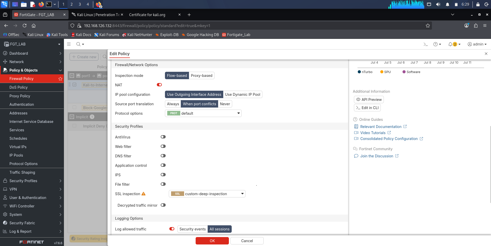

---

## Phase 3: Deep Inspection Alone Does Not Substitute the Certificate

With only custom-deep-inspection on the policy and no other security profile attached, browsed to several HTTPS sites from Kali Firefox including instagram.com.

Result: all sites loaded normally. The certificate panels still showed the real issuing authority for each site, not FortiGate. Logs showed plain Accept with no UTM indicator.

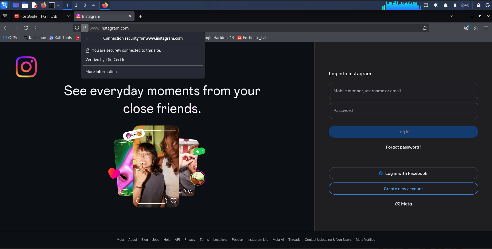

This was not what I expected. After testing different settings and getting the same result each time, the pattern became clear. Deep inspection on its own does not trigger FortiGate to intercept and replace certificates unless there is also a security profile (like an AV profile) active on the same policy. Without something that needs to scan the content inside the encrypted session, FortiGate reads the SSL handshake but does not step in and break open the session. The decryption only kicks in when there is an engine that actually needs to look at what is inside.

---

## Phase 4: Deep Inspection With AV Profile Added

Added the Kali-Default AV profile alongside custom-deep-inspection on the Kali to Internet policy. Saved.

Opened Firefox on Kali and navigated to:
```
https://www.reddit.com
```

Result: Firefox returned a TLS error page.

```
"Software is Preventing Firefox From Safely Connecting to This Site"

"reddit.com is most likely a safe site, but a secure connection could
not be established. This issue is caused by FGVMEVRSIK-BYC3F, which
is either software on your computer or your network."

Error code: MOZILLA_PKIX_ERROR_MITM_DETECTED
```

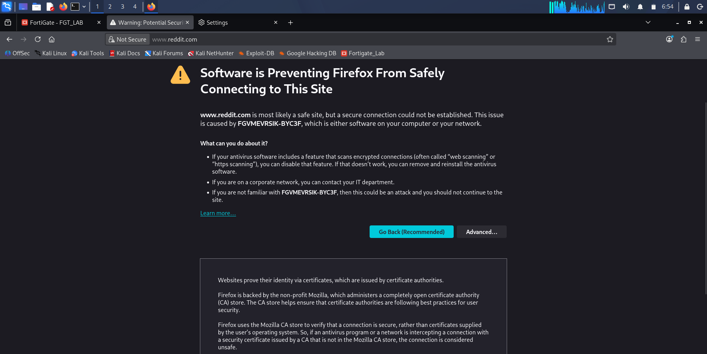

This error looks like something went wrong but it is actually the confirmation that deep inspection is working. FortiGate intercepted the TLS session between Kali and reddit.com and tried to substitute its own certificate. Firefox detected the substitution and named the device doing it. FGVMEVRSIK-BYC3F is FortiGate's device identity. MOZILLA_PKIX_ERROR_MITM_DETECTED is Firefox telling you something is sitting in the middle of the connection and it does not recognise that device's certificate authority.

In a real company environment, the FortiGate CA gets pushed to all company devices beforehand so they trust it. When that is done, the same interception happens silently in the background and users never see this error.

Clicked View Certificate on the Firefox error page.

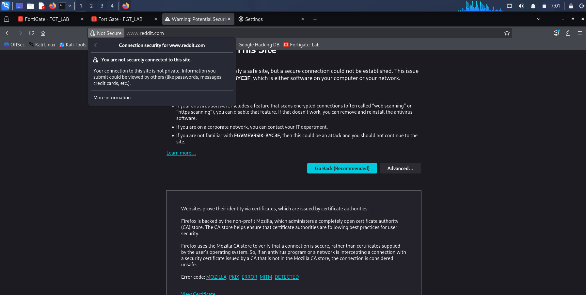

The View Certificate panel showed no certificate details, just a message saying the site is not securely connected. This happened because Firefox rejected the substitute certificate before the connection could finish, so there was no valid certificate chain to display.

Checked Log and Report > Forward Traffic. The session was logged as Accept (UTM allowed).

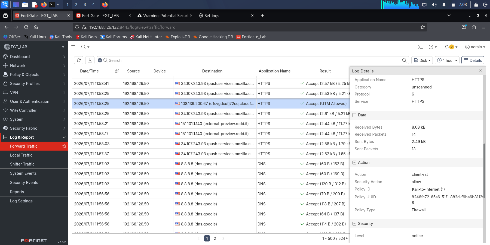

Checked Log and Report > Security Events > SSL. One entry appeared: SSL connection is bypassed due to unable to retrieve server's certificate.

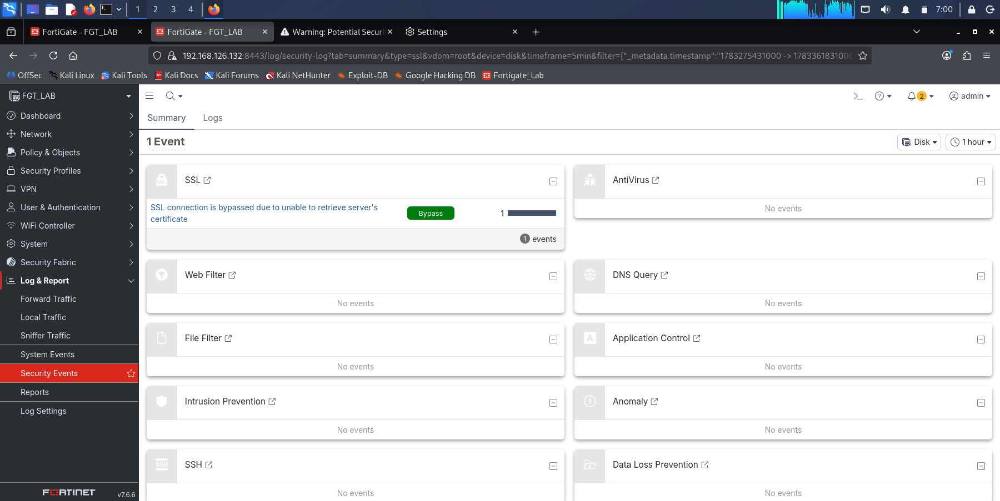

This log entry matches what happened in the browser. FortiGate tried to get reddit.com's certificate so it could generate its own replacement, but it could not complete that step. The session was bypassed at that point. This is related to the eval license cipher restriction that shows up more clearly in the next phase.

---

## Phase 5: Install the FortiGate CA Into Firefox

To see what happens when Firefox actually trusts FortiGate's certificate authority, I temporarily removed the Kali-Default AV profile from the policy so only custom-deep-inspection was active. Then I went through the steps to export and import the FortiGate CA.

**Export the FortiGate CA**

Navigated to System > Certificates. Found Fortinet_CA_SSL under Local CA Certificates. Downloaded it as fortigate_ca.crt.

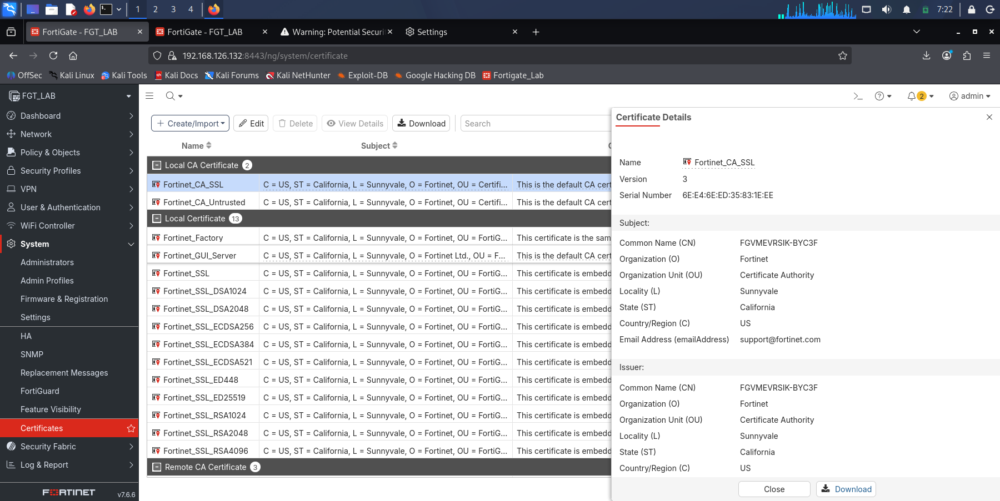

**Import into Firefox on Kali**

In Kali Firefox: Settings > Privacy and Security > Certificates > View Certificates > Authorities tab > Import. Selected fortigate_ca.crt. Checked Trust this CA to identify websites. Restarted Firefox.

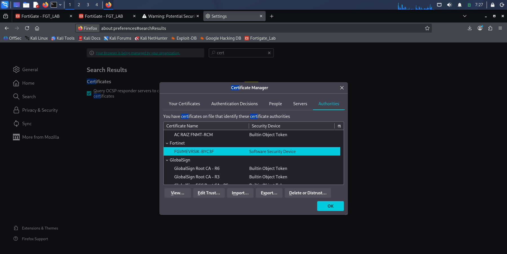

**Test with only deep inspection and no AV profile**

Browsed to bbc.com. The page loaded normally and still showed bbc.com's real certificate (GlobalSign). No MITM error, no FortiGate certificate appearing. This confirmed again that deep inspection on its own does not substitute certificates without a UTM profile also being active.

**Test with AV profile re-enabled**

Re-added Kali-Default AV profile to the policy alongside custom-deep-inspection. Browsed to google.com.

Result: a new error appeared.

```
Error code: MOZILLA_PKIX_ERROR_INADEQUATE_KEY_SIZE
```

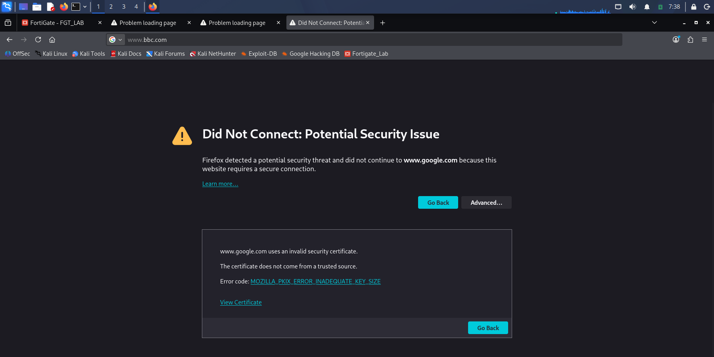

This is the next layer of the problem. Firefox now trusts FortiGate's CA (the import worked) but it is rejecting the replacement certificate FortiGate generated because the key is too small. The eval license (called LENC) limits all certificates FortiGate can generate to 512-bit RSA. Modern browsers require at least 2048-bit RSA. There is no way to change this through any setting on the eval license. This is confirmed by an official Fortinet KB article from March 2026.

Clicked View Certificate on the error page.

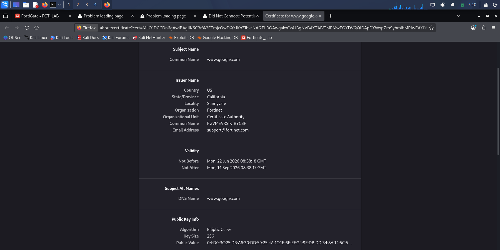

The certificate details confirmed FortiGate generated a replacement certificate for the session and the issuer shows FortiGate's CA. The key size is what caused Firefox to reject it.

---

## Phase 6: Checking Whether Any Other Certificate on the Device Could Work

To see if there was any other CA on the FortiGate that could get around the key size problem, I went through System > Certificates and looked at everything available.

Several built-in FortiGate certificates were visible including DSA, ECDSA, and RSA variants. Some RSA entries had key sizes in their names such as 1024, 2048, and 4096. These were listed under Local Certificates, not Local CA Certificates.

I tried using the Fortinet_SSL_RSA_2048 entry. After importing it into Firefox, the browser rejected it because it is not a certificate authority. Looking at the certificate details showed why:

```
X509v3 Basic Constraints
CA: FALSE

X509v3 Extended Key Usage
TLS Web Server Authentication
```

CA: FALSE means this certificate cannot be used to sign other certificates. It is a server certificate, not a CA. It cannot work as a signing authority in the SSL inspection profile no matter what key size it has.

**Trying to create a new CA**

Navigated to System > Certificates > Create New. The only option available was Generate Certificate Signing Request, which creates a request to be signed by an external certificate authority rather than creating a self-contained CA on the device. The key size option for that process was 512-bit RSA only.

The conclusion here is straightforward. The eval license cannot generate any CA certificate that modern browsers will accept. All CA-capable certificates on this device are subject to the same 512-bit limit. There is nothing in the GUI or CLI that gets around this on the eval license.

---

## Summary of the Three Error States

| Layer | Error Code | What Was Tried | Why It Failed |
|---|---|---|---|
| CA not trusted | MOZILLA_PKIX_ERROR_MITM_DETECTED | Deep inspection with AV profile, no CA installed in Firefox | FortiGate CA not in Firefox trusted authorities |
| CA key too small | MOZILLA_PKIX_ERROR_INADEQUATE_KEY_SIZE | FortiGate CA installed and trusted in Firefox | Eval license caps all generated certificate key sizes at 512-bit RSA |
| No other CA available | CA FALSE rejection | Tried using RSA 2048 server certificate as a CA | Certificate is not CA capable, confirmed by CA: FALSE in the certificate details |

---

## Key Findings

**Finding 1: Deep inspection only substitutes certificates when a UTM profile is also active on the policy**

With only custom-deep-inspection on the policy, HTTPS sites loaded normally and showed their real certificates. Adding the AV profile alongside deep inspection is what caused FortiGate to actually intercept and substitute certificates. Without something that needs to look inside the traffic, FortiGate does not break open the TLS session. This is not obvious from the GUI and was only discovered through testing.

**Finding 2: MOZILLA_PKIX_ERROR_MITM_DETECTED confirms deep inspection is working**

Firefox naming FortiGate by device identity as the intercepting entity is proof that deep inspection engaged and tried to do its job. The error shows up because Firefox does not trust FortiGate's CA yet. In a real environment where the CA is already distributed to managed devices, users would never see this error.

**Finding 3: The eval license limits all certificate generation to 512-bit RSA**

Installing FortiGate's CA into Firefox moved past the first error but revealed the next one. The replacement certificates FortiGate generates use a 512-bit signing key. That is below the minimum browsers accept. This is a hard license limit, not a configuration problem. Confirmed by official Fortinet documentation.

**Finding 4: There is no certificate on this device that can work around the limit**

The RSA 2048 certificate available in Local Certificates is a server certificate and cannot act as a CA. The certificate creation tool only offers 512-bit for new certificates. There is no internal path around this on the eval license.

**Finding 5: Forward Traffic and Security Events together show what actually happened**

Forward Traffic showed Accept (UTM allowed) which means the policy matched and the UTM pipeline started. Security Events SSL showed the bypass entry which means the inspection could not complete. Neither log on its own tells the whole story. Together they show that FortiGate tried to inspect the session but could not finish, and the traffic passed through without being fully inspected.

**Finding 6: This same license restriction shows up across multiple features**

The same root cause that stops deep inspection from completing here is the same one that prevented AV from scanning HTTPS content in Lab 07. It is not specific to SSL inspection. Anything that requires FortiGate to sit in the middle of a TLS session and decrypt content is affected by this limitation on the eval license.

---

## Lab Limitations and How They Were Handled

**Limitation 1: Deep inspection does not engage without a UTM profile**

Discovered through testing. The certificate substitution only happened once the AV profile was added to the policy alongside deep inspection. This was documented as a finding rather than a problem to fix.

**Limitation 2: Eval license limits CA certificate key size to 512-bit RSA**

No setting on this eval license produces a CA certificate that modern browsers accept. Documented as a confirmed license ceiling with no internal workaround.

**Limitation 3: The SSL BAD MAC READ error from earlier troubleshooting was not reproduced here**

That error would only appear after getting through the key size problem, which this license cannot do. It is referenced as a prior finding from the Gemini troubleshooting session rather than a result from this lab.

---

## What an Analyst Would Do Next

1. In a production environment with a full FortiGate license, push FortiGate's CA to all managed endpoints before turning on deep inspection. That way users never see certificate errors and the inspection runs in the background without disrupting anything.

2. When setting up deep inspection on a firewall policy, confirm there is also a UTM profile active on the same policy. Deep inspection on its own will not trigger certificate substitution on a standard firewall policy.

3. Check Security Events SSL regularly for bypass entries alongside Forward Traffic Accept entries on the same sessions. That combination means the inspection pipeline started but did not finish, so the content passed through without being fully checked.

4. Before deploying SSL deep inspection in a production environment, verify the FortiGate license tier supports the cipher suites and certificate key sizes needed. Testing on an eval license will show the configuration correctly but the license ceiling will prevent it from working against modern HTTPS traffic.
