**Date:** July 9, 2026
**Lab Environment:** FortiGate 7.6.6 VM | GNS3 + VMware | Kali Linux (192.168.126.50) | Windows Host (192.168.1.144)

---

## Objective

Configure antivirus scanning on the Kali to Internet firewall policy and test whether FortiGate can detect and block a known test file. The goal was to see what happens at each stage of the test, understand where things work and where they don't, and document everything with correlated log evidence from both Forward Traffic and Security Events.

---

## Tools Used

- FortiGate 7.6.6 VM (GNS3 running on VMware)
- FortiGate GUI (accessed from Kali Firefox at https://192.168.126.132:8443)
- Kali Linux Firefox (used as the browser and test client, 192.168.126.50)
- Python HTTP server running on Windows host (192.168.1.144, port 80)
- Windows PowerShell (used to create the test file correctly)
- Windows Defender (host antivirus, came into play during setup)
- FortiGate Log and Report module (Forward Traffic and Security Events)

**Test URLs used in order:**
- `http://www.eicar.org/download/eicar.com.txt` — public site, HSTS enforced
- `https://secure.eicar.org/eicar_com.zip` — public HTTPS with deep inspection enabled
- `http://192.168.1.144/eicar.txt` — local Windows Python server, plain HTTP

---

## Lab Architecture

```
Kali Linux (192.168.126.50)
    |
    | Adapter 2 (Host-Only, bridged to VMnet1)
    |
[Windows Network Bridge 192.168.126.139]
    |
VMware VMnet1
    |
GNS3 Cloud Node
    |
FortiGate Port 1 (LAN): 192.168.126.132/24
FortiGate Port 2 (WAN): 192.168.42.213 (DHCP/NAT)
    |
    | NAT outbound
    |
Windows Host home network (192.168.1.144)
running Python HTTP server on port 80
```

Kali and the Windows host are on separate subnets. Every packet Kali sends to 192.168.1.144 has to go through FortiGate first. This is what makes real AV testing possible since the traffic cannot skip around the firewall.

---

## Why This Lab Tests Three Different Sources

Testing from only one source would not have shown the full picture. Each source revealed something different about how AV inspection works:

The public HTTP source showed how browser security (HSTS) can change traffic before FortiGate even sees it. The public HTTPS source showed what happens when deep inspection tries to scan encrypted traffic. The local Python server gave a clean test with plain HTTP where nothing was getting in the way of the AV engine doing its job.

---

## Phase 1: AV Profile Configuration

### Step 1: Check subscription status

Navigated to System > FortiGuard in the FortiGate GUI. The page only shows basic VM subscription entries. There is no AV database version or last updated date visible in the GUI on this eval license setup.

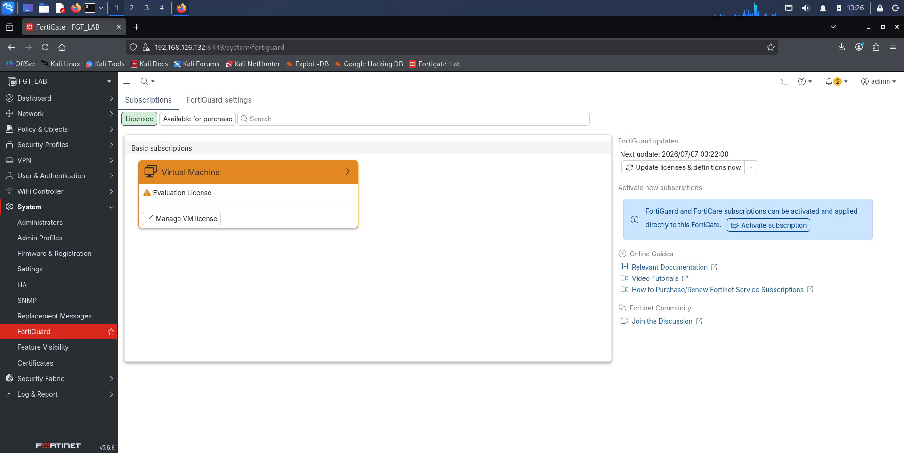

**Database status confirmed earlier in the lab series via CLI:**

```
diagnose autoupdate version
```

Output showed:
- Flow-based Virus Definitions Version: 1.00000 signed
- Last Updated: Mon Apr 9 18:07:00 2018
- Last Update Attempt: Jun 28 2026
- Result: Connectivity failure

The eval license comes with a static AV database from 2018 and no live update capability. This is a known limitation of the eval LENC license and is documented as such throughout this series. EICAR has been a standard test signature since the 1990s so the 2018 database is still able to detect it. For anything newer it would not have the signatures, but that does not affect this specific test.

### Step 2: Create the antivirus profile

Navigated to Security Profiles > Antivirus. Cloned the default profile and named it Kali-Default with the following settings:

| Field | Value |
|---|---|
| Feature set | Flow-based |
| AntiVirus scan | Block |
| HTTP | Enabled under Inspected Protocols |

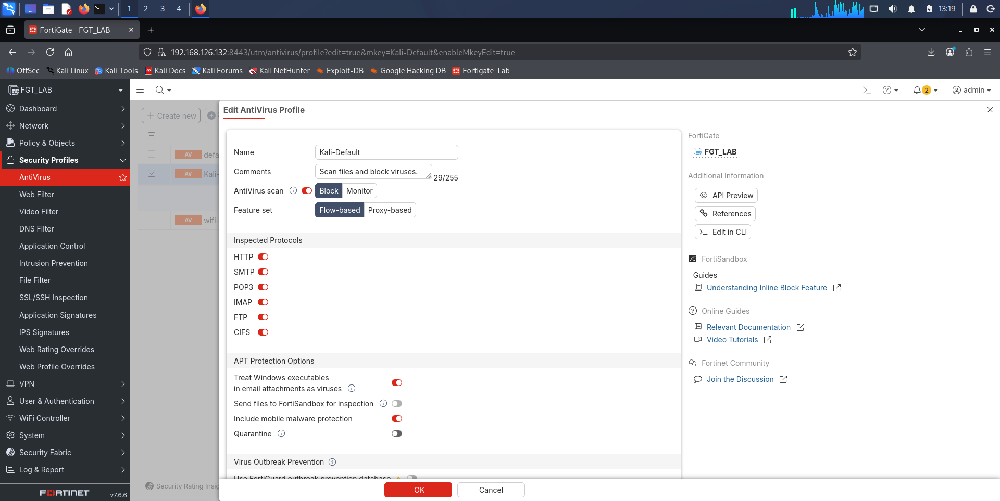

Flow-based was selected because the Kali to Internet policy uses flow inspection mode. The AV profile has to match the policy mode. If you attach a proxy-based AV profile to a flow-mode policy, it will not work and it will not tell you it is not working. No detection, no log entry, no error. This was something discovered earlier in the lab and it is one of the reasons the profile setting matters.

---

## Phase 2: Apply AV Profile to Policy

Navigated to Policy and Objects > Firewall Policy. Edited policy 1 (Kali-to-Internet). Under Security Profiles:

- Antivirus: Kali-Default
- SSL Inspection: no-inspection (for the first round of HTTP testing)

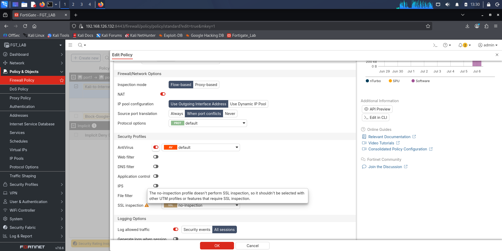

When no-inspection was selected, FortiGate showed a warning message: "The no-inspection profile doesn't perform SSL inspection, so it shouldn't be selected with other UTM profiles or features that require SSL inspection." This warning turned out to be directly relevant to what happened in Phases 4 and 5. AV scanning of HTTPS content needs SSL inspection to work first. FortiGate actually tells you this in the interface.

---

## Phase 3: Negative Test (AV Disabled, Control)

Before turning AV on, I needed to confirm the download path was actually working with no restrictions in place. I temporarily set Antivirus to none on the policy and saved.

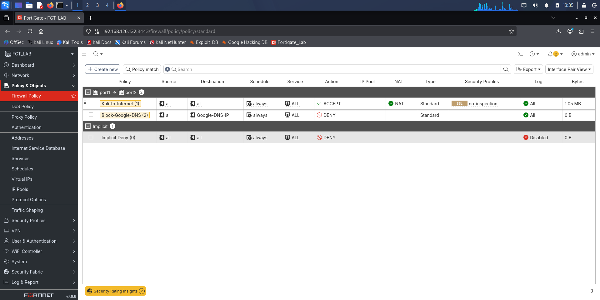

Opened Firefox on Kali and navigated to:
```
http://www.eicar.org/download/eicar.com.txt
```

Result: The file (eicar.com_.txt) downloaded with no block and no warning. File saved to Kali's downloads folder.

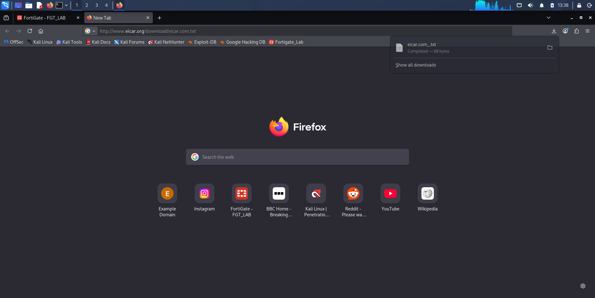

Checked Log and Report > Forward Traffic in the FortiGate GUI. The session was logged as a plain Accept with no UTM action shown.

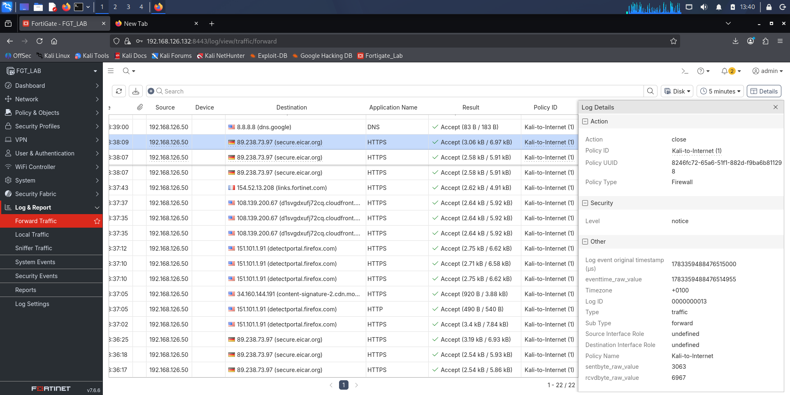

This is the before state. Any block that shows up in the next phases is coming from AV, not from a routing or connection problem.

---

## Phase 4: First AV Test (Public HTTP With AV Enabled)

Re-enabled Kali-Default AV profile on the policy. SSL Inspection stayed on no-inspection. Saved.

Opened Firefox on Kali and navigated to the same URL:
```
http://www.eicar.org/download/eicar.com.txt
```

Result: The file (eicar.com_(1).txt) downloaded again. AV did not block the transfer even though it was configured and active.

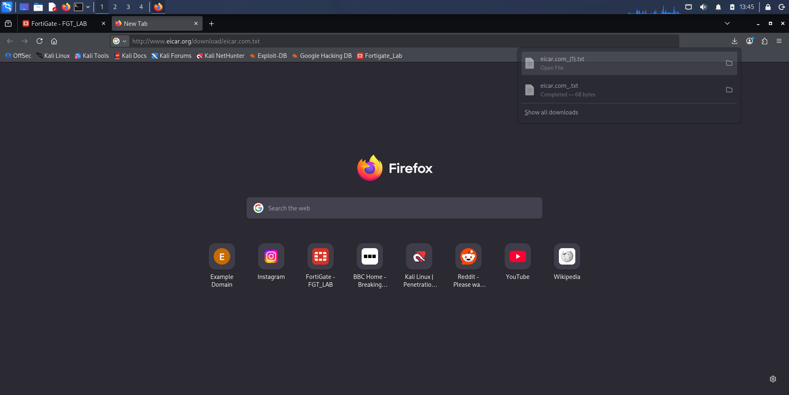

Checked Log and Report > Forward Traffic. The session was still logged as accepted with no UTM action and no Antivirus entry in Security Events.

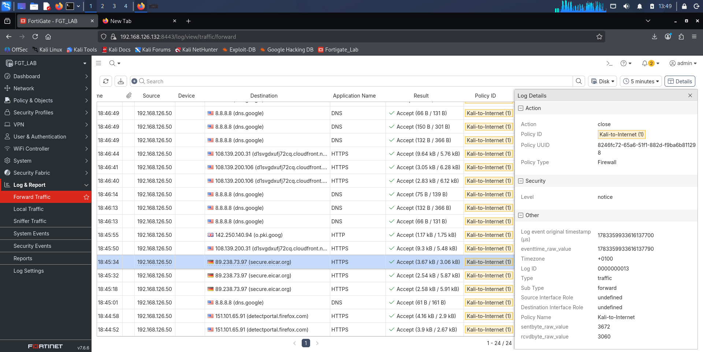

**What happened:** eicar.org enforces HSTS (HTTP Strict Transport Security). Even though the URL starts with http://, Firefox automatically upgraded the connection to HTTPS before FortiGate saw any of it. The traffic that actually crossed FortiGate was encrypted. With SSL Inspection set to no-inspection, FortiGate let the encrypted content through without being able to look inside it. AV cannot scan content it cannot see. This is not a FortiGate misconfiguration. It is just how HSTS works in the browser.

---

## Phase 5: HTTPS Test (Deep Inspection With AV Enabled)

To give AV a chance at HTTPS-delivered content, SSL Inspection on the policy was changed to custom-deep-inspection while keeping Kali-Default AV active.

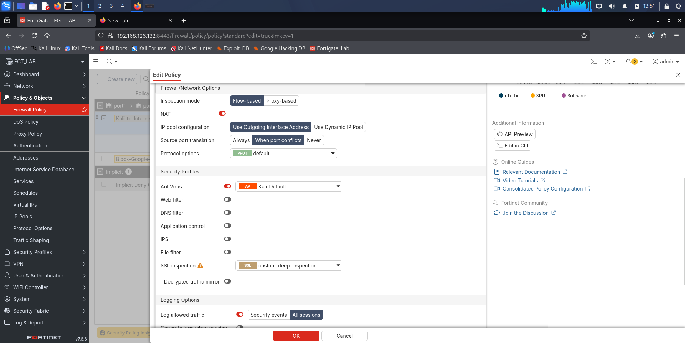

Opened Firefox on Kali and navigated to:
```
https://secure.eicar.org/eicar_com.zip
```

Result: Firefox returned a TLS error page.

```
"Software is Preventing Firefox From Safely Connecting to This Site"

"secure.eicar.org is most likely a safe site, but a secure connection
could not be established. This issue is caused by FGVMEVRSIK-BYC3F,
which is either software on your computer or your network."

Error code: MOZILLA_PKIX_ERROR_MITM_DETECTED
```

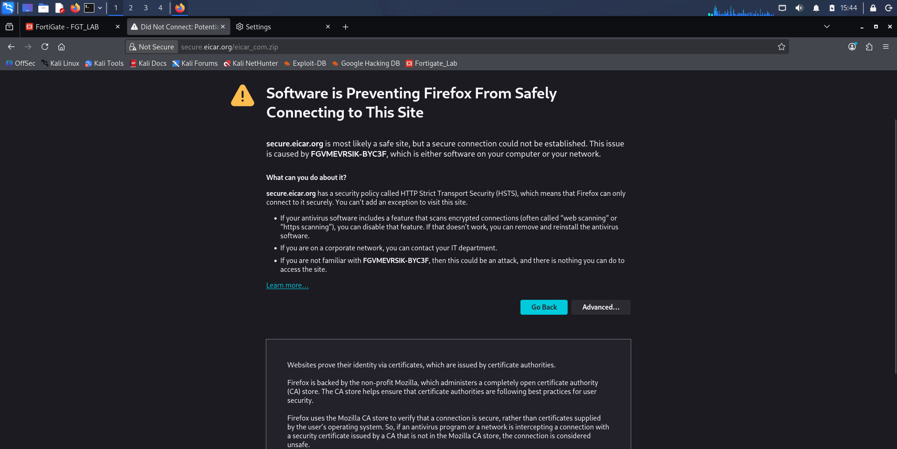

This error looks alarming but it is actually confirmation that deep inspection is working. FortiGate intercepted the TLS session and replaced the server's certificate with its own. Firefox detected that and named the device doing it (FGVMEVRSIK-BYC3F is the FortiGate's identity). The error appears because Firefox does not yet trust FortiGate's certificate authority. In a company environment where the FortiGate CA gets pushed out to all computers, this would happen silently in the background and users would not see any error.

The full details of what happened next when trying to install the certificate are documented in the SSL Inspection lab. The short version for this lab: the eval license prevented the TLS session from completing because it cannot support the cipher suites that modern HTTPS sites use. So AV never received decrypted content to scan.

Clicked View Certificate on the Firefox error page.

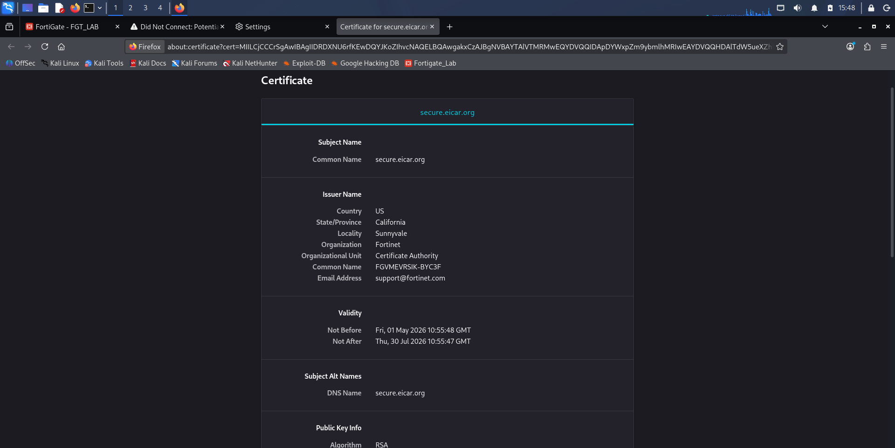

The issuer common name shown is FGVMEVRSIK-BYC3F, which is FortiGate's CA, not the real certificate authority for secure.eicar.org. FortiGate created a replacement certificate for the intercepted session. That is exactly what deep inspection is supposed to do.

Checked Log and Report > Forward Traffic. Session was logged as Accept (UTM allowed).

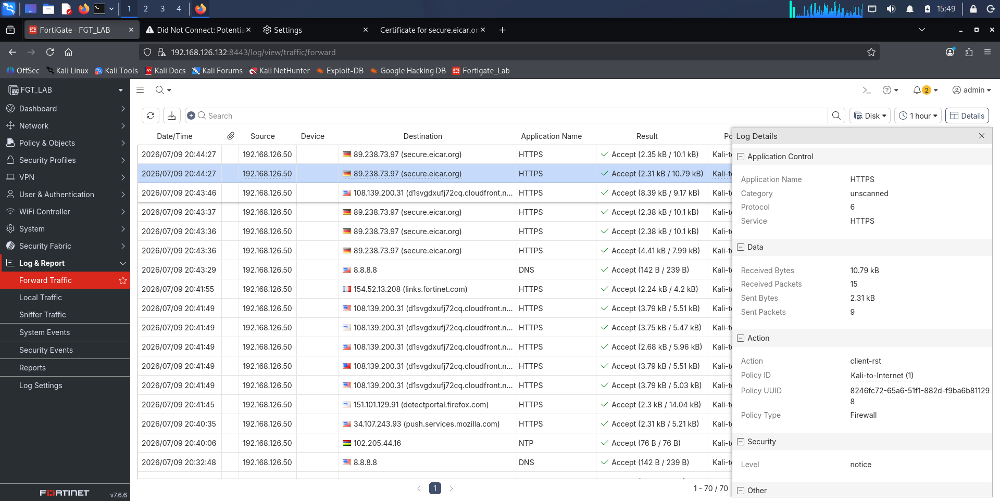

Checked Log and Report > Security Events. No Antivirus entries appeared even with AV active. This confirms that AV never got to see the content because the TLS session could not complete on this eval license.

---

## Phase 6: Architecture Pivot to Local Python HTTP Server

All the public EICAR test URLs redirect to HTTPS because of HSTS. Deep inspection cannot complete the TLS session on this eval license. To test the AV engine on its own without TLS getting in the way, the test needed to come from a source that serves plain HTTP and sits on a different subnet so all traffic still goes through FortiGate.

The solution was to run a simple Python web server on the Windows host (192.168.1.144) which is on the home network, separate from Kali's subnet. Any request from Kali to that address has to pass through FortiGate first.

**Setting up the test file on the Windows host:**

Created a folder at `C:\eicar-test\` and created the EICAR file using PowerShell:

```powershell
[System.IO.File]::WriteAllText(
  "C:\eicar-test\eicar.txt",
  'X5O!P%@AP[4\PZX54(P^)7CC)7}$EICAR-STANDARD-ANTIVIRUS-TEST-FILE!$H+H*'
)
```

PowerShell was used instead of Notepad because AV signature matching works on the exact bytes of the file. Notepad and most Windows text editors add a carriage return character at the end of each line. That one extra character is enough to change the file so AV does not recognize it as the EICAR signature. PowerShell writes the exact string as-is.

**Windows Defender reacted immediately:** As soon as PowerShell wrote the file to disk, Windows Defender detected it and quarantined it. This is the expected behavior for host-based antivirus. It scans files as they are written to disk. The FortiGate AV catches the same file while it is moving across the network. Both are doing their jobs at different points. The EICAR file was allowed in Windows Defender settings so the lab could continue since it is a harmless test file.

Started the Python HTTP server from Command Prompt on the Windows host:

```
cd C:\eicar-test
python -m http.server 80
```

Restored the policy in FortiGate to a clean AV-only state:

- Antivirus: Kali-Default
- SSL Inspection: no-inspection


Opened Firefox on Kali and navigated to:
```
http://192.168.1.144/eicar.txt
```

**First result: HTTP 404 Not Found**

Firefox showed a 404 error from the Python server. The routing was working (the server actually received and replied to the request) but the file was not found because Windows Defender had quarantined it before the browser could request it.

A 404 here is actually useful. A timeout would mean there is a network problem somewhere. A 404 means the whole path worked correctly from Kali through FortiGate to the Windows host and back. The only issue was at the application layer on the server side.

After allowing the file in Windows Defender, tried again in Firefox.

**Second result: Connection was reset**

Firefox showed "The connection was reset." This is FortiGate's AV engine detecting the EICAR signature in the HTTP response and cutting the connection before the file could reach Kali. This is the enforcement action, not a network error.

Checked Log and Report > Forward Traffic right after.

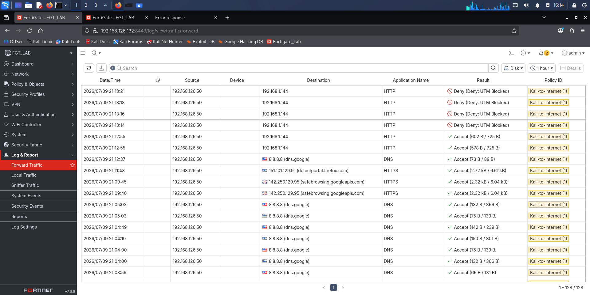

Source IP 192.168.126.50 (Kali), destination 192.168.1.144, port 80, service HTTP, utmaction=block, countav=1. FortiGate confirmed the block at the session level.

---

## Phase 7: Final Validation and Log Evidence

All further attempts to download the EICAR file from Kali continued to be blocked. The following log evidence was captured from the FortiGate GUI.

**Security Events log:**

Navigated to Log and Report > Security Events and located the AntiVirus entries.

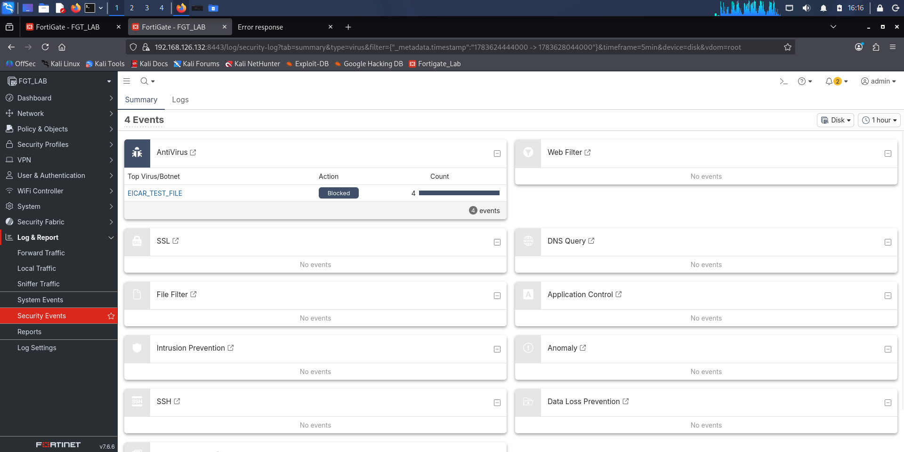

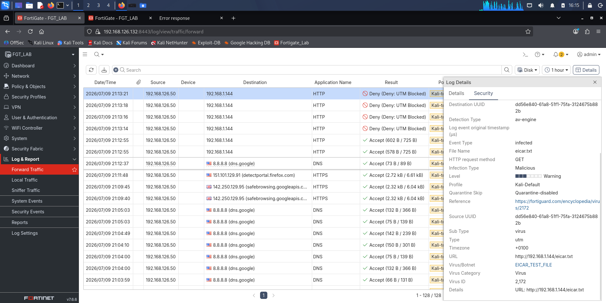

**Forward Traffic log:**

Navigated to Log and Report > Forward Traffic and located the session entry for Kali's IP to 192.168.1.144:80 with utmaction=block.

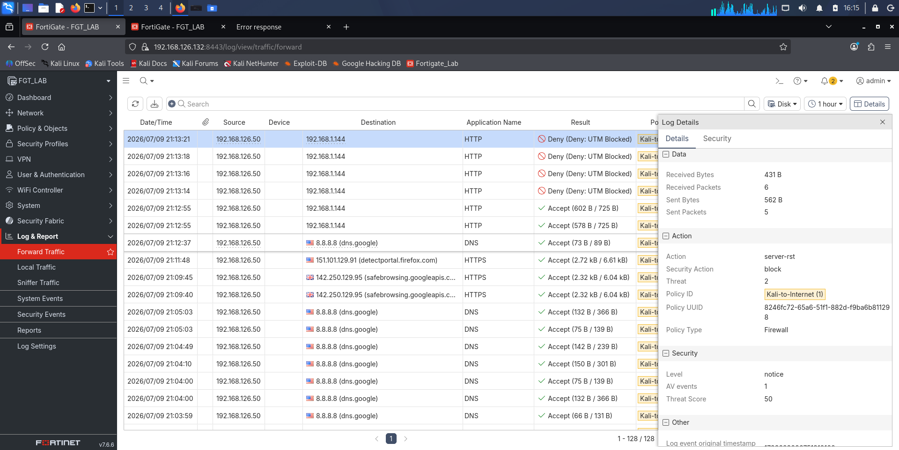

**Session ID match across both logs:**

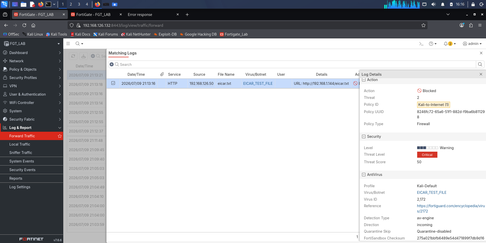

---

## Correlated Log Evidence

Both log entries share sessionid=1789. That means they are describing the same blocked session from two different angles.

**Security Events (Virus Log) at 21:13:16:**
```
logid="0211008192" type="utm" subtype="virus"
eventtype="infected" level="warning"
policyid=1 action="blocked" service="HTTP"
sessionid=1789
srcip=192.168.126.50 dstip=192.168.1.144
srcport=42470 dstport=80
filename="eicar.txt"
virus="EICAR_TEST_FILE"
viruscat="Virus" dtype="av-engine"
itype="infected"
url="http://192.168.1.144/eicar.txt"
profile="Kali-Default"
agent="Mozilla/5.0 (X11; Linux x86_64; rv:140.0)
       Gecko/20100101 Firefox/140.0"
httpmethod="GET"
crscore=50 craction=2 crlevel="critical"
msg="File is infected."
```

**Forward Traffic Log at 21:13:21:**
```
logid="0000000013" type="traffic" subtype="forward"
level="notice"
policyid=1 policyname="Kali-to-Internet"
sessionid=1789
srcip=192.168.126.50 dstip=192.168.1.144
srcport=42470 dstport=80
service="HTTP" action="server-rst"
trandisp="snat" transip=192.168.42.213
utmaction="block" countav=1
sentbyte=562 rcvdbyte=431
crscore=50 craction=2
```

The Security Events log tells you what was found: the file name, the virus name (EICAR_TEST_FILE), which AV profile triggered it, the browser that made the request, and the URL. The Forward Traffic log tells you what FortiGate did about it: it sent a TCP reset (server-rst) to kill the connection, blocked the session (utmaction=block), and confirmed one AV detection hit (countav=1). It also shows the NAT translation that was applied on the way out.

Looking at just one log gives you half the picture. Together and linked by the same session ID, they show the full story of what was detected and how it was handled. This is the same approach an analyst would take in a real SOC when investigating a blocked event.

---

## Lab Limitations and How They Were Handled

**Limitation 1: HSTS on eicar.org made the HTTP test path HTTPS in practice**

Even though the URL typed started with http://, Firefox upgraded the connection to HTTPS before FortiGate saw it. With no SSL inspection active, FortiGate could not look inside the encrypted content. AV had nothing to scan. The fix was to use a local server that serves plain HTTP.

**Limitation 2: Deep inspection worked but could not complete on this eval license**

The MOZILLA_PKIX_ERROR_MITM_DETECTED error confirmed that FortiGate did intercept the TLS session. However the eval license (LENC) prevents FortiGate from completing the TLS negotiation with modern HTTPS sites, so AV never received any decrypted content. The full details are in the SSL Inspection lab.

**Limitation 3: AV needs SSL inspection to work on HTTPS traffic**

AV can only scan content it can read. For HTTPS, SSL inspection has to successfully decrypt the traffic first. If SSL inspection is not working or not configured, AV sees encrypted bytes and has nothing to act on. These two features depend on each other for HTTPS coverage.

**Limitation 4: The AV signature database is a 2018 snapshot with no live updates**

No FortiGuard connection is available on this eval license. The database version is 1.00000 from April 9, 2018. EICAR detection still works because that signature has not changed. Anything discovered after 2018 would not be in the database.

**Limitation 5: Windows Defender quarantined the EICAR file before the server could serve it**

Windows Defender caught the file as soon as it was written to disk. Host antivirus catches files at the point they are saved. Network AV catches them while they are moving over the network. Both are valid and they work at different stages. The file had to be allowed on the Windows host specifically so the lab could continue.

**Limitation 6: The EICAR file has to be written as an exact byte match**

Windows text editors like Notepad add a carriage return character at the end of lines. That extra character is enough to break the AV signature match. The fix was to use PowerShell to write the file exactly as needed.

**Limitation 7: Python server directory had to match where the file was saved**

The first test returned a 404 because the server was started from a different directory than where the file was. Starting it from the correct folder fixed it. The 404 itself was useful because it confirmed the network path was working and the issue was only on the server side.

---

## Key Findings

**Finding 1: HSTS makes the public HTTP test path effectively HTTPS from modern browsers**

When a site enforces HSTS, the browser upgrades the connection to HTTPS automatically. This happens before FortiGate sees anything. So even if you type http:// in the address bar, the traffic that reaches FortiGate is already encrypted. AV coverage of web traffic depends on SSL inspection working, not just the AV profile being enabled.

**Finding 2: The MITM error is proof deep inspection is working, not that it failed**

When Firefox showed MOZILLA_PKIX_ERROR_MITM_DETECTED and named FortiGate by its device identity, that was confirmation that deep inspection intercepted the session and substituted its own certificate. The error appears because the browser does not yet trust FortiGate's certificate authority. In a managed environment that CA would be distributed to all devices and users would not see any error at all.

**Finding 3: AV and SSL inspection depend on each other for HTTPS traffic**

AV needs decrypted content to scan. SSL inspection provides that decryption. If SSL inspection is not configured, not working, or bypassed, AV will not detect anything in HTTPS traffic regardless of how the AV profile is set up. They are not independent of each other.

**Finding 4: A proxy-based AV profile on a flow-mode policy will silently do nothing**

If the AV profile feature set does not match the policy inspection mode, AV does not engage at all. No detection, no error, no log entry to indicate the problem. From the GUI it looks configured correctly. This is worth checking in any environment where AV coverage is expected.

**Finding 5: Host antivirus and network antivirus catch the same file at different points**

Windows Defender caught the EICAR file when it was written to disk. FortiGate caught it when it was being transferred over the network. Both detections are valid. Having both layers running means something malicious would have to get past two separate checks.

**Finding 6: Matching the session ID across Security Events and Forward Traffic gives the full picture**

Security Events shows what was detected. Forward Traffic shows what action was taken. Searching for the same session ID in both gives you the complete account of what happened in a single blocked session. Neither log alone is enough on its own.

**Finding 7: A 404 response is more useful than a timeout when troubleshooting**

A timeout means something in the network path is not working. A 404 means the entire path worked and the server received the request, it just could not find the file. That difference narrows down where the problem actually is.

---

## What an Analyst Would Do Next

1. When investigating a blocked file transfer, look up the session ID from Security Events in Forward Traffic to see both the detection details and the network-level enforcement action together.

2. Check all AV-enabled policies to confirm the AV profile feature set matches the policy inspection mode. A mismatch leaves AV silently inactive with no visible indicator.

3. On any policy where AV is expected to cover HTTPS traffic, confirm that SSL inspection is actually completing successfully. An Accept entry in Forward Traffic means the policy matched, not that SSL inspection finished and decrypted the content.

4. Include AV database version and FortiGuard subscription status as part of any routine security review. A database that cannot receive updates provides no coverage for threats discovered after its last update date.

5. Confirm both host-based and network-based AV are active where possible. Each layer catches threats at a different stage and neither one alone covers everything.
