**Date:** July 11, 2026
**Lab Environment:** FortiGate 7.6.6 VM | GNS3 + VMware | Kali Linux (192.168.126.50) | Windows Host

---

## Objective

Configure web filtering on the Kali to Internet firewall policy and document how FortiGate handles web filter requests when the FortiGuard service is not available. The lab tests category based filtering, manual URL filtering, and what happens to HTTPS traffic when SSL inspection is not active. Each result is documented with evidence from the browser and the FortiGate logs.

---

## Tools Used

- FortiGate 7.6.6 VM (GNS3 running on VMware)
- FortiGate GUI (accessed from Kali Firefox at https://192.168.126.132:8443)
- Kali Linux Firefox (browser and test client, 192.168.126.50)
- FortiGate Log and Report module (Forward Traffic and Security Events)

---

## Lab Architecture

Same setup as the earlier labs in this series. Kali (192.168.126.50) is a genuine LAN client with FortiGate as its default gateway. All traffic from Kali goes through FortiGate before reaching the internet.

---

## Phase 1: Enable Web Filter Feature Visibility

Navigated to System > Feature Visibility. Confirmed Web Filter was toggled on. This makes the Web Filter option visible under Security Profiles and inside firewall policy settings.

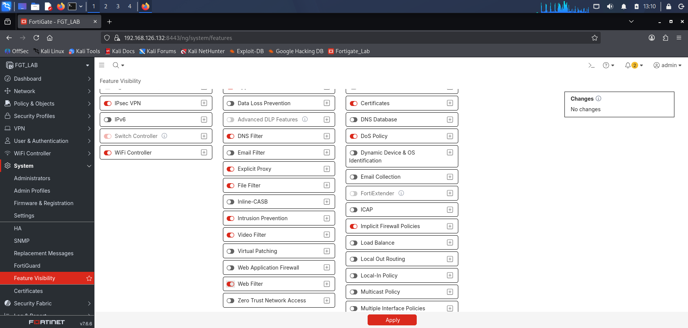

---

## Phase 2: Review FortiGuard Subscription Status

Navigated to System > FortiGuard. Only the Virtual Machine Evaluation License was visible. No web filtering subscription appeared. The page did not clearly say whether web filtering was included or not, just that the eval license was active.

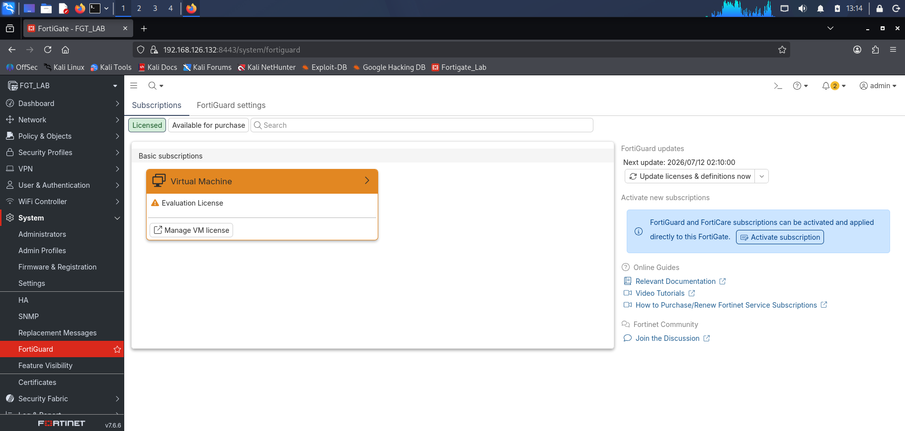

---

## Phase 3: Create the Web Filter Profile

Navigated to Security Profiles > Web Filter. Created a new profile named Kali-WebFilter.

Under FortiGuard Categories, found Social Networking and set it to Block.

As soon as that was done, FortiGate displayed a warning:

```
"This device is not licensed for the FortiGuard web filtering service.
Traffic may be blocked if this option is enabled."
```

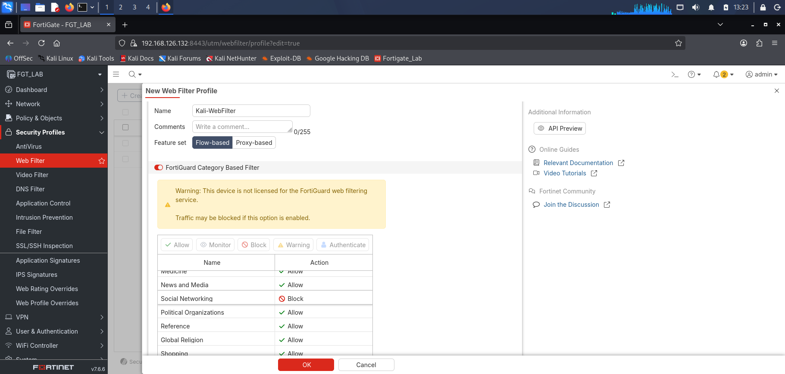

This warning confirms what the FortiGuard page did not say clearly. The eval license does not include the web filtering service. The warning also says traffic may be blocked if the option is enabled. That turned out to be accurate, and Phase 5 shows exactly what that looks like.

---

## Phase 4: Apply Web Filter Profile to Policy

Navigated to Policy and Objects > Firewall Policy. Edited Kali to Internet. Set Web Filter to Kali-WebFilter. Kept SSL Inspection on no-inspection.

When no-inspection was selected alongside a UTM profile, FortiGate showed another warning:

```
"The no-inspection profile doesn't perform SSL inspection, so it shouldn't
be selected with other UTM profiles or features that require SSL inspection."
```

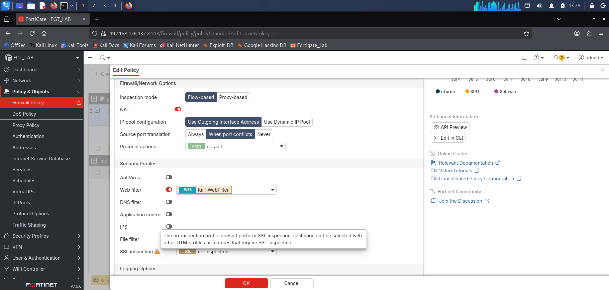

This warning is directly relevant to what happened in testing. Web filtering needs to be able to read the URL in the request. For HTTPS traffic, FortiGate cannot read the URL unless SSL inspection is decrypting the session first. FortiGate tells you this in the interface itself.

---

## Phase 5: Category Based Filtering Test

### HTTPS Test (Facebook)

Opened Firefox on Kali and navigated to:
```
https://www.facebook.com
```

The site loaded with no block and no warning. Forward Traffic showed a plain Accept with no web filter action. Security Events had no web filter entries at all.

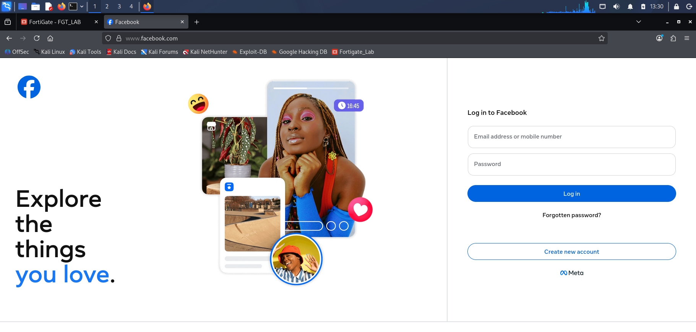

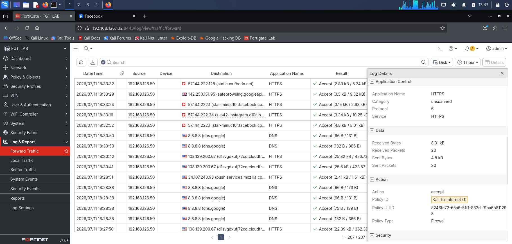

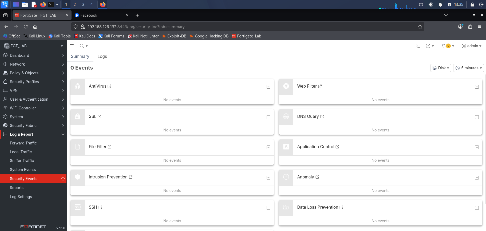

Why HTTPS was not filtered: without SSL inspection, FortiGate cannot read the URL from the encrypted connection. The web filter profile has no URL to match against so the traffic passes straight through.

This is the same license ceiling from Labs 06 and 07. SSL deep inspection cannot complete on this eval license because the key size restriction means browsers reject FortiGate's certificates. So web filtering cannot cover HTTPS traffic here. Every HTTPS test in this lab will show the same result: the site loads normally with no filter action. This is a confirmed license limitation, not a configuration mistake.

### HTTP Test — Unexpected Block Behavior

Manually typed `http://www.x.com` into Kali Firefox to force a plain HTTP request.

Result: FortiGate blocked the request and returned a block page:

```
Web Page Blocked
An error occurred while trying to rate the website using the
web filtering service.

Web Filter Service Error: all Fortiguard servers failed to respond
```

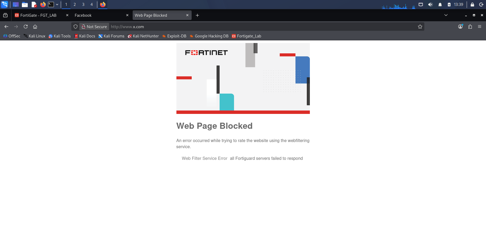

The same block happened for http://www.instagram.com and http://www.reddit.com.

Checked Log and Report > Forward Traffic. Sessions showed action=deny with UTM blocked.

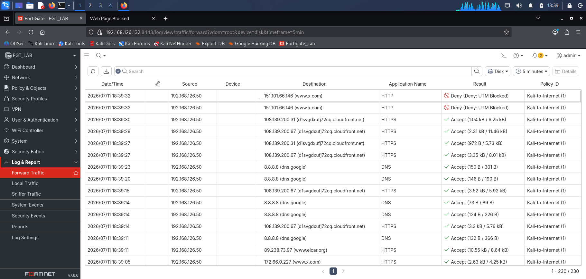

Checked Log and Report > Security Events > Web Filter. Entries appeared for each blocked HTTP session.

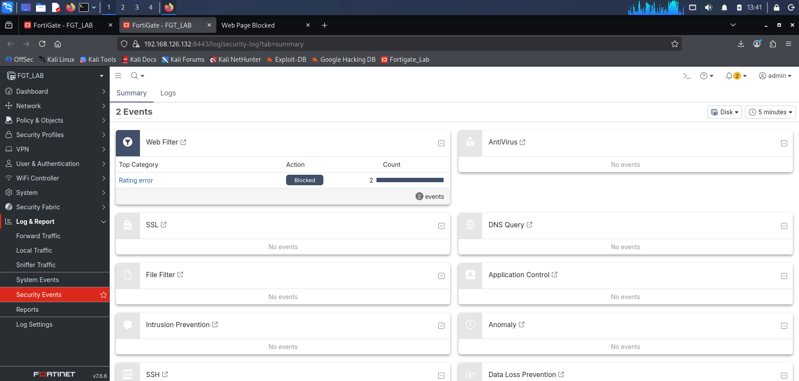

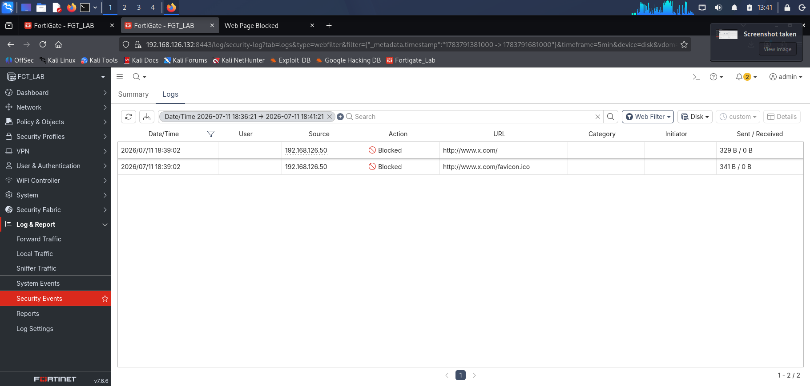

The log entries showed:

```
eventtype="ftgd_err"
action="blocked"
error="all Fortiguard servers failed to respond"
msg="A rating error occurs"
profile="Kali-WebFilter"
```

The `ftgd_err` event type means FortiGuard rating error. FortiGate tried to look up the category for the requested site by contacting FortiGuard's servers, got no response from any of them, and blocked the traffic as a result. This is different from a normal category block where FortiGate receives a category from FortiGuard and then blocks based on that. Here FortiGate blocked because it could not get a category at all. It did not let the traffic through just because the lookup failed. It blocked it instead.

This is called fail closed behavior. When the web filtering service is unavailable, unknown HTTP traffic gets blocked rather than allowed through. In a production environment this would affect users trying to reach legitimate sites during a FortiGuard outage, which is worth knowing before rolling out category based web filtering.

---

## Phase 6: Manual URL Filter Configuration

To test filtering that does not rely on FortiGuard at all, the FortiGuard category section in the profile was disabled. URL filter entries were added manually instead.

Navigated to Security Profiles > Web Filter. Edited Kali-WebFilter. Turned off the FortiGuard category section. Added two entries under URL Filter:

| URL | Type | Action |
|---|---|---|
| www.reddit.com | Simple | Block |
| *.twitter.com | Wildcard | Block |

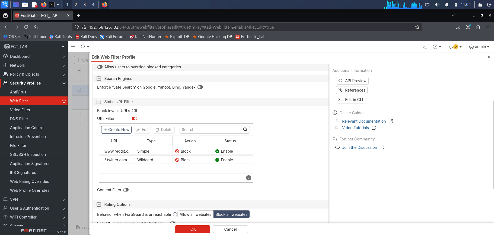

Saved.

**HTTPS test:** navigated to https://www.reddit.com and https://twitter.com from Kali Firefox. Both sites loaded normally with no block. Same reason as Phase 5. Without SSL inspection, FortiGate cannot read the URL from the encrypted connection so the filter list has nothing to match against.

**HTTP test:** manually typed http://www.reddit.com to test over plain HTTP. The site did not load but no clean FortiGate block page appeared and no clear URL filter entry showed up in Security Events for this specific test. The result was inconclusive. The category filter may have still been involved in the block even though it was disabled. This test is documented as not confirmed rather than a clean URL filter result.

The URL filter was set up correctly. The issue was with isolating it cleanly in the test, not with the configuration itself. URL filtering is designed to work without any FortiGuard connection since the list is stored on the device. A cleaner test would be to run it with the category filter fully removed from the profile and test only against plain HTTP.

---

## Web Filtering Behavior Summary

| Traffic Type | SSL Inspection | Filter Used | Result | Confirmed |
|---|---|---|---|---|
| HTTPS (Facebook, Instagram) | No inspection | Category block | Loaded normally, not filtered | Yes |
| HTTP (x.com, Instagram, Reddit) | No inspection | Category block | Blocked with ftgd_err | Yes |
| HTTPS (Reddit, Twitter) | No inspection | URL filter | Loaded normally, URL not visible to FortiGate | Yes |
| HTTP (Reddit, Twitter) | No inspection | URL filter | Inconclusive, not confirmed | No |

---

## Key Findings

**Finding 1: Web filtering on HTTPS traffic does not work without SSL inspection**

FortiGate cannot read the URL or hostname from an encrypted HTTPS connection unless SSL inspection is decrypting the session first. Without that, both category based and URL based filters have nothing to compare against and HTTPS traffic passes through regardless of what the profile says to block. FortiGate's own warning in the GUI confirms this when no-inspection is selected alongside a web filter profile.

**Finding 2: FortiGate blocks HTTP traffic when FortiGuard cannot be reached**

With the category filter active and FortiGuard unavailable, FortiGate blocked plain HTTP requests rather than allowing them through. The Security Events log shows `eventtype="ftgd_err"` and the error message confirms no FortiGuard server responded. FortiGate did not just let the traffic through because the lookup failed. It blocked it. In a production environment a FortiGuard outage could block users from reaching legitimate HTTP sites if category based web filtering is active.

**Finding 3: Manual URL filtering does not need FortiGuard but could not be confirmed cleanly in this lab**

URL filter entries are stored on the device and do not depend on any FortiGuard connection. The configuration was set up correctly. However the test on plain HTTP was not clean enough to confirm the URL filter was responsible for the block rather than leftover category filter behavior. This is a gap in the test design, not evidence that URL filtering does not work. A cleaner test would isolate the URL filter on its own against a plain HTTP target.

**Finding 4: URL filtering and category filtering have the same dependency on SSL inspection for HTTPS**

Both methods need to read the URL from the request. For HTTPS, that only happens when SSL inspection decrypts the session first. This is the same pattern from Labs 06 and 07 where AV could not scan HTTPS content without SSL inspection working. Web filtering is the third feature in this lab series to hit the same wall.

**Finding 5: ftgd_err and ftgd_blk are two different outcomes in the logs**

A working category block would show `eventtype="ftgd_blk"` with a category returned from FortiGuard. What this lab produced was `eventtype="ftgd_err"` which means the category lookup itself failed. FortiGate blocked because it could not get a rating, not because it identified the site as belonging to a blocked category. For an analyst reviewing logs, these two event types have different meanings even though both result in the traffic being blocked.

---

## Lab Limitations and How They Were Handled

**Limitation 1: FortiGuard web filtering service is not included in the eval license**

Confirmed by the warning FortiGate displayed when the category filter was configured. Category based filtering cannot work as designed without a valid FortiGuard subscription. The ftgd_err blocks in Phase 5 are a side effect of the missing subscription, not a working example of category filtering.

**Limitation 2: SSL inspection cannot complete on this eval license**

Without SSL inspection working on HTTPS traffic, both category and URL filters have no effect on encrypted sessions. This is the same license ceiling from Labs 06 and 07. Web filtering in this environment can only be observed on plain HTTP traffic, which is a small portion of real browsing. The full capability of web filtering cannot be shown on this license.

**Limitation 3: URL filter behavior on plain HTTP could not be confirmed in isolation**

The HTTP test for the URL filter was inconclusive because the category filter may have still been active when the block occurred. A cleaner test would disable the category filter entirely before running the URL filter test on plain HTTP. This was not done cleanly in this session and is left as an open item.

---

## What an Analyst Would Do Next

1. With a valid FortiGuard subscription in place, category based web filtering covers millions of sites automatically without needing manual lists and updates as new sites are added to FortiGuard categories.

2. Enable SSL inspection alongside web filtering so HTTPS traffic is covered. A web filter profile with no SSL inspection active provides no filtering on encrypted traffic, which is most of what users browse today.

3. Use manual URL filtering on top of category blocking for sites that need specific treatment. For example allowing one specific social media platform used for business purposes while blocking the rest of its category.

4. During a FortiGuard outage, know that HTTP traffic FortiGate cannot categorize will be blocked by default. This could affect users trying to reach normal HTTP sites while FortiGuard is down.

5. When reading web filter logs, check whether entries show ftgd_err or ftgd_blk. The first means the FortiGuard lookup failed and traffic was blocked because of that. The second means FortiGuard responded with a category and the block was intentional based on that category. Both look similar in the browser but they tell a different story in the logs.
