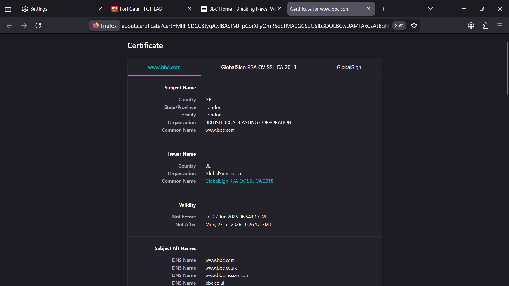
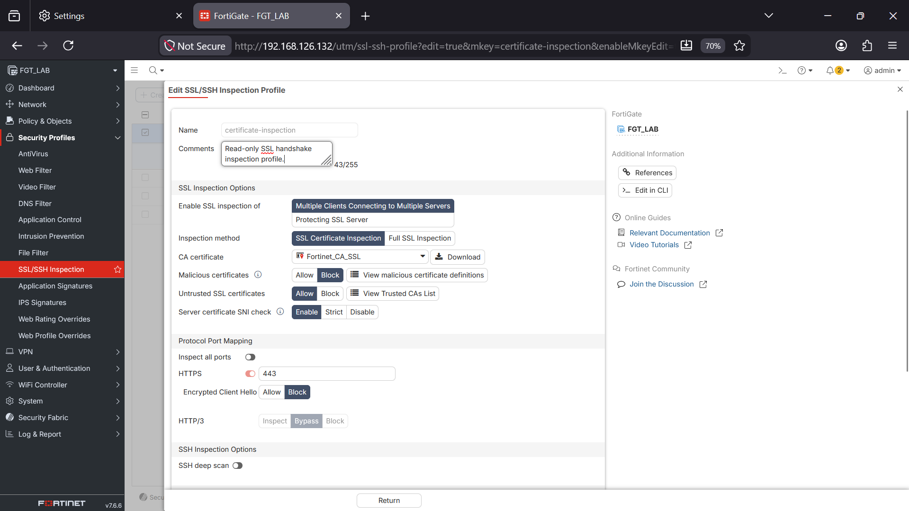
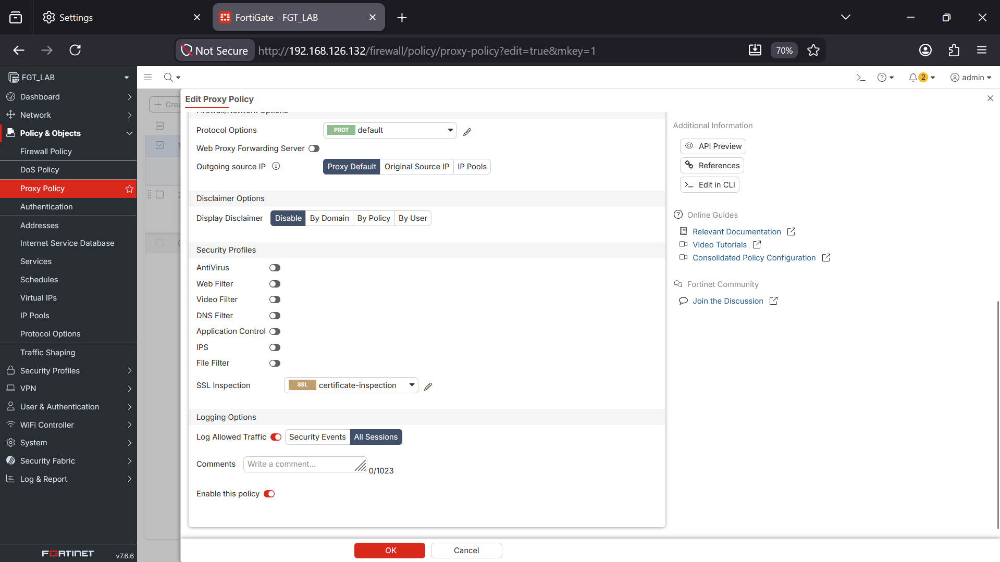
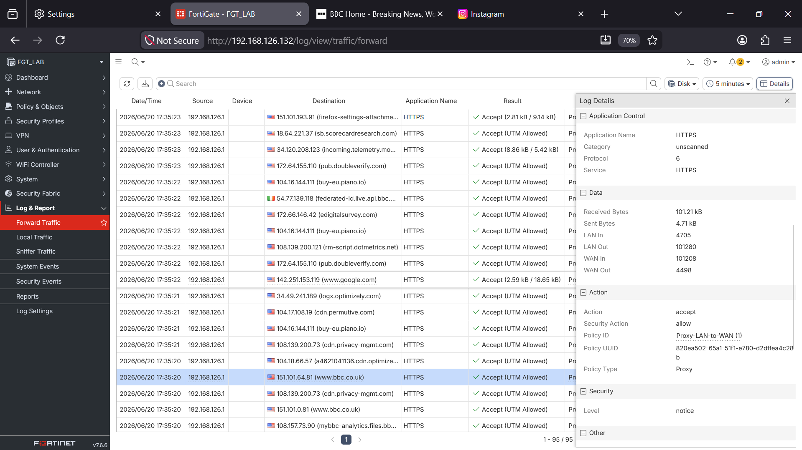
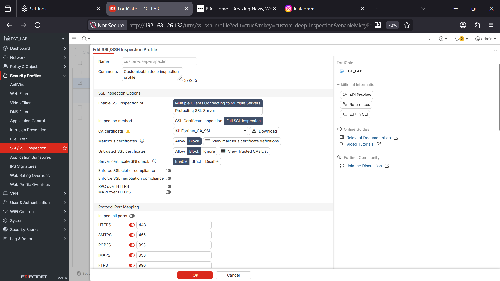
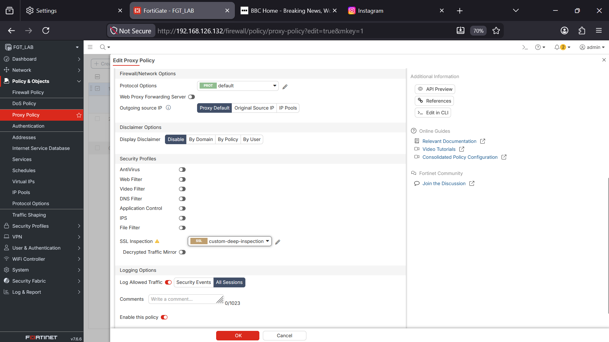
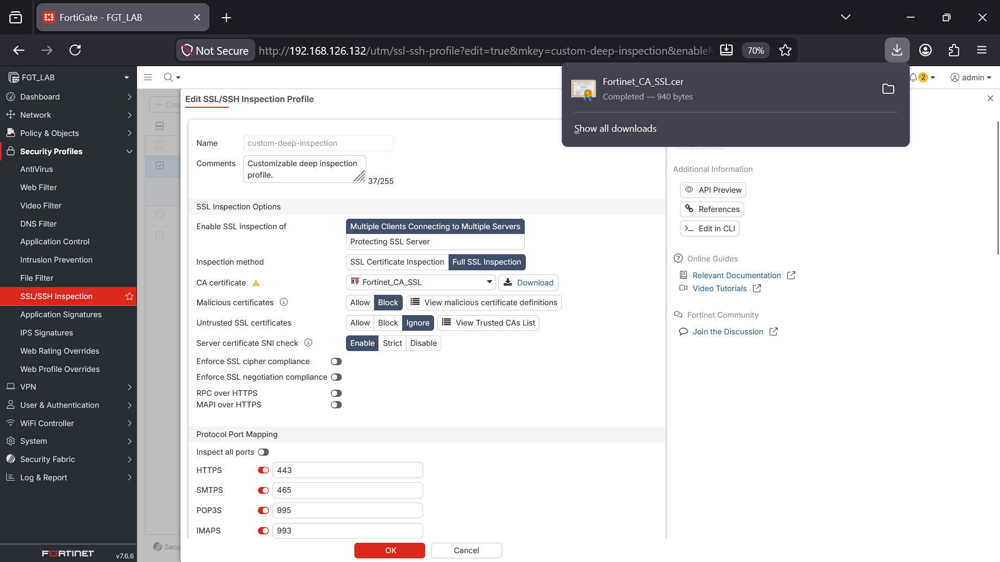
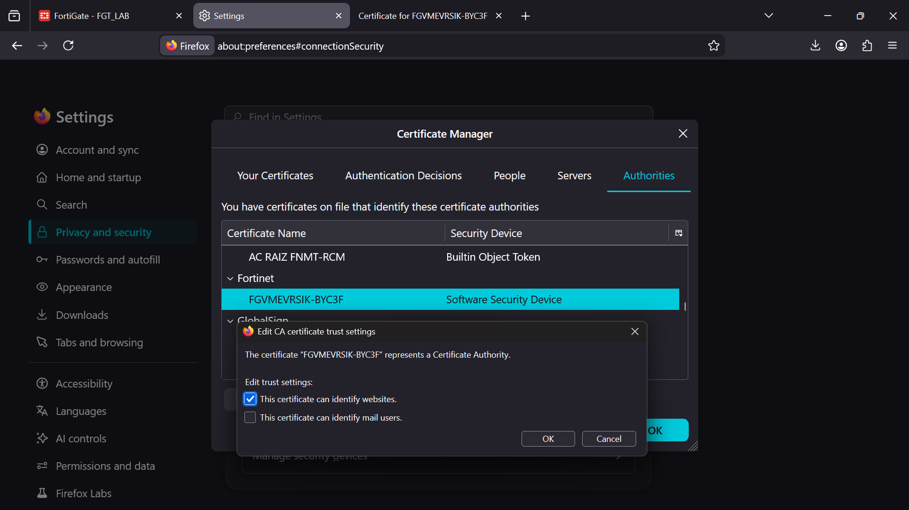

**Date:** 13th June, 2026
**Lab Environment:** FortiGate 7.6.6 VM, GNS3 and VMware, Windows Host

---

## Objective

Configure and compare SSL Certificate Inspection and SSL Deep Inspection on FortiGate, document what each mode reveals in traffic logs and the browser certificate chain, install FortiGate's CA certificate to fix browser trust warnings, and explain what each inspection mode means in practice for an analyst.

---

## Tools Used

- FortiGate 7.6.6 VM (GNS3 running on VMware)
- FortiGate GUI
- FortiGate CLI (used for connectivity checks)
- Windows Host Machine (physical client)
- Firefox Browser (explicit proxy client)

---

## Topology

Explicit Web Proxy setup carried over from the previous lab.

- **Port 1 (LAN):** Static IP 192.168.126.132
- **Port 2 (WAN):** DHCP via GNS3 NAT cloud
- **Proxy:** Explicit Web Proxy on port1, listening on port 8080
- **Firefox:** Manual proxy pointed to 192.168.126.132:8080

---

## How the Two Inspection Modes Work

**SSL Certificate Inspection** reads the SNI field in the TLS Client Hello. This is the part of the TLS handshake sent in plain text before encryption starts. FortiGate uses this hostname to make policy decisions but never looks inside the encrypted connection. The TLS session between client and server stays untouched.

**SSL Deep Inspection** ends that session completely. FortiGate creates two separate TLS connections: one between itself and the browser, using a certificate it generates and signs with its own CA (Fortinet_CA_SSL), and one between itself and the real server, using the real server certificate. The browser never talks directly to the destination server. FortiGate decrypts the traffic to inspect it, then re-encrypts it and sends it on.

In this lab, deep inspection was set up inside the Explicit Web Proxy rather than a standard firewall policy. This makes sense because the proxy already sits between the browser and the internet as a middleman. Firefox is already pointed at FortiGate as its proxy, so having FortiGate also handle TLS termination for deep inspection is a natural fit.

---

## Steps Taken

### Phase 1: Baseline, Real Certificate, No Inspection

Turned off the Firefox proxy temporarily (Settings > Network Settings > No Proxy). Browsed to bbc.com. Clicked the padlock, then Connection Secure, then More Information, then View Certificate.

The certificate chain showed the real certificate authority for bbc.com, not FortiGate. This is the clean baseline both inspection modes get compared against.

Turned the Firefox proxy back on (192.168.126.132:8080) before continuing.

---

### Phase 2: Reviewed the Built In SSL Inspection Profiles

Went to Security Profiles > SSL/SSH Inspection. FortiGate comes with four built in profiles: certificate-inspection, deep-inspection, no-inspection, and custom-deep-inspection.

Opened certificate-inspection in view mode. Confirmed it only checks the TLS handshake, not the encrypted content, and that the profile cannot be edited.

---

### Phase 3: Applied Certificate Inspection to the Proxy Policy

Went to Policy & Objects > Proxy Policy. Edited Proxy-LAN-to-WAN. Set the SSL Inspection field to certificate-inspection. Saved.

---

### Phase 4: Tested Certificate Inspection and Checked the Logs

Browsed to bbc.com and instagram.com through Firefox with the proxy active. Went to Log & Report > Forward Traffic and opened the detail panel on an HTTPS log entry.

**This worked on the first try.**

**Lab limitation: log fields not fully visible**

The Forward Traffic log detail panel on this trial VM does not show a dedicated url field or ssl-inspector field. The closest visible fields are Destination (domain and IP) and Security Action. With certificate inspection active, Security Action showed Accept.

This is a known limit of the trial license and local log storage, not a sign that inspection was not working. On a production FortiGate with FortiAnalyzer or cloud logging enabled, the full log schema including ssl-inspector, url, app, and utmaction would be visible.

---

### Phase 5: Configured Deep Inspection

Went to Security Profiles > SSL/SSH Inspection.

**Lab limitation: profile cloning not available on trial**

Cloning a read only SSL inspection profile is not available on this trial VM. deep-inspection is preloaded and read only with no clone option. custom-deep-inspection is the fourth built in profile and is editable by design for exactly this kind of situation.

**How this was handled:** opened custom-deep-inspection directly and configured it instead of trying to clone deep-inspection.

Configuration applied:

| Field | Value |
|---|---|
| SSL Inspection Method | Deep Inspection |
| CA Certificate | Fortinet_CA_SSL |
| HTTPS Port 443 | Enabled |
| Untrusted SSL Certificates | Block |
| Expired SSL Certificates | Block |
| Invalid SSL Certificates | Block |
| Log SSL Anomalies | Enable |

---

### Phase 6: Applied Deep Inspection to the Proxy Policy

Went to Policy & Objects > Proxy Policy. Edited Proxy-LAN-to-WAN. Changed the SSL Inspection field from certificate-inspection to custom-deep-inspection. Saved.

---

### Phase 7: Tried to Capture the Untrusted Certificate Warning

**This is where the lab hit a wall.**

Plan: browse to bbc.com before installing the CA certificate, expecting a SEC_ERROR_UNKNOWN_ISSUER warning that could be clicked into to see Fortinet_CA_SSL listed as an untrusted issuer.

**What actually happened:** the page loaded with no warning at all. No certificate error, no advanced prompt, no change in browser behavior.

**Troubleshooting steps taken to find the cause:**

1. Confirmed `network.dns.echconfig.enabled` was set to false in Firefox about:config, then restarted Firefox fully. No change.
2. Confirmed `network.http.http3.enable` was still false from earlier lab setup. No change.
3. Tried a simpler site (example.com) to rule out site specific TLS behavior like certificate pinning or QUIC. Same result, no warning.
4. Confirmed custom-deep-inspection was actually saved and active on the Proxy-LAN-to-WAN policy, not reverted back to certificate-inspection.
5. Confirmed all FortiGate certificates were valid and not expired under System > Certificates.
6. Tested in a fresh Firefox private window to rule out cached certificate exceptions from earlier tests.
7. Switched the test method entirely, moving from the explicit proxy to a standard firewall policy (LAN-to-WAN-Allow from an earlier lab) with a manual `route add` command forcing specific destination IPs through FortiGate's port1, to rule out a proxy specific quirk.
8. With deep inspection applied to the standard firewall policy instead, several HTTPS sites (including bbc.com and facebook.com) returned a **connection timed out** error in the browser, even though the Forward Traffic log showed the session as accepted at the policy level.
9. Checked FortiGate's own outbound connectivity from the CLI:
   - `execute ping 8.8.8.8` returned 0% packet loss with clean round trip times (28.5ms to 48.2ms, average 37.9ms)
   - `execute telnet 8.8.8.8 443` connected successfully, ruling out basic port 443 reachability as the problem

**Root cause assessment:**

Basic IP connectivity, DNS resolution, and TCP level reachability on FortiGate's WAN interface all worked fine. The failure points specifically to the TLS decrypt and reestablish step inside deep inspection, the moment FortiGate has to end the client facing session and start a new outbound TLS session to the real server. This lines up with a resource or compatibility limit of running FortiGate as a nested VM (VMware running GNS3 running FortiGate), where TLS renegotiation is more sensitive to virtualization overhead than basic ping or TCP connectivity.

**What was not tested yet:** installing the FortiGate CA certificate before trying deep inspection again. It is possible the silent page load on the explicit proxy path happened simply because no warning trigger exists on that pipeline, and that installing the CA combined with working TLS renegotiation might resolve cleanly. This was not confirmed either way since the standard policy test failed at the TLS layer before reaching that question. This is left as an open item, not a closed finding.

---

### Phase 8: CA Certificate Export (Completed, Result Unconfirmed)

Even though Phase 7 never reached the warning state, the CA export step was completed anyway for documentation and because it is a required step regardless of the troubleshooting outcome.

Went to Security Profiles > SSL/SSH Inspections > custom-deep-inspection > edit. Found Fortinet_CA_SSL under CA Certificates. Selected and downloaded it as fortigate_ca.crt.

Imported into Firefox: Settings > Privacy & Security > Certificates > View Certificates > Authorities tab > Import. Selected fortigate_ca.crt, checked "Trust this CA to identify websites," restarted Firefox.

**Note:** since the warning never showed up in Phase 7, there was no before and after change to confirm this step actually fixed anything. The certificate imported successfully and shows as trusted in Firefox's Authorities list, which confirms the import itself works. Whether it would have cleared a SEC_ERROR_UNKNOWN_ISSUER warning, had one appeared, is still untested. This will be revisited if the deep inspection timeout gets resolved in a future lab.

---

## Lab Limitations and How They Were Handled

**Limitation 1: Log field visibility limited on trial license**

The Forward Traffic log detail panel does not show ssl-inspector, url, or app fields the way production deployments with FortiAnalyzer or cloud logging would. This is a license and storage limit. The Security Action field (Accept vs Accept with UTM allowed) was used as the main way to confirm inspection was running throughout this lab.

**Limitation 2: SSL inspection profile cloning not available on trial**

deep-inspection cannot be cloned on this trial VM. custom-deep-inspection, the editable profile meant for this exact purpose, was used instead. This is the correct supported approach, not a missing feature.

**Limitation 3: Deep inspection TLS renegotiation failure (unresolved)**

Deep inspection was set up correctly and confirmed active at the policy and log level, but TLS sessions to external HTTPS sites timed out during the decrypt and reestablish step, both through the explicit proxy and a standard firewall policy. Step by step testing ruled out routing issues, ECH interference, DNS failure, basic ping connectivity, and TCP/443 reachability as causes. The problem narrows down to the TLS renegotiation step inside deep inspection, likely linked to resource or compatibility limits of running FortiGate as a nested VM. This was not resolved in this lab session and is documented as an open finding, not a misconfiguration.

---

## Key Findings

**Finding 1: Certificate inspection sees the hostname but not the content**

FortiGate reads the SNI field from the TLS handshake to identify the destination hostname. No URL path, HTTP header, or response body is visible. Web filtering under certificate inspection only works at the domain category level, good enough for blocking entire domains but not for filtering specific URLs or scanning content. The TLS session between browser and server is not touched. This mode worked correctly and was fully tested in this lab.

**Finding 2: Deep inspection is built to create two separate TLS sessions, confirmed at the policy level but not fully tested end to end**

With deep inspection configured, FortiGate is meant to act as the TLS endpoint for the browser, presenting its own certificate while keeping a separate session with the real server. The log showing Accept (UTM allowed) confirms FortiGate engaged this process. However, the full end to end result, including the browser actually receiving and showing FortiGate's certificate, was not observed in this lab because of the TLS renegotiation timeout described in Limitation 3.

**Finding 3: Policy level acceptance and session level completion are two different things**

This was the most useful unplanned finding in the lab. A session can be accepted and processed at the policy level while still failing afterward during TLS negotiation. A log entry showing Accept (UTM allowed) confirms the policy matched and inspection was triggered, but it does not confirm the user actually got a working connection. This matters for log analysis: an analyst who only checks the Security Action field could think a session succeeded when the real user experience was a failed connection.

**Finding 4: Testing one variable at a time is more useful than getting lucky with a working config**

Ruling out routing, DNS, ECH, ping, and TCP reachability one at a time, and testing across two different policy types (explicit proxy and standard firewall policy), narrowed down an unclear failure to one specific layer. This is the same approach used in real troubleshooting and incident response, where the goal is eliminating possibilities step by step instead of guessing at one cause.

**Finding 5: The certificate chain is the clearest proof that deep inspection is working, when it completes**

Comparing State A (real certificate authority) against a hypothetical State C (Fortinet_CA_SSL as the issuer) would be the clearest visual proof of inspection happening in the middle of the connection. This lab successfully captured State A and confirmed how the mechanism is supposed to work through the setup in Phase 5, but State C was not captured because of the unresolved timeout. This is the single most valuable screenshot to get in a follow up session.

---

## What an Analyst Would Do Next

1. **Check which proxy and firewall policies have deep inspection turned on** versus certificate inspection or no inspection at all, since this lab showed that a policy can log UTM activity without the session actually completing. This means policy checks alone are not enough without also checking the session level.
2. **Investigate unexpected certificate warnings from users** by checking the issuing certificate authority first. If it matches the organization's known FortiGate CA, the cause is likely a CA distribution gap. If it is unrecognized, that is a possible sign of unauthorized man in the middle activity.
3. **Review SSL anomaly logs regularly**, since Log SSL Anomalies was turned on in this lab's profile and would catch blocked sessions from untrusted, expired, or invalid certificates in a working deployment.
4. **Check TLS layer timeouts separately from policy level logs**, the central lesson from this lab, since relying only on Accept or Accept (UTM allowed) would have hidden the fact that sessions were failing after the policy already accepted them.

---

## Status

This lab is partially complete. The certificate inspection objective was fully achieved and tested end to end, including logs. The deep inspection objective was configured correctly at every checkable layer (profile, policy assignment, log activity) but did not complete end to end due to an unresolved TLS renegotiation timeout.

---

## Skills Demonstrated

- SSL/TLS inspection configuration on FortiGate (certificate inspection and deep inspection)
- Explicit Web Proxy configuration and policy management
- Certificate chain analysis and browser trust troubleshooting
- FortiGate CA certificate export and import workflow
- Forward Traffic log analysis and Security Action interpretation
- Systematic network troubleshooting: ruling out DNS, routing, ECH, ICMP, and TCP layer issues one at a time
- CLI based connectivity testing (ping, telnet) for root cause isolation
- Documenting unresolved technical issues with clear root cause reasoning
- Understanding the difference between policy level logging and session level completion
- SOC relevant log analysis judgment, recognizing that Accept in logs does not always mean a successful connection
