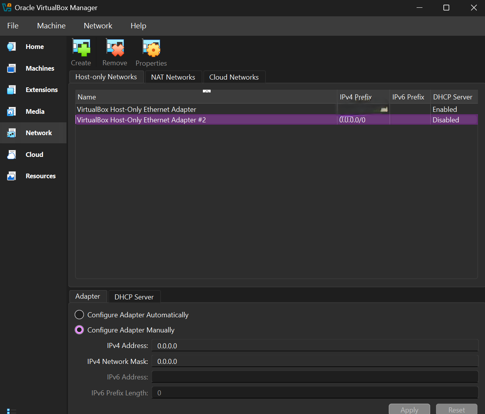
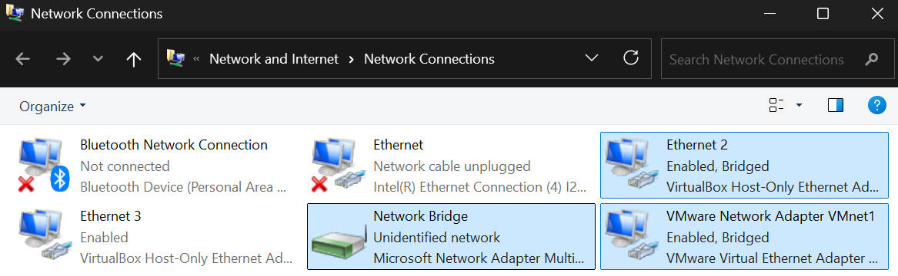
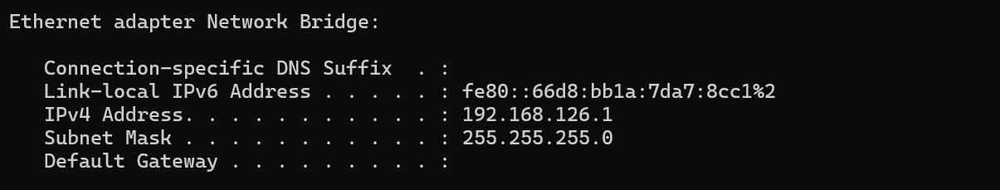
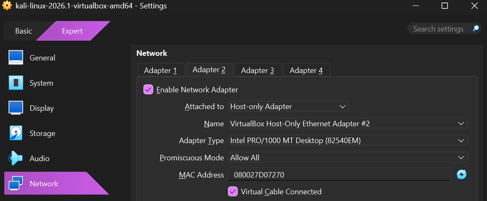
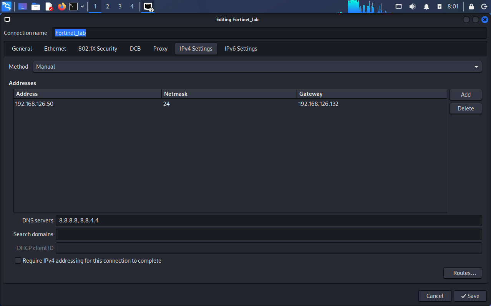
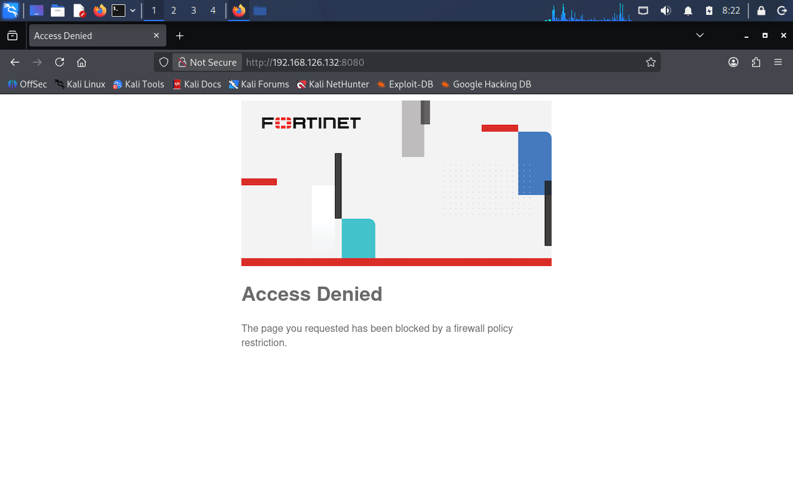
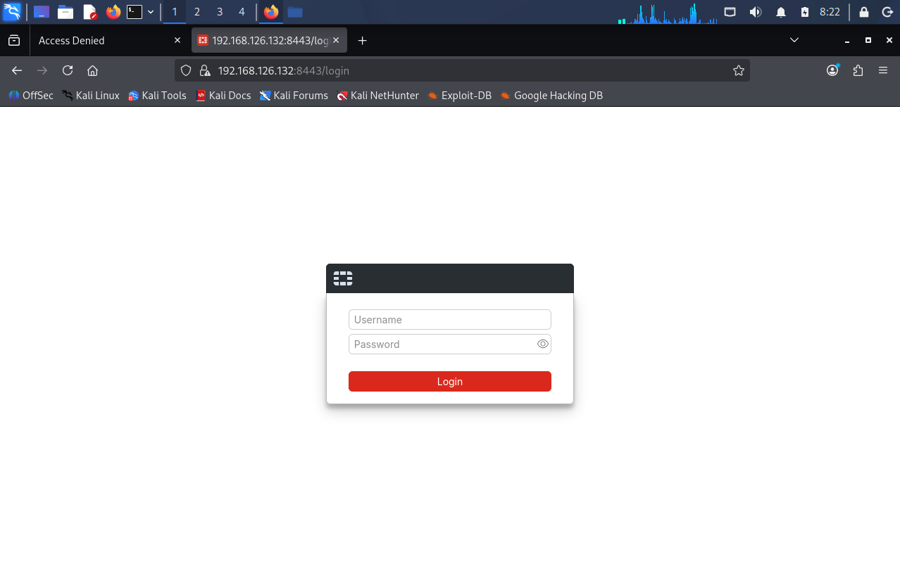
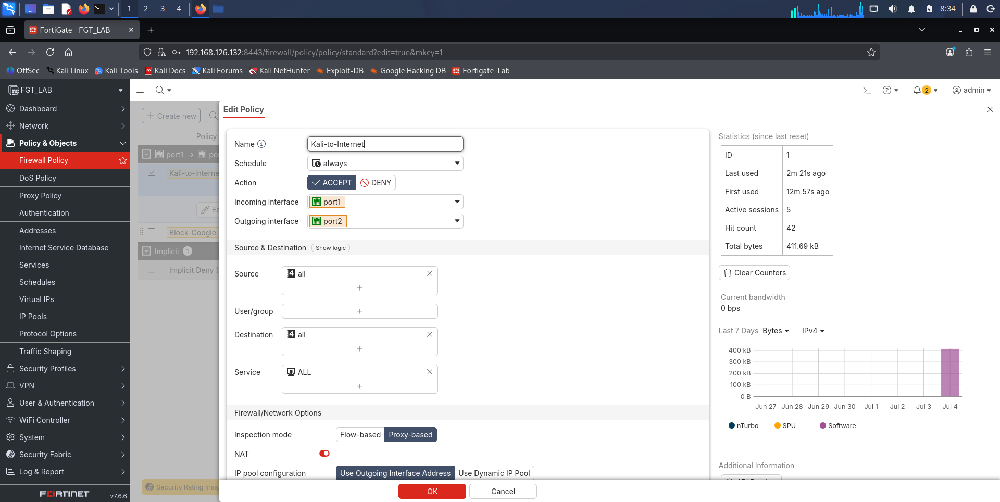
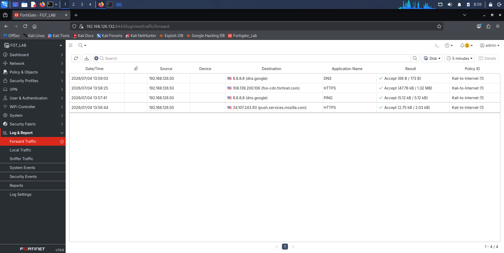

**Date:** July 3, 2026  
**Lab Environment:** FortiGate 7.6.6 VM | GNS3 + VMware Workstation | Kali Linux (VirtualBox) | Windows Host Machine

---

## Objective

Build and validate a multi-hypervisor lab infrastructure that connects a VirtualBox-hosted Kali Linux machine directly into a GNS3 FortiGate 7.6.6 firewall running on a VMware backend. The goal was to replace the Windows host as the test client with a proper, isolated endpoint so that all future lab traffic genuinely passes through FortiGate's inspection engine before reaching the internet — producing clean Forward Traffic logs and accurate security event data for portfolio documentation.

---

## Why This Setup Was Necessary

Earlier labs (Labs 03 and 05) used the Windows host machine as both the test client and the physical machine running VMware, GNS3, and FortiGate. This created a fundamental problem: when the Windows host generates traffic, that traffic follows the host's own routing table and default gateway (the home router), bypassing FortiGate entirely.

Two workarounds were used in earlier labs to get around this:

**Explicit Web Proxy (Labs 03 and 05):** Firefox was pointed manually at FortiGate's proxy port (8080), which forced browser traffic through the proxy. This worked for proxy policy testing but introduced its own limitations, including SSL inspection bypass caused by the evaluation license.

**CMD route add (Labs 03 and 05):** Specific destination IPs were routed through FortiGate's port1 IP via the Windows routing table. This worked for standard firewall policy testing but required manual route entries per destination and still couldn't reliably push all traffic classes through FortiGate.

Neither workaround scales well for advanced lab work such as antivirus scanning, IPS testing, or full HTTPS inspection because both approaches depend on traffic reaching FortiGate in a limited, controlled way rather than from a genuine network client sitting behind the firewall.

**The correct architecture** is to have a dedicated client machine on FortiGate's LAN side, with the firewall set as its actual default gateway. Every packet that client sends must physically pass through FortiGate's inspection engine before going to the internet. That is what this lab builds.

Kali Linux ended up in VirtualBox while FortiGate stayed in VMware/GNS3 due to lab progression: FortiGate was already stable in its environment before Kali was added, and moving FortiGate risked disrupting a working setup. Instead, a cross-hypervisor bridge was engineered using the Windows host as an intermediary Layer 2 switch allowing VMs on two separate hypervisors to share the same virtual network segment.

---

## Tools Used

- FortiGate 7.6.6 VM (running in GNS3 on VMware Workstation)
- FortiGate GUI and CLI (accessed via Solar-PuTTY)
- Kali Linux VM (VirtualBox, dual adapter configuration)
- VMware Workstation Pro (VMnet1 Host-Only virtual switch)
- VirtualBox (Host-Only adapter bridged to VMnet1)
- Windows Host Machine (Windows Network Bridge, Device Manager)
- Firefox Browser (inside Kali, for GUI access and traffic testing)

---

## Topology

```
Kali Linux (VirtualBox)
  Adapter 2: 192.168.126.50/24
  Gateway:   192.168.126.132
       |
       | VirtualBox Host-Only Adapter
       |
  [Windows Network Bridge]
  (Windows Host: 192.168.126.1)
       |
       | VMware VMnet1 (Host-Only)
       |
  GNS3 Cloud Node (VMnet1)
       |
  FortiGate Port 1 (LAN): 192.168.126.132/24
  FortiGate Port 2 (WAN): 192.168.42.213 (DHCP via GNS3 NAT Cloud)
       |
  Internet
```

**Traffic flow:**  
Kali (192.168.126.50) → VirtualBox switch → Windows Bridge → VMnet1 → GNS3 Cloud → FortiGate port1 → FortiGate port2 → Internet

---

## How the Multi-Hypervisor Bridge Works

In a standard single-hypervisor lab, VMs on the same virtual switch share a Layer 2 broadcast domain automatically. When Kali is in VirtualBox and FortiGate is in VMware, these are two completely separate virtual switching environments with no native connection between them.

The Windows host runs both hypervisors at the same time and has a network adapter for each: a VMware Network Adapter (VMnet1) and a VirtualBox Host-Only Ethernet Adapter. These are two separate virtual switches that would normally never exchange traffic.

A Windows Network Bridge joins both adapters into a single Layer 2 broadcast domain at the OS level. When Kali sends a packet out its Host-Only adapter in VirtualBox, that packet reaches the VirtualBox virtual switch, crosses the Windows bridge, lands on VMnet1, and enters GNS3 through a Cloud node connected to that network. From GNS3's perspective, Kali is just another device on the same network segment as FortiGate's port1.

The end result: Kali behaves exactly like a physical workstation plugged into a LAN switch behind a real FortiGate firewall. Its default gateway is FortiGate's port1 IP (192.168.126.132), so every outbound packet gets forwarded to FortiGate first, inspected against the active security policy, and then forwarded out port2 to the internet.

---

## Steps Taken

### Phase 1: Engineering the Cross-Hypervisor Layer 2 Bridge

**Step 1: Created a new VirtualBox Host-Only adapter**

Opened VirtualBox > File > Tools > Network Manager. Created a new Host-Only Ethernet Adapter and disabled the built-in DHCP server on it. Disabling DHCP was important, if DHCP was left on, it could assign IPs automatically and conflict with the static address already planned for Kali (192.168.126.50).



**Step 2: Created the Windows Network Bridge**

Opened Windows Network Connections (ncpa.cpl). Selected both adapters at the same time:
- VMware Network Adapter VMnet1 (already connected to GNS3, 192.168.126.x subnet)
- The new VirtualBox Host-Only Network Adapter (Ethernet 2)

Right-clicked and selected Bridge Connections. Windows created a new Network Bridge interface that combined both adapters into one Layer 2 domain.



**Step 3: Verified bridge IP on the Windows host**

Ran `ipconfig` in Command Prompt. The Network Bridge adapter showed up with an automatically assigned IP of 192.168.126.1, placing the Windows host on the same subnet as FortiGate's port1 and Kali's planned IP.



---

### Phase 2: Dual Adapter Configuration in Kali Linux

A dual adapter setup was used so Kali could switch between two network contexts without reconfiguring the VM each time:

- **Adapter 1 (Bridged):** Keeps Kali's normal internet access for tool downloads, updates, and general use when not running firewall labs
- **Adapter 2 (Host-Only, bridged to VMnet1):** The dedicated lab interface that places Kali on FortiGate's LAN segment for all lab traffic

**Step 5: Configured Adapter 2 in VirtualBox**

Opened Kali VM Settings > Network > Adapter 2. Changed Attached to from Disabled to Host-Only Adapter. In the Name dropdown, selected the VirtualBox Host-Only adapter created in Phase 1 (VirtualBox Host-Only Ethernet Adapter #2). Under Advanced settings, set Promiscuous Mode to Allow All so that broadcast and multicast traffic passes correctly through the software bridge.



**Step 6: Configured a static IP on Adapter 2 inside Kali**

Booted Kali. Went to the network icon in the taskbar > Edit Connections. Located the profile for Adapter 2 (Wired Connection 2) and renamed it to Fortinet Lab for clarity. Set the following under IPv4 Settings:

| Field | Value |
|---|---|
| Method | Manual |
| IP Address | 192.168.126.50 |
| Netmask | 255.255.255.0 |
| Gateway | 192.168.126.132 |
| DNS Servers | 8.8.8.8, 8.8.4.4 |

The gateway pointing to FortiGate's port1 IP is the critical setting here. Every outbound packet from Kali now goes to FortiGate first instead of the home router.

DNS was set to public servers (8.8.8.8) rather than the home router's DNS. This was necessary because GNS3's WAN subnet (192.168.42.x) is completely isolated from the home network (192.168.1.x). If Kali used the home router's DNS resolver (192.168.1.1), DNS queries would exit through the home router while data traffic routed through FortiGate creating an asymmetric path where DNS replies could not return correctly.

Toggled the Fortinet Lab profile on and disabled Adapter 1 (Bridged) to make sure all lab traffic routes exclusively through Adapter 2 and FortiGate.



---

### Phase 3: FortiGate Interface and Administrative Access

**Step 7: Verified port1 interface configuration via CLI**

Accessed FortiGate's console through GNS3. Confirmed port1 settings and administrative access protocols:

```
config system interface
    edit port1
        set mode static
        set ip 192.168.126.132 255.255.255.0
        set allowaccess https http ping ssh
    end
```

**Step 8: Diagnosed and resolved TCP SYN drop issue for GUI access from Kali**

Initial browser attempts from Kali to the FortiGate GUI failed even though ICMP pings were working. Used FortiGate CLI packet capture to investigate:

```
diagnose sniffer packet port1 "tcp port 443"
```

The output showed inbound SYN packets arriving from 192.168.126.50 but no SYN-ACK replies confirming FortiGate was receiving the connection attempts but silently discarding them. This is the exact pattern described in Limitation 2 below (the TCP checksum offload issue). After disabling checksum offload in Windows Device Manager, SYN-ACK replies appeared and the connection completed successfully.

This finding is worth noting: **a successful ICMP ping does not confirm TCP connectivity.** ICMP operates at Layer 3 and doesn't depend on the same offload settings as TCP. A firewall can process ICMP cleanly while silently dropping TCP sessions when those packets arrive with invalid checksums.

**Step 9: Remapped FortiGate administrative ports**

To avoid port conflicts in the nested virtualization environment:

```
config system global
    set admin-sport 8443
    set admin-port 8080
end
```

FortiGate GUI is now accessible from Kali at:
- HTTPS: `https://192.168.126.132:8443`
- HTTP: `http://192.168.126.132:8080` (returns Access Denied by design, FortiGate enforces TLS for management access)

**Step 10: Confirmed GUI access from Kali**

Opened Firefox inside Kali. Tried `http://192.168.126.132:8080` first and confirmed the FortiGate Access Denied page expected behavior, not a failure.



Switched to `https://192.168.126.132:8443`, accepted the self-signed certificate warning, and successfully loaded the FortiGate management login page from inside Kali.



---

### Phase 4: Outbound Firewall Policy for Kali Internet Access

**Step 11: Created the Kali-to-Internet firewall policy**

Navigated to Policy & Objects > Firewall Policy > Create New.

| Field | Value |
|---|---|
| Name | Kali-to-Internet |
| Incoming Interface | port1 |
| Outgoing Interface | port2 |
| Source | all |
| Destination | all |
| Service | ALL |
| Action | ACCEPT |
| NAT | Enabled (Use Outgoing Interface Address) |
| Log Allowed Traffic | All Sessions |

This is a standard firewall policy, not a proxy policy. The difference matters: standard firewall policy traffic logs to Forward Traffic with full session visibility, producing cleaner and more complete log data than the proxy policy pipeline used in Labs 03 and 05.



**Step 12: Tested and validated the policy**

From the Kali terminal, ran:

```
ping 8.8.8.8
```

Confirmed successful replies. Navigated to Log & Report > Forward Traffic in the FortiGate GUI. Log entries appeared immediately, confirming Kali's traffic was being accepted, NAT-translated, and forwarded through FortiGate.



---

## Observations

### Test 1: ICMP from Kali through FortiGate

```
date=2026-07-03 time=18:54:21 logid="0000000013" type="traffic"
subtype="forward" level="notice" srcip=192.168.126.50
srcintf="port1" dstip=8.8.8.8 dstintf="port2" proto=1
action="accept" policyid=1 policyname="Kali-to-Internet"
service="PING" trandisp="snat" transip=192.168.42.213
sentbyte=252 rcvdbyte=252
```

### Test 2: DNS from Kali through FortiGate

```
date=2026-07-03 time=18:51:18 logid="0000000013" type="traffic"
subtype="forward" level="notice" srcip=192.168.126.50
srcport=54681 srcintf="port1" dstip=8.8.8.8 dstport=53
dstintf="port2" policyid=1 policyname="Kali-to-Internet"
service="DNS" trandisp="snat" transip=192.168.42.213
action="accept"
```

Both log entries confirm:
- Source IP 192.168.126.50 (Kali) entering on port1
- FortiGate applying Source NAT and translating the source to 192.168.42.213 (WAN IP)
- Policy ID 1 (Kali-to-Internet) matching correctly
- Traffic logged in Forward Traffic, not Security Events

---

## Lab Limitations and How They Were Handled

**Limitation 1: Asymmetric DNS routing**

During initial testing, Kali could ping by IP but couldn't resolve domain names. Running `diagnose debug flow` on FortiGate showed DNS queries leaving correctly but replies never returning. The root cause: Kali was defaulting to the home router's DNS (192.168.1.1) despite its gateway pointing to FortiGate. Because the home network (192.168.1.x) and GNS3's WAN subnet (192.168.42.x) are completely isolated, DNS replies had no valid return path. Fixed by manually setting DNS in the Kali network profile to use public DNS servers (8.8.8.8 and 8.8.4.4) directly bypassing home network DNS entirely.

**Limitation 2: Silent TCP drops due to cross-hypervisor checksum offloading**

ICMP worked right away but TCP connections including GUI access on port 443 failed silently with no FortiGate policy log entries. Diagnosed using FortiGate's built-in packet sniffer, which showed inbound SYN packets from Kali arriving on port1 but no SYN-ACK being sent back. Root cause: the Windows NIC driver's TCP checksum offload feature miscalculates checksums on packets crossing from one hypervisor's virtual switch to another, producing invalid TCP headers that FortiGate's packet processor drops before policy evaluation even takes place. Fixed by disabling IPv4 Checksum Offload and TCP Checksum Offload in Windows Device Manager for both bridged adapters.

---

## Key Findings

**Finding 1: A successful ping does not confirm TCP connectivity**

ICMP and TCP are evaluated separately at different OSI layers. FortiGate can process ICMP packets cleanly while silently dropping TCP connections if those packets arrive with invalid checksums. An analyst who only pings to check reachability would miss a broken TCP path entirely. Packet-level sniffer output (`diagnose sniffer packet`) is required to see what is actually arriving at the interface separate from what the policy is accepting.

**Finding 2: Source NAT abstracts the internal client from external destinations**

FortiGate's SNAT translates Kali's internal IP (192.168.126.50) to the WAN interface IP (192.168.42.213) before forwarding traffic to the internet. External destinations only see the WAN IP, not the internal client. The log entries confirm this via `trandisp="snat"` and `transip=192.168.42.213`. In a real SOC context this matters for incident response: logs at an external destination would show only the WAN IP, while FortiGate's own Forward Traffic logs preserve the original source IP making FortiGate the authoritative source for internal attribution during an investigation.

**Finding 3: Standard firewall policy logs produce cleaner and more complete session data than proxy policy logs**

Earlier labs used explicit proxy policies, which log primarily to Security Events and return partial session data. This lab's standard firewall policy logs every session to Forward Traffic with full fields: source IP, destination IP, NAT translation details, policy name, bytes sent and received, and service type. This is the log format that most SIEM platforms  including Splunk  are configured to ingest from FortiGate, making standard firewall policy logging the more operationally relevant format for SOC work.

**Finding 4: Multi-hypervisor networking is a Layer 2 problem, not a Layer 3 problem**

Connecting VMs across two different hypervisors on the same physical machine requires a Layer 2 solution. Adding static routes would not solve it the fundamental issue is that VMware's VMnet1 and VirtualBox's Host-Only adapter are separate virtual switches that don't share a broadcast domain. The Windows Network Bridge solved this by binding both adapters at Layer 2, creating one shared network segment without needing any routing between them.

---

## What an Analyst Would Do Next

1. **Attach security profiles to the Kali-to-Internet policy**: now that traffic genuinely flows through FortiGate for inspection, antivirus, IPS, and web filtering labs that were blocked by the Windows-host routing bypass can be properly tested with Kali as the traffic source
2. **Use Kali's toolset for realistic traffic generation**: tools like nmap, curl, and wget produce more varied and realistic traffic patterns than simple browser requests from Windows, giving richer log data for analysis and documentation
3. **Monitor Forward Traffic logs for Kali's normal traffic patterns**: in a real SOC, understanding what normal traffic looks like from an endpoint is a prerequisite for identifying anomalous behavior from that same endpoint
4. **Test deny rule behavior**: adding a targeted deny rule above Kali-to-Internet validates the same first-match logic from Lab 03, but now with a proper client machine generating real traffic rather than a workaround

---

## Why This Lab Matters for the Portfolio

Most entry-level candidates document security tool configurations on single-machine setups. This lab demonstrates something more technically demanding: an understanding of multi-hypervisor virtual networking, Layer 2 bridging concepts, cross-platform NIC offloading behavior, and the difference between network-layer reachability and application-layer connectivity. These are skills that show up in real enterprise environments where security infrastructure is rarely limited to a single platform.

Documenting the bridge build, the TCP checksum problem, and the asymmetric DNS issue shows methodical troubleshooting rather than just following a script.

This lab also resolves the structural limitation that affected Labs 03 and 05, where the Windows host acting as both the client and the physical machine forced workarounds explicit proxy and route add commands that restricted what could be tested and logged. From this point forward, Kali serves as a genuine network client behind FortiGate, producing clean Forward Traffic logs without workarounds.
