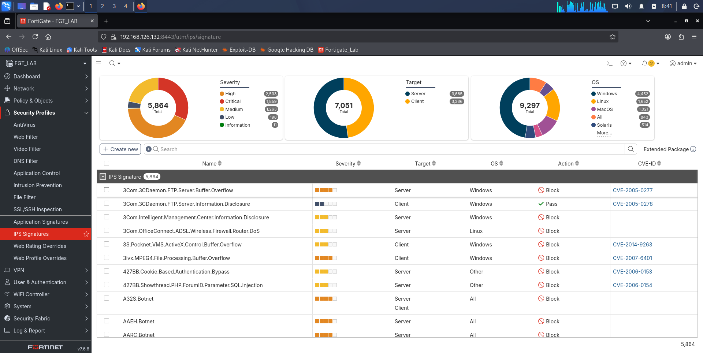
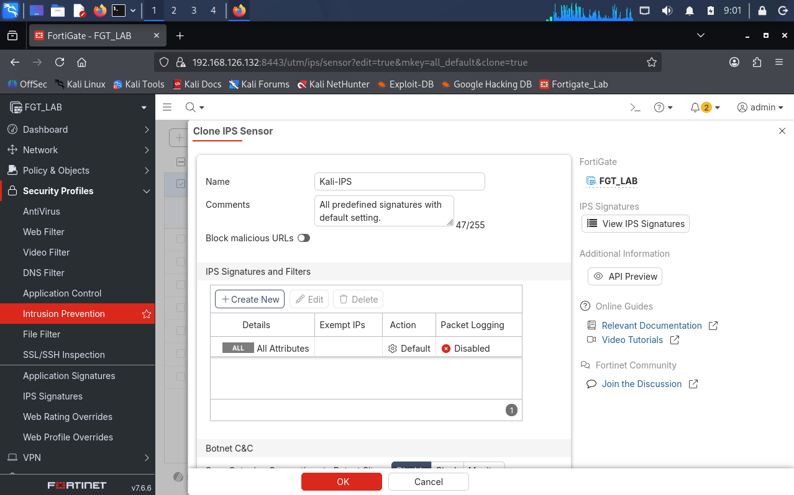
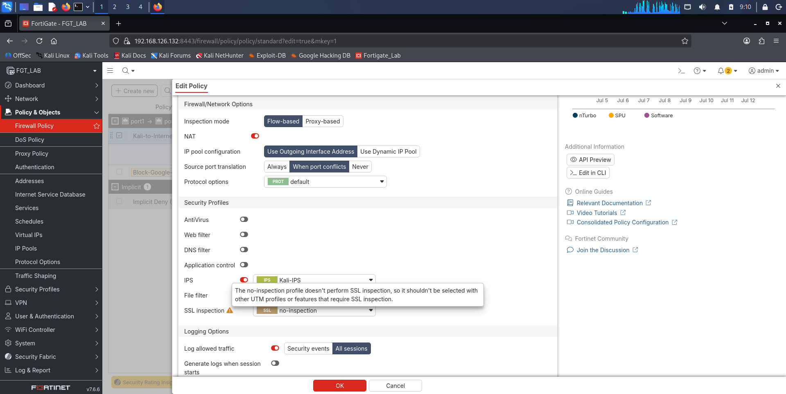
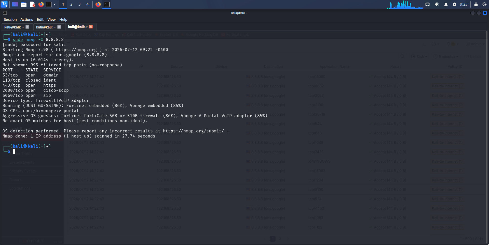
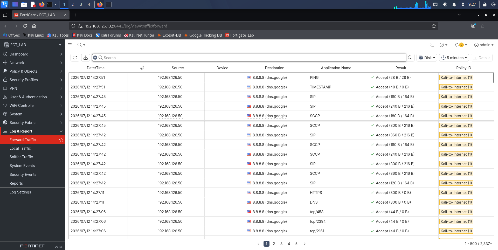
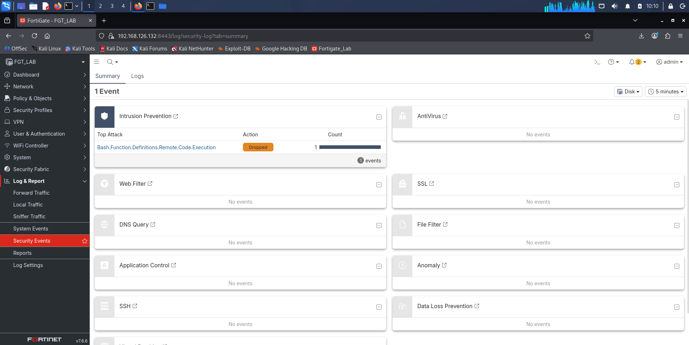
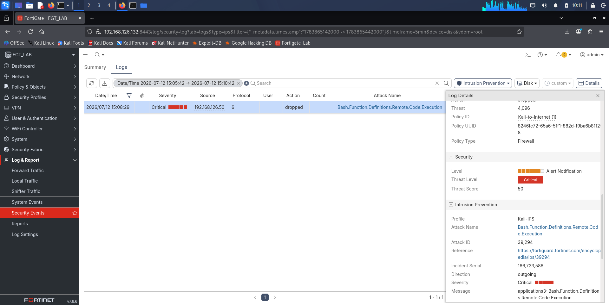
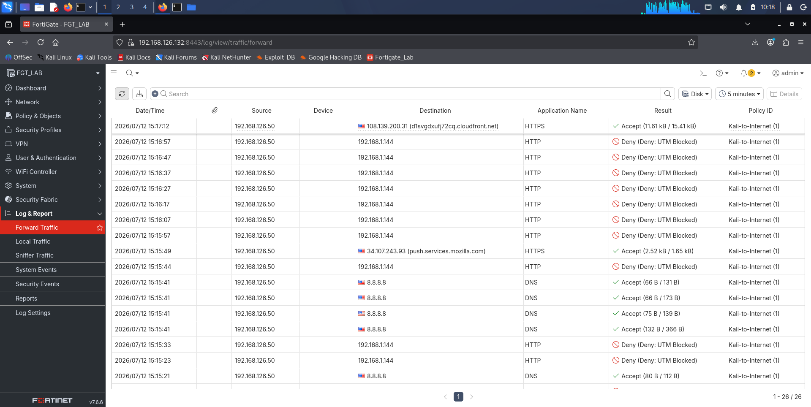

**Date:** July 12, 2026
**Lab Environment:** FortiGate 7.6.6 VM | GNS3 + VMware | Kali Linux (192.168.126.50) | Windows Host

---

## Objective

Configure and test the FortiGate IPS engine using a custom IPS profile applied to the standard firewall policy. Generate attack traffic from Kali Linux toward a Windows VM acting as a local HTTP server, observe how FortiGate detects and blocks known exploit signatures in real time, and document what the IPS logs reveal.

---

## Tools Used

- FortiGate 7.6.6 VM (GNS3 running on VMware)
- FortiGate GUI (accessed from Kali Firefox at https://192.168.126.132:8443)
- Kali Linux (192.168.126.50) — test machine generating attack traffic
- Windows VM (192.168.1.x) — target running Python http.server on port 80
- curl — used to send exploit payloads from the Kali terminal
- Nikto — automated web vulnerability scanner
- FortiGate Log and Report module (Forward Traffic and Security Events)

---

## Lab Architecture

This lab added a second machine into the topology for the first time. Previous labs used Kali as the only internal client with all traffic going outbound to the internet. Here the Windows VM was set up as an internal target on a separate subnet with FortiGate sitting between Kali and the Windows VM to inspect the traffic between them.

```
Kali (192.168.126.50) → port1 → FortiGate → port2 → Windows VM (192.168.1.x)
```

This setup means all traffic from Kali to the Windows VM passes through FortiGate's IPS engine before reaching the target. That is the required architecture for IPS to inspect and act on the sessions.

---

## What I Originally Planned vs What Actually Happened

### Original Plan

The original plan was to run nmap scans from Kali toward 8.8.8.8 (Google's public DNS server), using different scan types to generate reconnaissance traffic. The idea was that nmap's probe patterns would match IPS signatures in FortiGate's local database and trigger entries in Security Events.

### The Roadblock

After running all five nmap tests against 8.8.8.8, no IPS entries appeared in Security Events. Forward Traffic showed the nmap sessions passing through FortiGate with plain Accept and no UTM action. The IPS profile was confirmed active on the policy. The issue was not a configuration problem.

Two things worked against the original plan. The FortiGate 7.6.6 trial VM ships with a static IPS database from around 2018 and nmap has changed significantly since then, so the current probe formats may not match older signatures. On top of that, scanning an internet target means FortiGate sees outbound probes going out but Google's infrastructure does not respond to most of nmap's crafted packets in a way that completes the session patterns the signatures look for.

### How It Was Resolved

After reviewing the situation, the approach was changed to use a local Windows VM as the target and switch from scanning tools to active exploit delivery tools.

Setting up a Python HTTP server on the Windows VM gave FortiGate a real HTTP session to inspect rather than outbound probes going nowhere. Two methods then produced confirmed IPS detections.

The first was a curl command sending a Shellshock (CVE-2014-6271) payload in the HTTP User-Agent header. The second was Nikto, which fires a large number of malicious HTTP requests in quick succession. Both triggered IPS signature ID 39294 (`Bash.Function.Definitions.Remote.Code.Execution`) with a dropped action on every matched request.

Documenting this troubleshooting process was worth including rather than removing it. Nmap scanning labs are common in portfolios. Getting a real CVE exploit signature to fire with log evidence showing what FortiGate did about it is a stronger demonstration of how IPS works.

---

## Phase 1: IPS Signature Database Status

Navigated to System > FortiGuard. The page only showed the Virtual Machine Evaluation License. No IPS database version or last updated date was visible under the eval license.

Navigated separately to Security Profiles > IPS Signatures. The database contains 5,864 signatures. This confirms the local signature database is present and populated even though the FortiGuard page does not display the version details on this license.



---

## Phase 2: Create the IPS Profile

Navigated to Security Profiles > Intrusion Prevention.

Cloned the `all_default` profile and renamed it `Kali-IPS`. This profile includes all 5,864 signatures with their default actions. Critical and high severity signatures default to block or reset. Lower severity ones default to alert or monitor only.



---

## Phase 3: Apply the IPS Profile to the Policy

Navigated to Policy and Objects > Firewall Policy. Edited the Kali to Internet policy. Set IPS to Kali-IPS. Left SSL Inspection on no-inspection.

FortiGate showed the same warning that appeared in Labs 07 and 08:

```
"The no-inspection profile doesn't perform SSL inspection, so it shouldn't
be selected with other UTM profiles or features that require SSL inspection."
```

This is expected and not a problem for this lab. The test traffic is plain HTTP on port 80 and IPS does not need SSL inspection to read HTTP headers and payload.



---

## Phase 4: Baseline Nmap Tests (No IPS Triggers — Documented)

The following nmap commands were run from Kali against 8.8.8.8 in sequence with about 30 seconds between each test.

**Test 1 — Basic connectivity:**
```bash
ping -c 4 8.8.8.8
```
Confirmed outbound connectivity. Appeared in Forward Traffic as accepted ICMP. No IPS event expected and none observed.

**Test 2 — TCP SYN scan:**
```bash
sudo nmap -sS 8.8.8.8
```
Ports 53, 443, and a few others showed as visible. Passed through FortiGate with Accept. No IPS event.

**Test 3 — Service version detection:**
```bash
sudo nmap -sV 8.8.8.8
```
Scan took 174 seconds. Services returned as tcpwrapped. Passed through with Accept. No IPS event.

**Test 4 — OS fingerprinting:**
```bash
sudo nmap -O 8.8.8.8
```
Passed through with Accept. No IPS event.

**Test 5 — Aggressive combined scan:**
```bash
sudo nmap -A 8.8.8.8
```
Scan took 199 seconds. Passed through with Accept. No IPS event.

After all five tests, Security Events showed no IPS entries. Forward Traffic showed all sessions from Kali to 8.8.8.8 with plain Accept and no UTM action. The approach was changed after this.





---

## Phase 5: Switch to Local Target — Windows VM HTTP Server

A Python HTTP server was started on the Windows VM to create a plain HTTP endpoint on port 80 for FortiGate to inspect:

```cmd
python -m http.server 80
```

All subsequent test traffic from Kali was directed at the Windows VM instead of the internet. This puts FortiGate fully in between the test machine and the target and gives the IPS engine a complete HTTP session to inspect rather than one-sided outbound probes.

---

## Phase 6: CVE-2014-6271 Shellshock — IPS Triggered

The Shellshock vulnerability (CVE-2014-6271) involves a flaw in how older versions of the Bash shell handle function definitions passed through environment variables. When a web server passes HTTP headers into a CGI environment, a malicious User-Agent header containing the Shellshock payload can cause Bash to execute commands it should not.

The payload was delivered from Kali using curl:

```bash
curl -H 'User-Agent: () { :;}; echo Content-Type: text/plain; echo; /bin/bash -c "id"' http://192.168.1.x/
```

The curl connection froze and returned an empty reply. This is the IPS engine dropping the packet and resetting the TCP session before the server could process the request.

FortiGate logged a critical severity IPS event immediately:

```
attack="Bash.Function.Definitions.Remote.Code.Execution"
attackid=39294
action="dropped"
severity="critical"
srcip=192.168.126.50
dstip=192.168.1.x
service="HTTP"
profile="Kali-IPS"
```





---

## Phase 7: Nikto Vulnerability Scan — Volume of IPS Triggers

Nikto is an automated web vulnerability scanner. When pointed at a target it fires hundreds of requests covering known vulnerabilities, directory paths, and malicious header injection patterns in quick succession.

```bash
nikto -h http://192.168.1.x
```

Nikto began timing out almost immediately after starting. The reason is that FortiGate's IPS engine recognised the Shellshock style User-Agent headers that Nikto sends as part of its default scan and started dropping those sessions before they reached the Windows VM.

The IPS logs showed a continuous stream of `Bash.Function.Definitions.Remote.Code.Execution` detections across different URL paths that Nikto was probing:

```
url="/admin.cgi"           action="dropped"
url="/administrator.cgi"   action="dropped"
url="/authLogin.cgi"       action="dropped"
url="/bb-hist.sh"          action="dropped"
url="/banner.cgi"          action="dropped"
url="/book.cgi"            action="dropped"
url="/cgiinfo.cgi"         action="dropped"
url="/cgitest.py"          action="dropped"
```

Each entry carried the same signature ID 39294, critical severity, and dropped action. The log timestamps showed entries arriving roughly every 10 seconds across the 15:08 to 15:15 window, covering the full duration of the Nikto scan.

The corresponding Forward Traffic entries showed these sessions as `action="timeout"` with `utmaction="block"` and `countips=1`, confirming FortiGate blocked the IPS matched sessions before they could complete.

---

## Observations

### IPS Log Fields Observed

From the raw exported IPS logs, the key fields per entry were:

| Field | Value |
|---|---|
| `type` | `utm` |
| `subtype` | `ips` |
| `eventtype` | `signature` |
| `severity` | `critical` |
| `attack` | `Bash.Function.Definitions.Remote.Code.Execution` |
| `attackid` | `39294` |
| `action` | `dropped` |
| `service` | `HTTP` |
| `srcip` | `192.168.126.50` |
| `dstip` | `192.168.1.x` |
| `profile` | `Kali-IPS` |
| `url` | `/admin.cgi` (varies per Nikto request) |

The `agent` field captured the malicious User-Agent string from the HTTP header, which is proof the IPS engine was reading inside the HTTP session and not just matching on IP address or port number.

### Forward Traffic Correlation

The Forward Traffic log entries for the same sessions showed:

- `action="timeout"` — the TCP session was never properly closed because FortiGate dropped the packets mid-session
- `utmaction="block"` — the IPS engine triggered the block
- `countips=1` — one IPS signature matched per session
- `crscore=50` — FortiGate's risk score for critical severity

Sessions that did not match the Shellshock signature (such as Nikto's initial handshake requests) showed `action="close"` with no `utmaction` field, which is the normal completed session indicator.



---

## Key Findings

**Finding 1: IPS works at the HTTP payload level, not just IP and port**

The IPS engine matched the Shellshock signature by reading the HTTP User-Agent header content, not by IP address, port number, or connection volume. The `agent` field in the IPS log shows the exact string that triggered the match. This is a different level of inspection from a standard firewall deny rule which only looks at source IP, destination IP, and port.

**Finding 2: The action field tells you what FortiGate did, not just what it saw**

`action="dropped"` in the IPS log means FortiGate discarded the matching packets. The corresponding Forward Traffic entry shows `action="timeout"` because from a session perspective the TCP connection never got a proper response. The attacker's curl or Nikto client was left waiting until it timed out. The combination of `dropped` in the IPS log and `utmaction="block"` in the Forward Traffic log gives the full picture of a blocked event.

**Finding 3: A 2018 signature database still catches known CVEs reliably**

CVE-2014-6271 (Shellshock) is over ten years old and signature ID 39294 is present and working in this trial database. Known and well-documented CVEs with stable attack patterns stay detectable long after the vulnerability was first published. What a stale database cannot catch is newer attack types and techniques that did not exist in 2018.

**Finding 4: The target type matters for IPS detection**

All five nmap scans against 8.8.8.8 passed through with no IPS detections. When the target was switched to the local Windows VM running an HTTP server, IPS detections appeared immediately. Scanning an internet target produces one sided probe traffic where the responses are inconsistent. Scanning a local HTTP server that actually responds gives FortiGate a complete session to inspect, which is what most signature matching depends on.

**Finding 5: countips=1 in Forward Traffic is the quick filter for IPS activity**

The `countips=1` field appears in Forward Traffic on every session where the IPS engine took action. For sessions with no IPS match it is absent. When reviewing a large number of Forward Traffic log entries, filtering by `countips > 0` is a fast way to find sessions where IPS acted before even opening Security Events.

**Finding 6: Nikto's scan pattern shows up as a clear attack timeline in the logs**

The Nikto generated IPS entries arrived roughly every 10 seconds across a 7 minute window, each targeting a different CGI path that Nikto cycles through. The URL field in each log entry shows the scanner working through its list methodically. In a SOC environment, repeated IPS hits from the same source IP against different URL paths in a short window is a recognisable automated scanner pattern.

---

## Lab Limitations and How They Were Handled

**Limitation 1: Nmap did not trigger IPS signatures against an internet target**

The original plan used nmap against 8.8.8.8. After all five scans produced no IPS events, the approach was changed to use a local Windows VM and active exploit tools. This is documented as a real troubleshooting decision rather than left out, because the reason why the static 2018 database may not match current nmap probe formats is itself a useful finding.

**Limitation 2: Trial license does not show the IPS database version in the GUI**

System > FortiGuard only showed the Virtual Machine Evaluation License with no IPS version date visible. The signature count of 5,864 was verified separately under Security Profiles > IPS Signatures. On a fully licensed production FortiGate, the FortiGuard page would show the IPS package version and last update timestamp, which is important for confirming how current the protection is.

---

## What an Analyst Would Do Next

1. When a single source IP generates multiple critical IPS detections in a short window, check whether it is an internal machine that should not be scanning, a compromised account, or an authorized test. The source IP in this lab was a known test machine but in a real environment that same pattern would be an immediate escalation trigger.

2. Correlate IPS events with Forward Traffic to confirm whether the block actually stopped the session. An `action="timeout"` with `utmaction="block"` means the payload was dropped. An alert-only entry with `action="close"` means the traffic was logged but passed through to the destination.

3. Check the destination of IPS hits. In this lab the target was an intentional test server. In production, IPS detections aimed at a database port or an admin interface raise the urgency significantly compared to detections aimed at a general purpose server.

4. Verify IPS database currency as part of any routine security review. A 2018 database covers well-known CVEs from that period but is blind to anything discovered since. On a licensed FortiGate, checking the last IPS update date and confirming automatic updates are enabled is a standard health check.

5. Look at the timestamp distribution across IPS events. The Nikto scan in this lab produced entries every 10 seconds for 7 minutes. A sudden burst followed by silence can mean the attacker stopped. A slow and steady trickle may mean they are throttling the scan to stay under rate based detection. The timing pattern in the log tells that story.
