**Date:** July 30, 2026

**Lab Environment:** FortiGate 7.6.6 VM | GNS3 + VMware | Kali Linux (192.168.126.50) | Windows Host

**Lab Status:** Partial — IKEv2 Phase 1 handshake confirmed successful. Full tunnel completion blocked by vendor ecosystem and firmware constraints documented below.

---

## Objective

Configure a full tunnel IPsec Remote Access VPN on FortiGate, connect a client machine through it, and verify that all traffic routes through FortiGate's inspection engine before reaching the internet. The secondary objective was to confirm whether the eval license (LENC) restricts IPsec the same way it restricted SSL deep inspection in Labs 06 and 07.

---

## Tools Used

- FortiGate 7.6.6 VM (GNS3 running on VMware)
- FortiGate GUI and CLI (accessed from Windows host browser)
- Kali Linux (192.168.126.50) — primary test client
- Windows host machine — secondary test client
- strongSwan (open source IKEv2 daemon installed on Kali)
- FortiClient standalone Linux .deb package
- FortiClient Windows VPN-only edition
- FortiGate Log and Report module (Forward Traffic and VPN Events)

---

## Lab Architecture

```
Kali Linux (192.168.126.50)
    |
    | Adapter 2 (Host-Only, bridged to VMnet1)
    |
[Windows Network Bridge]
    |
VMware VMnet1
    |
GNS3 Cloud Node
    |
FortiGate Port 1 (LAN / Dial-Up Listener): 192.168.126.132/24
FortiGate Port 2 (WAN): 192.168.42.213 (DHCP/NAT)
    |
Internet
```

VPN client IP pool assigned to connected endpoints: 10.10.10.1 to 10.10.10.100

---

## Important Note on the VPN Wizard

Before getting into the lab steps, this is worth stating clearly because it caused confusion during the session.

The VPN Wizard in FortiGate 7.6.6 creates IPsec tunnels only. It does not offer a choice between IPsec and SSL-VPN anywhere in the interface. There is no label that says IPsec because the wizard assumes it. Whatever name you give the tunnel, whatever settings you fill in, the wizard produces an IPsec configuration underneath. Corp-FullTunnel was an IPsec tunnel. Every other tunnel created through this wizard would also be IPsec.

SSL-VPN lives in a completely separate menu (VPN > SSL-VPN Settings) that was not present in this version of FortiGate at all. More on that in the troubleshooting section.

---

## Phase 1: Confirm the Listening Interface

Navigated to Network > Interfaces. Confirmed port1 was configured with IP 192.168.126.132/24. This is the interface FortiClient dials into when establishing the VPN connection.

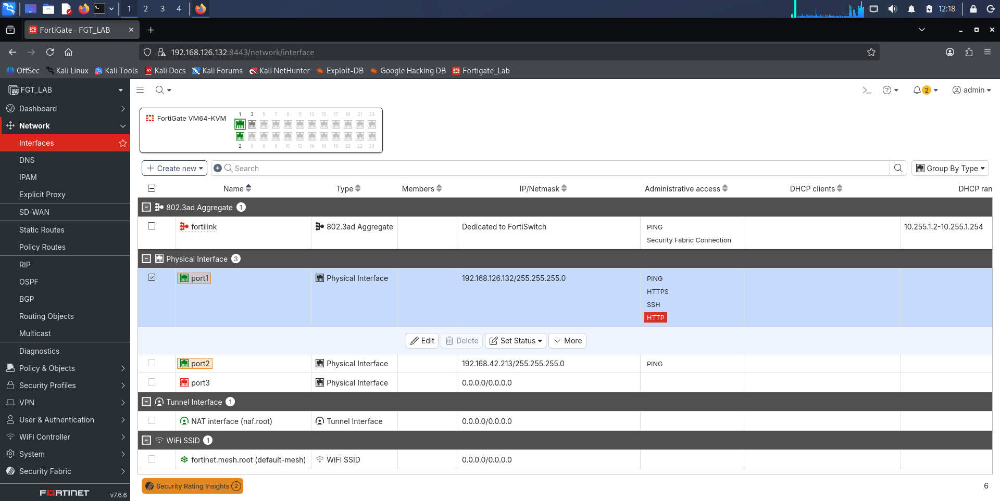

---

## Phase 2: Build the IPsec Tunnel via Wizard

Navigated to VPN > VPN Wizard. Created Corp-FullTunnel using the FortiClient Remote Access template.


**Final wizard configuration for Corp-FullTunnel:**

| Field | Value |
|---|---|
| Name | Corp-FullTunnel |
| Template | Remote Access |
| Remote Device Type | FortiClient (Windows, Mac, Linux) |
| Incoming Interface | port1 |
| Authentication Method | Pre-Shared Key |
| User Group | VPN-group |
| Client IP Pool Start | 10.10.10.1 |
| Client IP Pool End | 10.10.10.100 |
| Subnet for endpoints | 255.255.255.255 |
| Split Tunneling | Disabled (full tunnel mode) |
| Local Address | all |

**FortiClient settings configured inside the wizard:**

| Setting | Value |
|---|---|
| Security posture gateway matching | OFF (requires EMS) |
| EMS SN Verification | OFF (requires EMS) |
| Save password | ON |
| Auto Connect | OFF |
| Always up (keep alive) | ON |

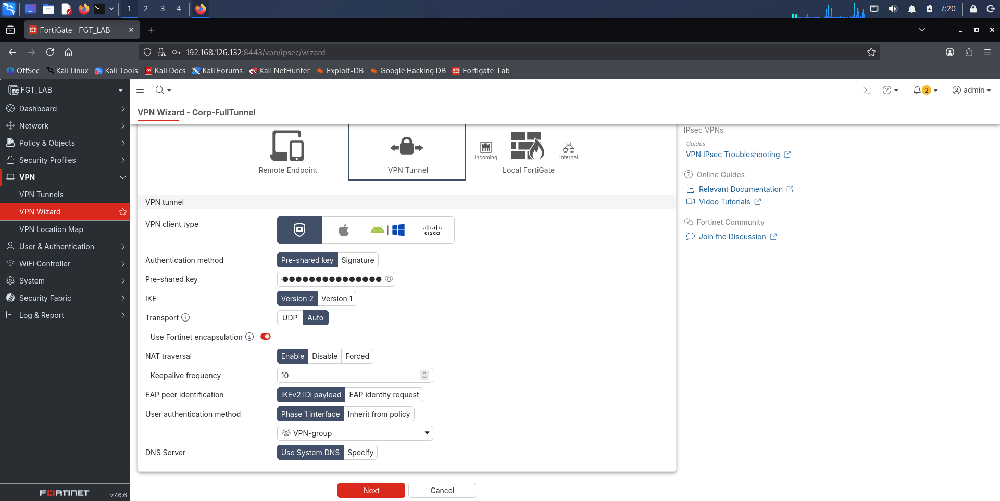

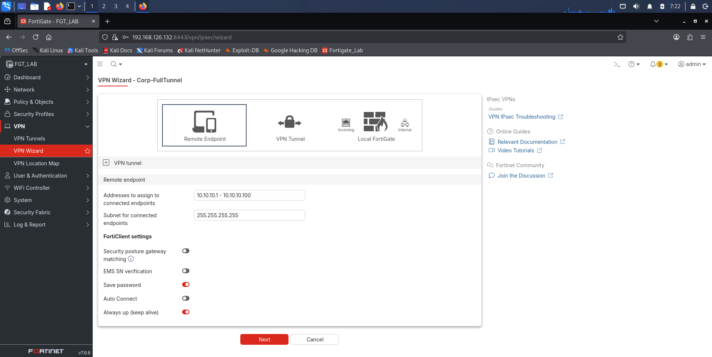

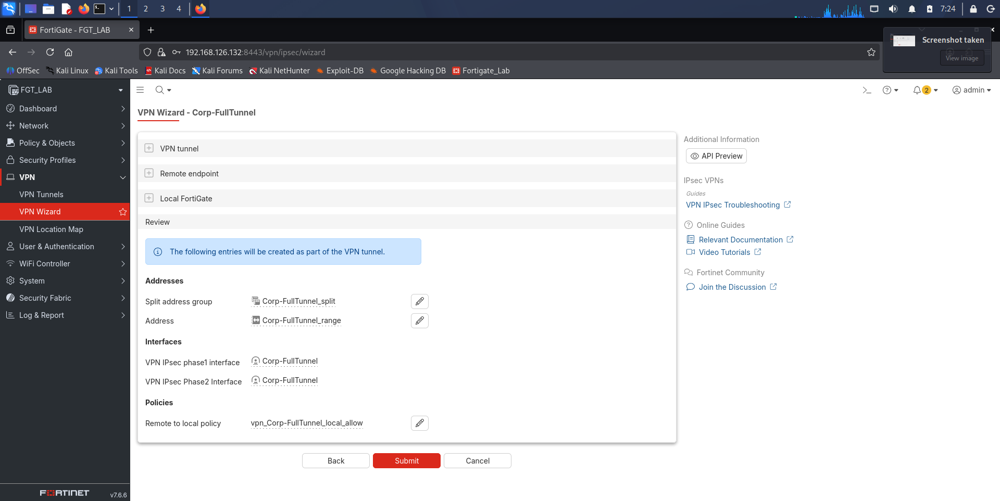

---

## Phase 3: User and Group Configuration

A new user group was created to control who can authenticate into the VPN.

Navigated to User and Authentication > User Groups. Created VPN-group and added two users: John and Sarah.

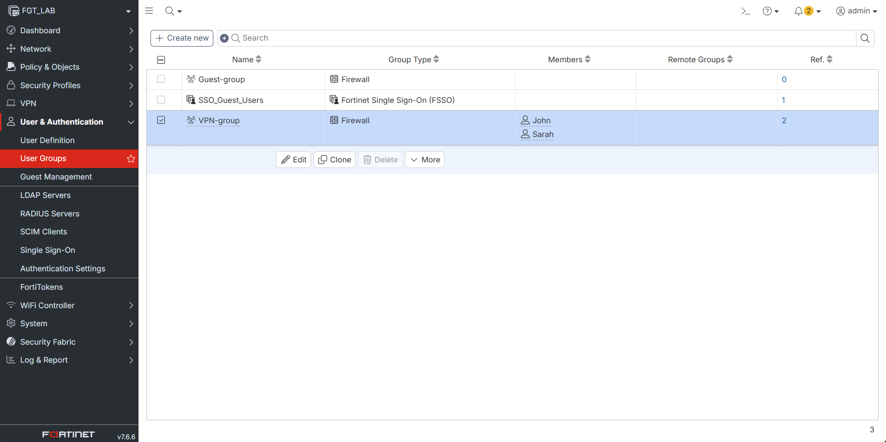

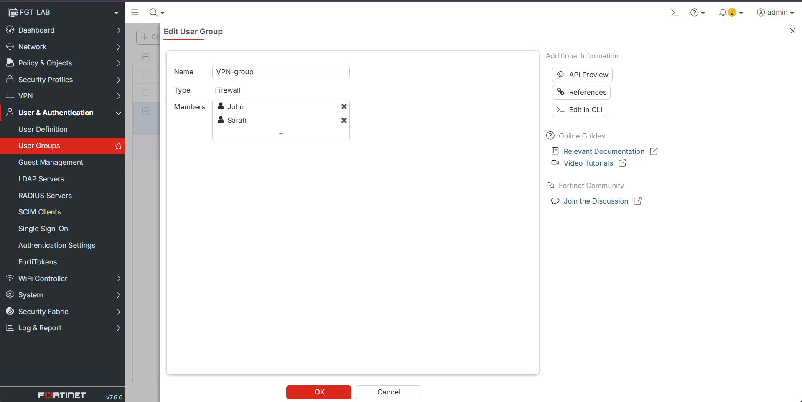

---

## Phase 4: Verify Auto-Generated Firewall Policies

The wizard automatically created firewall policies to allow traffic between the VPN tunnel interface and the internal LAN. Navigated to Policy and Objects > Firewall Policy to confirm they were in place. The policy was renamed to VPN-to-Internet.

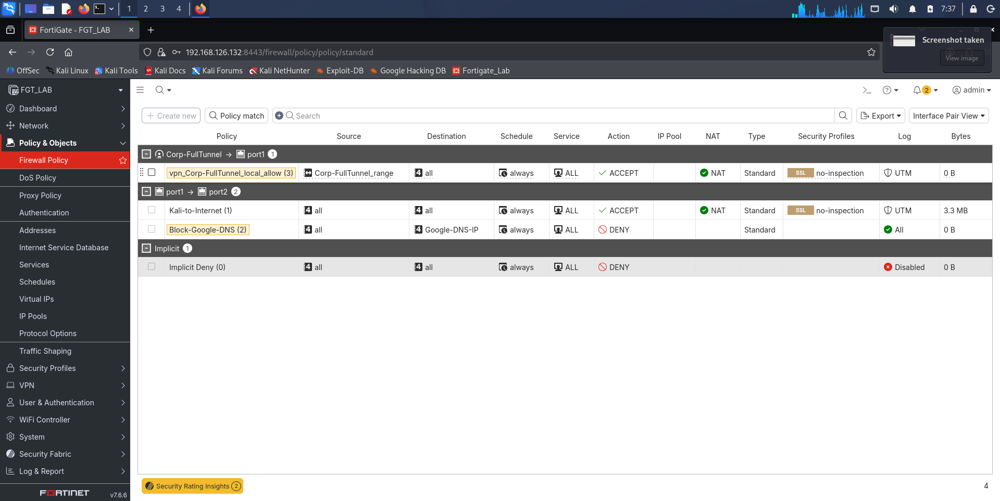

---

## Phase 5: LENC License Check for IPsec

The original secondary objective was to find out whether the eval license restricts IPsec the way it restricted SSL deep inspection in Labs 06 and 07.

The answer is no. IPsec does not require FortiGate to generate dynamic RSA certificates the way SSL deep inspection does. IPsec relies on Pre-Shared Keys and negotiated cipher proposals between the two endpoints. The eval license did not block any part of the IKEv2 negotiation. Phase 1 completed successfully and crypto proposals matched cleanly on both sides.

Every failure point in this lab was a vendor ecosystem or firmware decision, not a license restriction. The difference matters and is worth stating explicitly since every previous lab hitting a ceiling was LENC. This one was different.

---

## Troubleshooting Sequence

This lab had more troubleshooting than any previous one in the series. Six separate approaches were attempted before the session ended. Each one is documented below with the exact error and what caused it.

---

### Attempt 1: FortiClient on the Windows Host (Full Tunnel)

The first attempt used FortiClient installed directly on the Windows machine that also runs GNS3, VMware, and FortiGate.

FortiClient was configured and connected. The tunnel came up. Internet access on the host dropped immediately and the FortiGate GUI became unreachable.

**Root cause:** The Windows host is the physical machine running GNS3 and VMware. When FortiGate pushed a full tunnel default route to it, the host tried to route all its own traffic including GNS3 and VMware backend communication through the VPN. That broke the network path GNS3 depends on to run. This is a routing loop caused by using the hypervisor machine itself as the full tunnel VPN client.

**Resolution:** Disconnected FortiClient to restore internet access. The Windows host cannot be used as a full tunnel client when it is also the machine running the hypervisor.

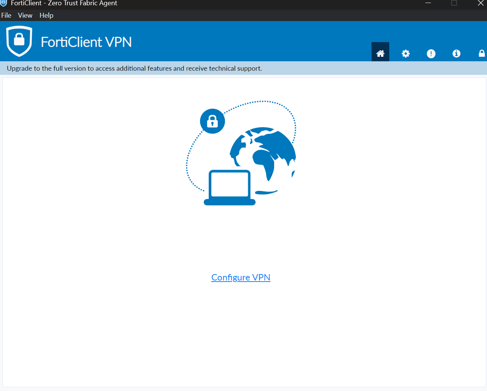

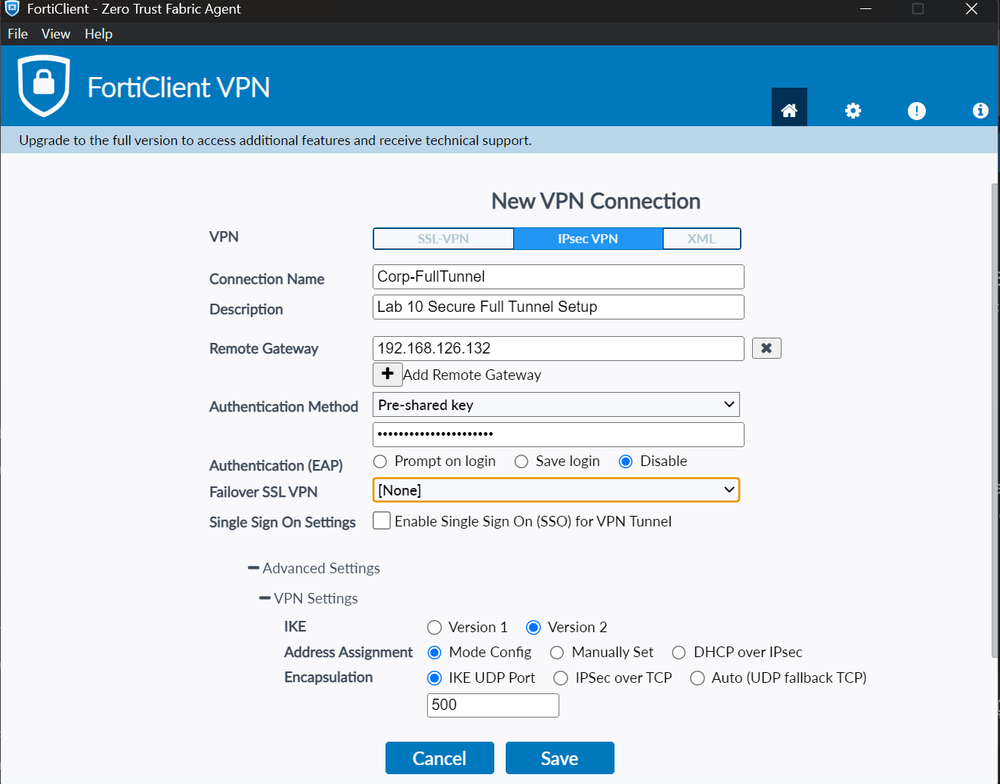

---

### Attempt 2: strongSwan on Kali Linux (IKEv2 CLI)

Kali was chosen as the next client because it is a fully isolated VM inside GNS3 and cannot cause the same routing loop.

strongSwan installed on Kali:
```bash
sudo apt update && sudo apt install strongswan libcharon-extra-plugins -y
```

**ipsec.secrets:**
```
%any 192.168.126.132 : PSK "FortinetFullTunnel123!"
```

**ipsec.conf (final version after cipher troubleshooting):**
```
config setup
    charondebug="ike 2, knl 2, cfg 2"

conn Corp-FullTunnel
    keyexchange=ikev2
    left=%any
    leftid=192.168.126.50
    leftauth=psk
    leftsourceip=%config
    right=192.168.126.132
    rightid=192.168.126.132
    rightauth=psk
    rightsubnet=0.0.0.0/0
    mobike=no
    ike=des-md5-modp1024,des-sha1-modp1024!
    esp=des-md5,des-sha1!
    auto=add
```

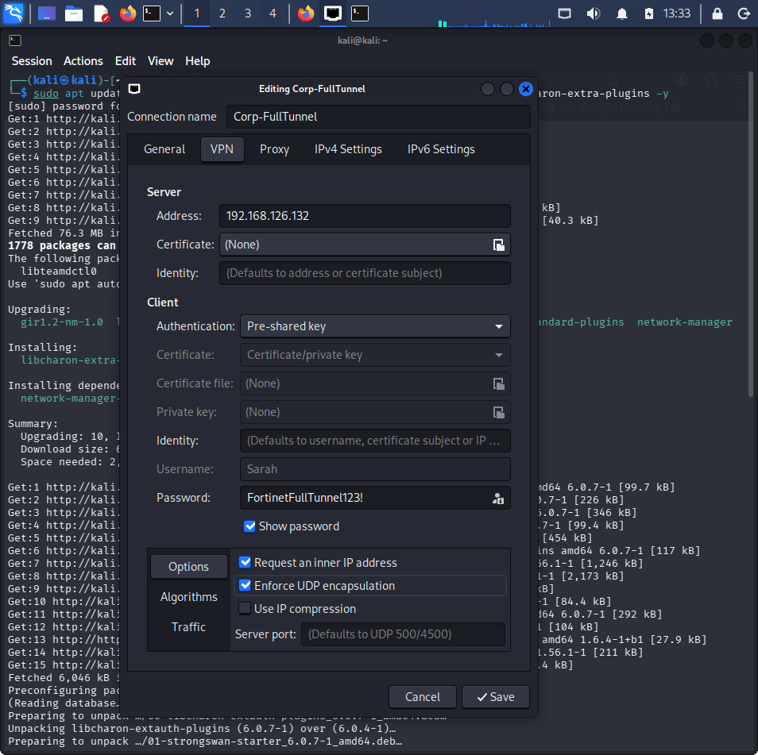

**Phase 1 output — confirmed successful:**
```
initiating IKE_SA Corp-FullTunnel[1] to 192.168.126.132
sending packet: from 192.168.126.50[500] to 192.168.126.132[500]
received packet: from 192.168.126.132[500] to 192.168.126.50[500]
selected proposal: IKE:DES_CBC/HMAC_MD5_96/PRF_HMAC_MD5/MODP_1024
authentication of '192.168.126.50' with pre-shared key
establishing CHILD_SA Corp-FullTunnel{1}
```

Phase 1 completed. The Pre-Shared Key matched. Diffie-Hellman Group 2 (MODP_1024) was agreed on by both sides. The cipher suite negotiated cleanly. Everything at the cryptographic layer worked.

**Where it failed — FortiGate debug output:**
```
ike V=root:0:Corp-FullTunnel:25: peer identifier IPV4_ADDR 192.168.126.50
ike V=root:0:Corp-FullTunnel:25: re-validate gw ID
ike V=root:0:Corp-FullTunnel:25: gw validation failed
ike V=root:Corp-FullTunnel Negotiate SA Error: gateway validation failed
```

**Root cause:** The tunnel was built using the FortiClient Wizard template. That template injects proprietary Fortinet vendor-specific parameters into the Phase 1 configuration including specific Peer ID requirements and FortiClient signature headers. When strongSwan sends its IKE_AUTH packet it sends a plain IP address as the peer identity. FortiGate compares that against what a real FortiClient app would send. They do not match. The gateway validation fails and the SA is deleted.

The handshake itself was correct. The failure was at the vendor identity check layer which only accepts the proprietary FortiClient header format.

**Additional issue during cipher troubleshooting:**

Before the correct cipher suite was found, strongSwan was defaulting to modern elliptic curve DH groups (20 and 21) which the eval license does not support. FortiGate was silently dropping packets and strongSwan was retransmitting on port 4500. The fix was to remove DH groups 20 and 21 from the FortiGate Phase 1 proposal and replace them with Groups 2, 5, and 14. The Kali config was updated to match. Phase 1 completed on the next attempt.

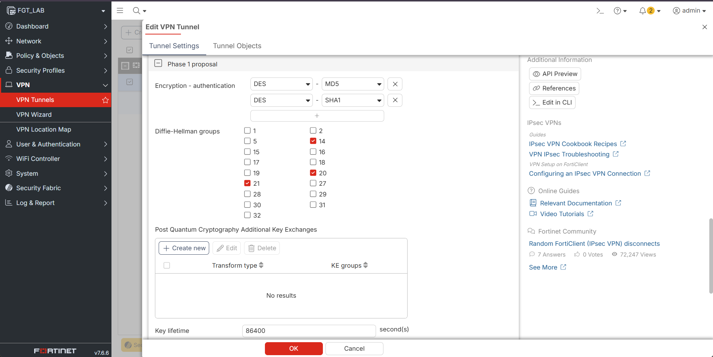

---

### Attempt 3: FortiGate CLI Override to Remove Vendor Validation

After the gateway validation failure, the approach was to modify the tunnel via CLI to accept generic IKEv2 clients.

**Command attempted:**
```
config vpn ipsec phase1-interface
    edit "Corp-FullTunnel"
        set mode-cfg enable
        set accept-type any
        set usrgrp "VPN-group"
    next
end
```

**Error:**
```
command parse error before 'usrgrp'
Command fail. Return code -61
```

**Root cause:** The tunnel was created through the FortiClient Wizard template which sets the object type as aggressive mode dial-up with specific internal schema dependencies. The FortiOS CLI parser rejects certain overrides on wizard-created objects because of these schema conflicts. Return code -61 is the expected result when a CLI command conflicts with how the object was originally constructed.

---

### Attempt 4: FortiClient Linux (Enterprise Repository)

With CLI overrides blocked, the next attempt was to install the official FortiClient app on Kali so it could send the correct proprietary headers FortiGate expects.

Repository setup commands:
```bash
wget -O - https://repo.fortinet.com/repo/forticlient/debian/DEB-GPG-KEY | sudo gpg --dearmor -o /usr/share/keyrings/fortinet-archive-keyring.gpg

echo "deb [signed-by=/usr/share/keyrings/fortinet-archive-keyring.gpg] https://repo.fortinet.com/repo/forticlient/debian/ stable main" | sudo tee /etc/apt/sources.list.d/forticlient.list

sudo apt update
sudo apt install forticlient -y
```

**Error:**
```
HTTP 404 Not Found
```

**Root cause:** Fortinet restructured its repository paths. The generic `/debian/ stable main` path no longer exists. Fixed by updating the source to:
```
deb [arch=amd64 signed-by=/usr/share/keyrings/repo.fortinet.com.gpg] https://repo.fortinet.com/repo/forticlient/8.0/ubuntu/ stable non-free
```

After correcting the path, FortiClient installed but launched directly to a registration screen:

```
Register EMS Zero Trust Telemetry
```

Entering FortiGate IP returned:
```
EMS was not found
```

**Root cause:** Enterprise Linux FortiClient requires a FortiClient EMS (Endpoint Management Server) license. FortiGate is a firewall, not an EMS server. Without EMS registration the entire VPN configuration tab stays hidden.

---

### Attempt 5: FortiClient Standalone .deb Package

The standalone VPN-only build from forticlient.com/downloads was tried to bypass the EMS requirement.

```bash
cd ~/Downloads
sudo apt install ./forticlient_vpn_*_amd64.deb -y
```

The app opened to the Remote Access tab with no EMS prompt. Clicked Configure VPN. The dropdown showed two options: SSL-VPN and XML. IPsec VPN was not listed.

**Root cause:** Fortinet does not include the IPsec stack in the free standalone Linux FortiClient binary. On Linux, IPsec is only available in enterprise EMS-managed builds. Free Windows and macOS standalone builds include IPsec. Free Linux standalone does not. This is a deliberate compilation decision by Fortinet, not an installation error.

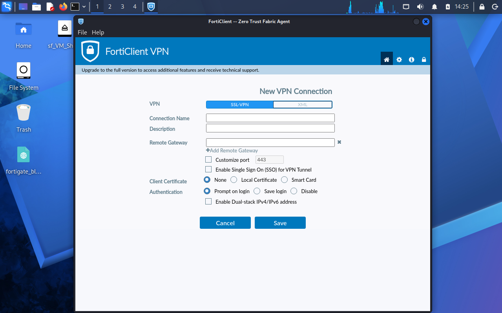

---

### Attempt 6: SSL-VPN Pivot (FortiOS 7.6 Firmware Removal)

Since the Linux standalone FortiClient only showed SSL-VPN, the approach shifted to configuring SSL-VPN on FortiGate so the Linux client could connect over it.

VPN > SSL-VPN Settings was not in the FortiGate GUI sidebar. Only VPN Tunnel, VPN Wizard, and VPN Location Map appeared under VPN.

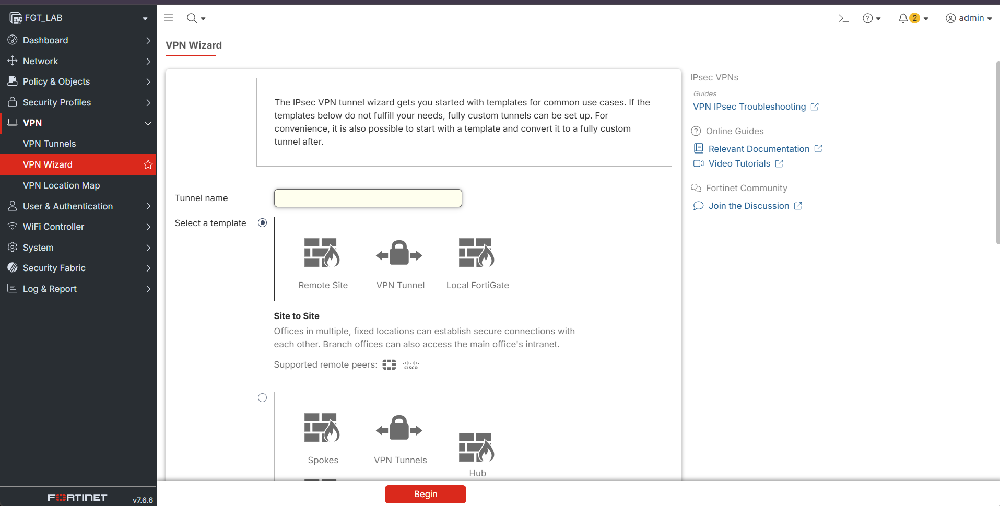

A CLI command was attempted to unhide the SSL-VPN menu:
```
config system settings
    set gui-sslvpn enable
end
```

**Error:**
```
value parse error before 'enable'
Command fail. Return code -1
```

**Root cause:** Fortinet permanently removed SSL-VPN Tunnel Mode from FortiOS 7.4.4 and above including all VM trial builds. The decision followed severe vulnerabilities in the SSL-VPN engine (CVE-2024-21762). Return code -1 means the underlying feature code no longer exists in the firmware binary. This is not a hidden setting. There is no path around it on FortiOS 7.6.

---

## What 90% Success Actually Looks Like

The cryptographic and network work in this lab was largely successful. Every failure was a vendor ecosystem or firmware decision, not a configuration error.

**What worked:**
- Network routing between Kali and FortiGate confirmed via ICMP
- IKEv2 Phase 1 SA_INIT completed with Diffie-Hellman Group 2 key exchange
- Pre-Shared Key authentication confirmed matched on both sides
- Cipher proposal negotiated: DES-CBC / HMAC-MD5 / MODP-1024
- VPN user group created with two members
- Wizard-generated firewall policies confirmed present and correctly structured

**What blocked completion:**
- Gateway validation failure because strongSwan does not send proprietary FortiClient vendor ID headers
- CLI schema conflict on wizard-created object (Return code -61)
- Linux FortiClient standalone binary excludes IPsec stack
- FortiOS 7.6 SSL-VPN tunnel mode permanently removed (Return code -1)

---

## Error Reference Table

| Attempt | Tool | Error | Root Cause |
|---|---|---|---|
| Windows host full tunnel | FortiClient Windows | Routing loop, lost internet and GUI | Host is also the hypervisor, full tunnel breaks GNS3 routing |
| Kali strongSwan | IKEv2 CLI | gw validation failed | Wizard tunnel expects proprietary FortiClient peer ID headers |
| FortiGate CLI override | CLI | Return code -61 | Schema conflict on wizard-created dial-up object |
| FortiClient repo install | apt install | HTTP 404 Not Found | Deprecated repository path on Fortinet CDN |
| FortiClient enterprise | Linux app v8 | EMS was not found | Enterprise Linux client requires EMS license |
| FortiClient standalone | .deb package | No IPsec VPN option | Free Linux binary excludes IPsec stack by design |
| SSL-VPN enable | CLI | Return code -1 | FortiOS 7.4+ permanently removed SSL-VPN tunnel mode |

---

## Key Findings

**Finding 1: The eval license does not restrict IPsec**

IPsec does not depend on FortiGate generating RSA certificates the way SSL deep inspection does. It uses Pre-Shared Keys and negotiated cipher proposals. The eval license placed no ceiling on any part of the IKEv2 negotiation. This is a direct contrast to Labs 06, 07, and 08 where the LENC license was the ceiling. Here the ceiling was vendor software, not the license.

**Finding 2: Phase 1 success does not mean the tunnel is established**

strongSwan showed a fully successful Phase 1 handshake with cipher agreement, PSK authentication, and DH key exchange all completing. The tunnel still failed at gateway validation. This is the same pattern from Labs 04 and 06 where the log showed Accept while the session had not actually completed. Success at one layer does not guarantee success at the next.

**Finding 3: The VPN Wizard builds tunnels that only accept genuine FortiClient connections**

The wizard injects proprietary Fortinet vendor identity headers into the Phase 1 configuration. Any client that does not send those headers will fail gateway validation. strongSwan is a standards-compliant IKEv2 implementation and sends a plain IP address as its peer identity. That is enough to make the FortiGate tunnel reject it. Nothing in the wizard UI explains this.

**Finding 4: Linux FortiClient and Windows FortiClient are not the same product**

Free standalone FortiClient on Linux supports only SSL-VPN. Free standalone FortiClient on Windows supports IPsec. Enterprise Linux repository FortiClient supports neither without EMS. Testing IPsec from a Linux client using any free FortiClient build will not succeed.

**Finding 5: SSL-VPN tunnel mode does not exist in FortiOS 7.4 and above**

The firmware binary no longer contains the SSL-VPN tunnel mode code. The GUI menu is absent because the feature was removed, not disabled. Return code -1 on the CLI command confirms the code is gone. This was a deliberate security decision by Fortinet following a series of critical CVEs in the SSL-VPN engine.

**Finding 6: Documenting a vendor ceiling is as valid as completing a lab**

The routing was correct. The crypto worked. The PSK matched. The DH groups negotiated. At the 90% mark the lab hit vendor software decisions that no configuration change can resolve. Identifying exactly where and why something cannot work in a specific environment is a real skill, and it is what this lab demonstrates.

---

## Lab Limitations

**Limitation 1: No isolated Windows VM was used**

The original plan used a Windows VM as the FortiClient client. This was not done because the laptop does not have enough resources to run GNS3, VMware, FortiGate, Kali, and a Windows VM simultaneously. The lab was redesigned around what the hardware can support.

**Limitation 2: Windows host cannot be a full tunnel VPN client in this setup**

Discovered during testing. Full tunnel mode on the host machine creates a routing loop that breaks GNS3 and internet access at the same time. Split tunnel mode would avoid this because it only routes specific lab subnet traffic through FortiGate while leaving the host's own internet traffic on its normal path.

**Limitation 3: No clean connected state screenshot was captured**

The gateway validation failure on Kali and the missing IPsec stack on Linux FortiClient together prevented a clean connected tunnel from being reached. This is documented as a limitation rather than left out.

---

## What an Analyst Would Do Next

1. Test FortiClient on the Windows host again using split tunnel mode instead of full tunnel. Split tunnel only routes lab subnet traffic through FortiGate and leaves the host's internet connection alone so the routing loop cannot happen.

2. After a successful connection, check Log and Report > VPN Events to see the full IKE Phase 1 and Phase 2 negotiation sequence logged by FortiGate. That log shows the SA establishment, user authentication result, and IP address assigned from the pool.

3. Cross-reference the VPN Events log with the Forward Traffic log using the session timestamp. A Forward Traffic entry sourced from the VPN pool address (10.10.10.x) confirms traffic is routing through the tunnel and through FortiGate's inspection engine. This is the same cross-log correlation technique used in Labs 07 and 09.
