**Date:** August 20, 2026

**Series:** FortiGate Security Operations Lab Series (Final Lab)

**Lab Environment:** FortiGate 7.6.6 VM (GNS3/VMware Workstation) | Kali Linux | Windows Host | Splunk Enterprise Free (127.0.0.1:8000)

---

## Objective

Every lab in this series up to now lived entirely inside FortiGate's own logs: Security Events, Forward Traffic, IPS logs, and VPN Monitor. This lab bridges FortiGate to Splunk so those findings become in an external SIEM, which is how an actual SOC environment works.

The goal was to forward FortiGate logs via syslog into Splunk, confirm the data arrived correctly, and build a small dashboard that correlates a real detection (the Lab 09 IPS event) from FortiGate all the way through to a Splunk panel.

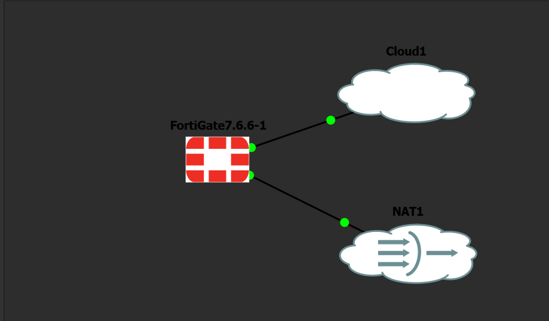

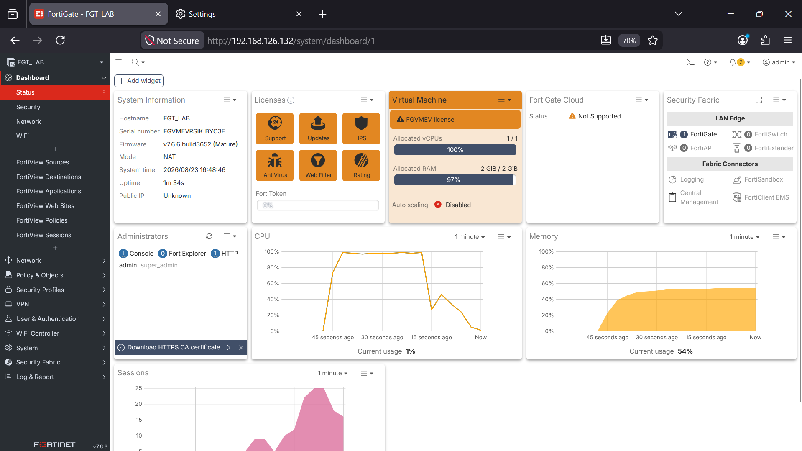

---

## Phase 1: Configure FortiGate to Send Syslog

Before touching FortiGate's syslog settings, the correct destination IP was needed. The Windows host has multiple adapters and not all of them are reachable from FortiGate. The right one is the Bridged Adapter created in earlier labs.

Ran `ipconfig` on the Windows host and identified the bridged adapter IP: `192.168.126.141`.

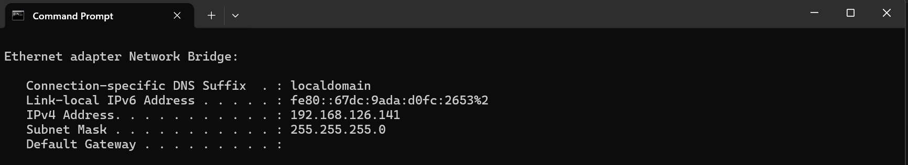

Rather than configure syslog and troubleshoot blind afterward, reachability was confirmed first from the FortiGate CLI:

```
ping 192.168.126.141
```

This succeeded, confirming FortiGate could reach the Windows host before any syslog setting was saved.

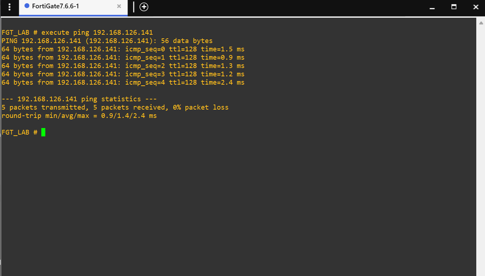

Syslog forwarding was then enabled from Log and Report > Log Settings. The GUI toggle turns syslog on or off but does not expose port or facility controls. Those only exist in the CLI. This is a FortiOS 7.6 GUI design choice, not a licensing restriction.

From the CLI console:

```
config log syslogd setting
    set status enable
    set server 192.168.126.141
    set mode udp
    set port 9514
    set facility local0
end
```

Verified with:

```
show log syslogd setting
```

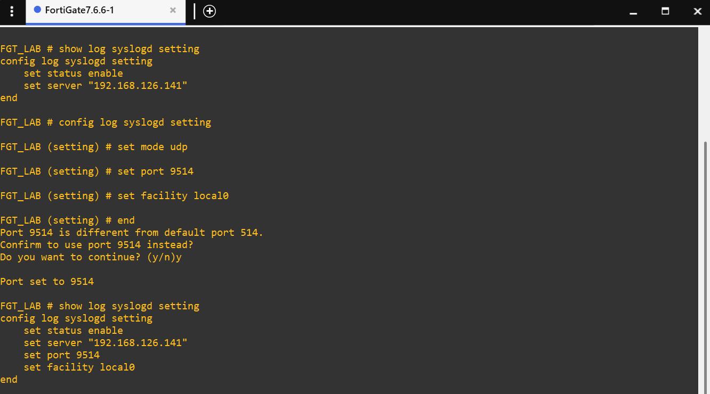

---

## Phase 2: Create a Splunk UDP Data Input

In Splunk Web (127.0.0.1:8000): Settings > Data Inputs > UDP > Add New.

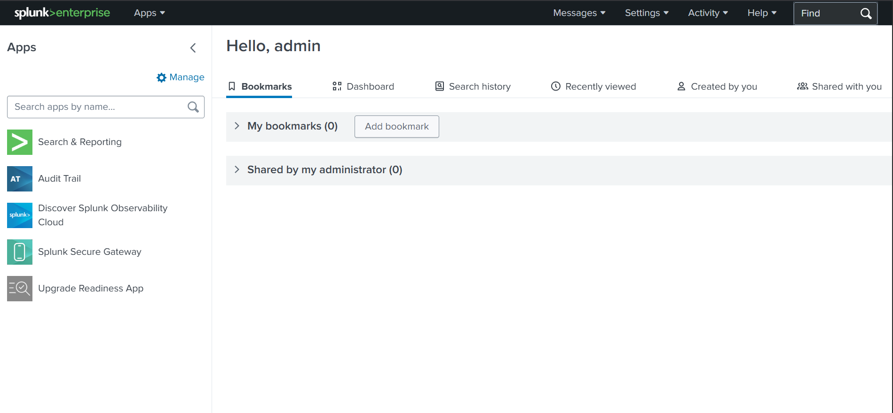

| Field | Value |
|---|---|
| Port | 9514 (matching the port set on FortiGate) |
| Source type | Operating System > syslog |
| App Context | Search and Reporting |
| Index | main |

The source type `fortinet:fortigate` was searched for during setup and was not present in this Splunk installation. Falling back to the generic `syslog` source type is a documented and expected outcome when a dedicated Fortinet Splunk app is not installed. This is noted as a limitation, not a failure. As Phase 5 showed, generic syslog still produced clean, queryable fields because FortiGate's log format already uses key=value pairs.

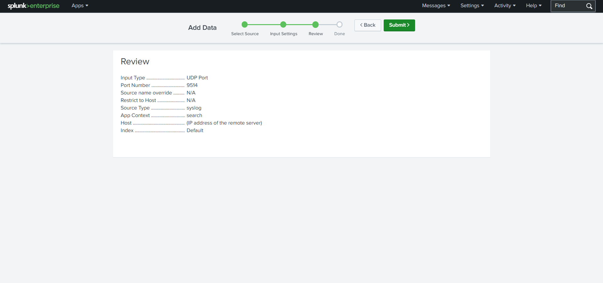

Windows Defender Firewall silently drops inbound UDP traffic on any port with no matching inbound rule. There is no error on either the FortiGate side or the Splunk side. The packets simply never arrive.

An inbound firewall rule was created via `wf.msc` > Inbound Rules > New Rule > Port > UDP > 9514 > Allow > all profiles. Named `Splunk Syslog UDP 9514`.

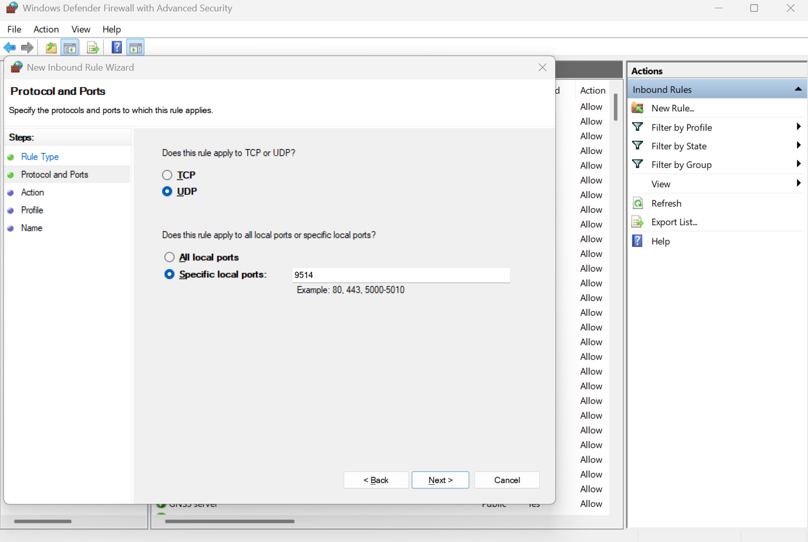

This is worth calling out on its own. Everything on both the FortiGate side and the Splunk side can be configured correctly and logs will still not arrive if the Windows inbound firewall rule is missing. Neither tool reports the problem directly.

---

## Phase 3: Generate Test Traffic

To generate a log with a known signature, the Lab 09 Shellshock (CVE-2014-6271) trigger was reused rather than creating a new test from scratch. Reusing a known event also confirms that the Splunk pipeline can reproduce findings already documented in the series.

On the Windows host, a plain HTTP server was started:

```
python -m http.server 80
```

From Kali:

```bash
curl -H 'User-Agent: () { :;}; echo Content-Type: text/plain; echo; /bin/bash -c "id"' http://192.168.1.x/
```

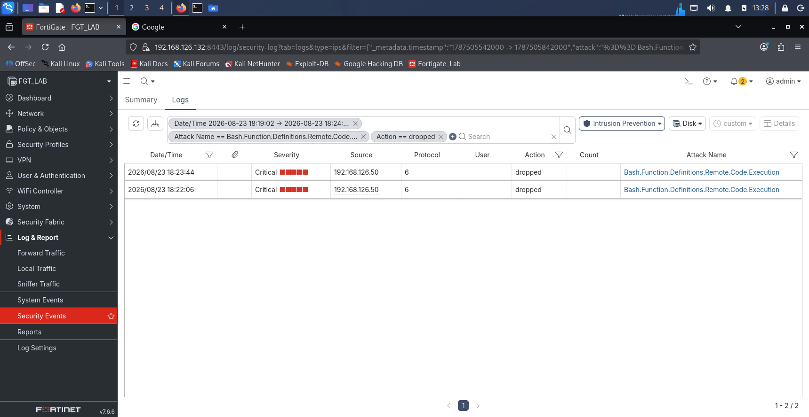

---

## Phase 4: Confirm Logs Landing in Splunk

In Search and Reporting, with time range set to Last 30 minutes:

```
source="udp:9514" sourcetype="syslog"
```

FortiGate logs appeared immediately, including background traffic that was not deliberately triggered. FortiGate's own outbound HTTPS session showed up without any manual test. That is a useful confirmation on its own: once the syslog pipeline is live, everything FortiGate logs flows into Splunk, not just traffic generated for testing purposes.

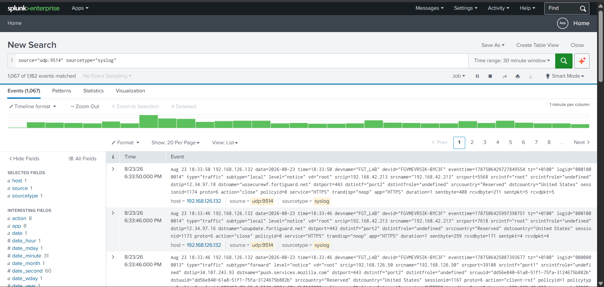

---

## Phase 5: Field Extraction Check

FortiGate logs are already formatted as key=value pairs, so Splunk's default extraction handled them cleanly without a dedicated app. Running:

```
index=main sourcetype=syslog
| table _time, devname, subtype, action, srcip, dstip, attack, msg
```

This produced a clean structured table pulling FortiGate fields directly out of the raw syslog line. The table was reordered to surface the `attack` field first, and the simulated Shellshock event appeared clearly.

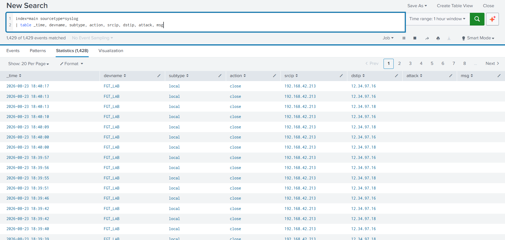

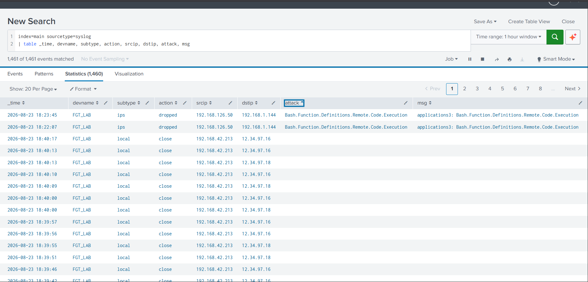

---

## Phase 6: Build the Correlation Search

To isolate security-relevant events specifically:

```
index=main (subtype=ips OR type=utm OR attack=*)
| table _time, devname, srcip, dstip, attack, severity, action
| sort - _time
```

This returned the Shellshock detection with the same `attack` field and severity that appeared in FortiGate's own IPS log in Lab 09, now from Splunk instead of the FortiGate GUI.

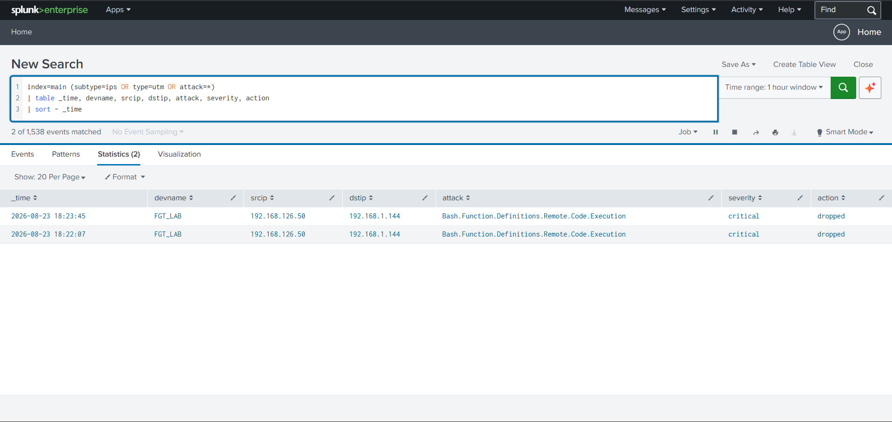

---

## Phase 7: Dashboard Construction

The dashboard was built in two passes. Both are documented because the difference between them is itself a finding.

**First pass: FortiGate SOC Overview**

A basic classic dashboard with a statistics table (`action=*`, all traffic) and an area chart (`timechart count by action`). The pipeline worked and data appeared, but the table was noisy. Routine DNS lookups and background traffic dominated the panel and buried the one security event that mattered.


**Second pass: FortiGate Threat Activity Monitor**

Refined queries that filter out DNS and background chatter and surface only IPS, UTM, and attack events:

```
index=main (type=utm OR subtype=ips OR attack=* OR action=deny OR action=block) service!="DNS" service!="dns"
| table _time, srcip, dstip, attack, severity, action, service
| sort - _time
```

```
index=main (type=utm OR subtype=ips OR attack=* OR action=deny OR action=block) service!="DNS" service!="dns"
| timechart count by attack usenull=f
```

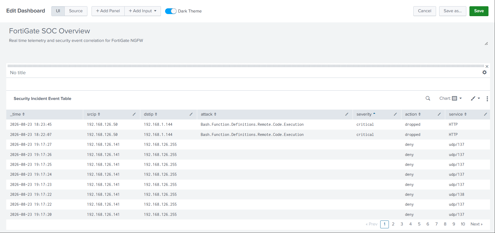

The first version proved the pipeline worked end to end. The second version is what an analyst would actually want to look at day to day. This mirrors the same kind of iteration documented earlier in the series, where the Explicit Proxy approach in Labs 03 and 05 was eventually replaced by proper Firewall Policy logging in Lab 07, just applied at the SIEM layer instead of the firewall layer.

---

## Key Findings

**Finding 1: Syslog destination requires topology awareness, not just an IP**

The Windows host had multiple network adapters. Only the bridged one created in earlier labs was reachable from FortiGate. Confirming with a CLI ping before saving syslog settings avoided troubleshooting blind afterward.

**Finding 2: FortiGate syslog port and facility settings are CLI-only**

The GUI in Log and Report > Log Settings only toggles syslog on or off. Port and facility configuration requires the CLI. This is a FortiOS 7.6 GUI design choice, not a license restriction.

**Finding 3: No Fortinet-specific sourcetype was available in this Splunk install**

Without a FortiAnalyzer license or a dedicated Fortinet Splunk app, there is no pre-built parser for FortiGate's log format. Falling back to generic `syslog` is a legitimate workaround and still produced clean queryable fields because FortiGate logs are already formatted as key=value pairs.

**Finding 4: The Windows host firewall is a silent failure point**

Both FortiGate and Splunk can be configured correctly and logs will still never arrive if no inbound Windows Firewall rule exists for the UDP port. Neither tool reports the missing rule or produces an error. The fix is a single inbound rule in Windows Firewall for UDP 9514, but without knowing to check, the cause would be invisible.

**Finding 5: A live syslog pipeline captures everything, not just test traffic**

Once the pipeline was active, FortiGate's own background traffic to FortiGuard appeared in Splunk without being manually triggered. This confirms the pipeline is genuine centralised logging, not a one-off test artifact.

**Finding 6: A noisy first dashboard and a refined second one are both valid steps**

The first pass proved the pipeline. The second pass is what would actually be useful operationally. Documenting both shows the iteration, not just the end state.

**Finding 7: End-to-end log correlation confirmed**

The IPS detection first seen in Lab 09's FortiGate logs was independently reproduced and queried inside Splunk using SPL, proving log integrity across the full syslog pipeline from FortiGate through to the SIEM.

---

## Lab Limitations

**No FortiAnalyzer or dedicated Fortinet Splunk app**
No CIM-normalised fields and no vendor-built dashboards. Every Splunk panel in this lab was written by hand in SPL against raw syslog fields. In a production environment with a Fortinet Splunk app installed, much of this would come pre-built.

**Plain UDP syslog with no encryption or delivery guarantee**
UDP is acceptable for an isolated lab network. A production deployment would use TLS-encrypted syslog or a TCP transport with a log forwarder, since UDP drops packets silently with no retransmission.

**Splunk Free tier caps ingestion at 500MB per day**
Not a factor at lab traffic volume but a real constraint at any meaningful production scale.

**This lab is not affected by the LENC eval license**
Syslog forwarding and Splunk data input configuration do not touch certificate generation or cipher restrictions. Combined with Lab 10's finding that IPsec also works on this license, this confirms the LENC ceiling is specifically tied to FortiGate's own RSA certificate generation as documented in Labs 04, 06, and 08, not to logging, VPN, or IPS functionality.

---

## Conclusion

This lab closes the FortiGate Security Operations series.

Labs 03 through 11 built and tested individual security controls: firewall policy, SSL inspection, AV, web filtering, IPS, and VPN. Each was documented against the eval license's real constraints. Lab 12 ties that work together by proving those findings are queryable outside FortiGate entirely, in a SIEM, which is the actual shape of day-to-day SOC work.

The same approach that ran through the whole series applied here too. Constraints were documented as ceilings rather than treated as failures. The constraint that mattered most in this lab was not FortiGate's license at all. It was a silent host firewall rule that neither tool reported on its own.
