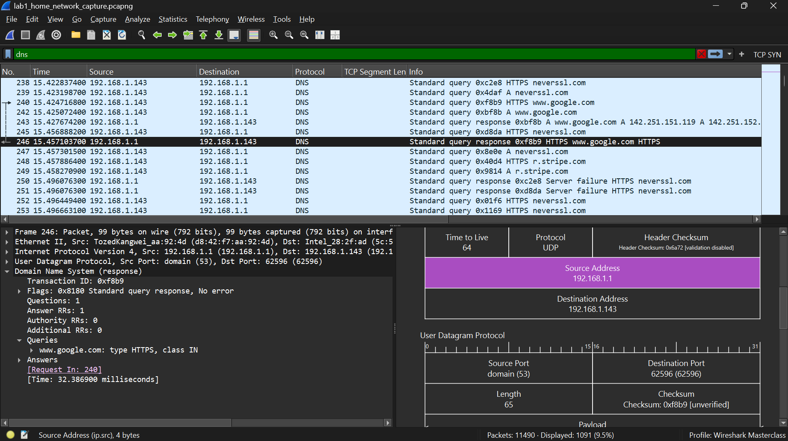
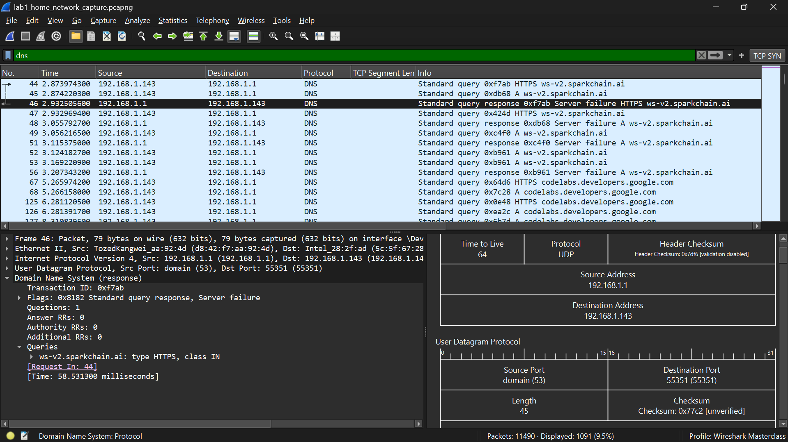
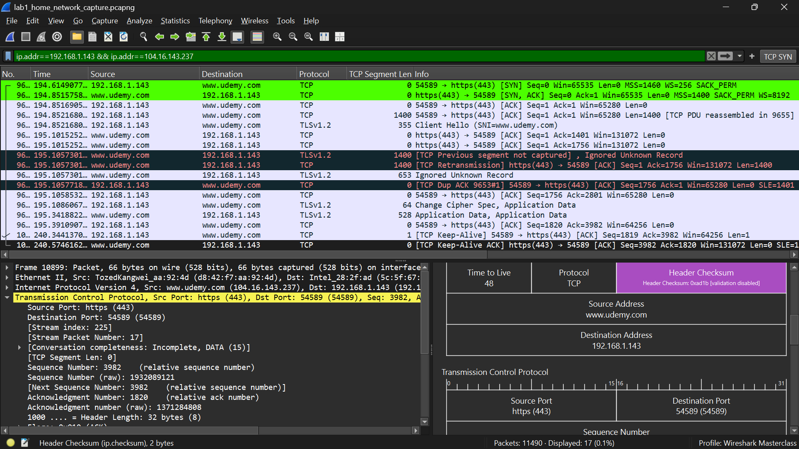
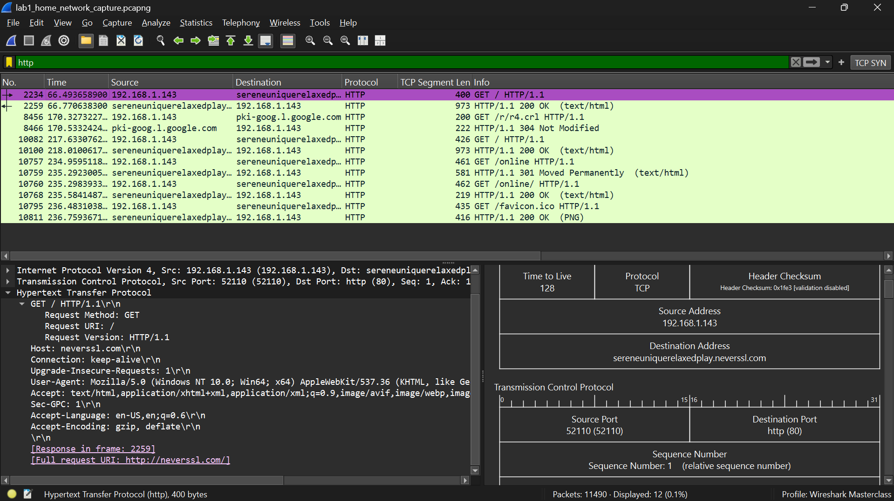

**Date completed:** 21st May 2026
**Tool used:** Wireshark (Version 4.6.4)
**Environment:** Windows laptop, home Wi-Fi (192.168.1.143), Home router (192.168.1.1)  
**Capture duration:** ~250 seconds | **Total frames:** 11,000+  
**Filters used:** `dns` | `ip.addr==192.168.1.143 && ip.addr==104.16.143.237` | `http`

---

## Objective

Capture live home network traffic using Wireshark, identify and analyze three core protocols (DNS, TCP, HTTP), document what normal traffic looks like for each, and flag any patterns worth noting from an analyst perspective.

---

## Protocol 1 — DNS (Domain Name System)

**Frames analyzed:** 240–246 (google.com DNS query and response)  

**Filter:** `dns`

### What DNS does

DNS translates domain names into IP addresses. Before any connection is made, the device sends a DNS query to ask "what is the IP for this domain?" and waits for a response.
In my capture, all DNS traffic flowed between my laptop (192.168.1.143) and my router (192.168.1.1), which acted as the local DNS resolver, forwarding queries upstream on UDP port 53.

### What I observed

- Query type: A record (IPv4 address lookup) and HTTPS record
- Response flag: `Standard query response, No error`, clean resolution
- Transaction IDs matched correctly between queries and responses
- google.com resolved as expected with multiple IP addresses returned

### Normal DNS — does my capture show it?

Yes. All queries went to the router on UDP port 53. Response times were under 100ms.

Domains were recognizable (google.com, udemy.com, brave.com, stripe.com).

### What suspicious DNS looks like

- Random looking domain names, is a sign of Domain Generation Algorithms (DGA) used by malware
- High query volume to one external server in short bursts DNS beaconing
- Long encoded subdomains, DNS tunneling used for data exfiltration
- DNS queries bypassing the local router going directly to an external IP
- Server failure responses followed by immediate retries in a loop

### Notable finding — DNS Server Failure (frames 44–46)

My machine queried `ws-v2.sparkchain.ai` and received a Server failure response (flag `0x8182`), then immediately retried the same query.

In isolation this is harmless, the domain simply could not be resolved at that moment.
In a SOC context, this retry loop pattern on an unknown domain would warrant investigation.

---

## Protocol 2 — TCP (Transmission Control Protocol)

**Frames analyzed:** 9650 (SYN), 9654 (ACK) — conversation with Udemy server.

**Filter:** `ip.addr==192.168.1.143 && ip.addr==104.16.143.237`

### What TCP does

TCP establishes reliable connections between two machines. Before data moves, both sides complete a three way handshake to confirm they can send and receive.

Unlike UDP, TCP guarantees packet delivery and ordering making it the protocol used for web browsing, file transfers, and application logins.

### What I observed — the three way handshake
| Step | Frame | Flag    | Meaning                                             |
| ---- | ----- | ------- | --------------------------------------------------- |
| 1    | 9650  | SYN     | My laptop requests a connection to Udemy's server   |
| 2    | —     | SYN-ACK | Udemy's server agrees and sends its sequence number |
| 3    | 9654  | ACK     | My laptop confirms connection established           |

After the handshake completed, data began flowing consistent with loading a Udemy course page or video content.

### What suspicious TCP looks like

- Many SYN packets to different ports with no completing handshake — port scan
- Connections to unusual ports (4444, 1337, 31337) — common malware listener ports
- Excessive RST packets — sign of aggressive scanning or refused connections
- Direct connections to IP addresses with no prior DNS query — red flag for C2 traffic

### Does my capture show suspicious TCP?

No. The Udemy connection shows a clean handshake and normal data transfer.
No unusual ports or incomplete handshake patterns were observed in this conversation.

---

## Protocol 3 — HTTP (Hypertext Transfer Protocol)

**Frames analyzed:** 2234 (GET Request), 2259 (Server Response) 

**Filter:** `http`

### What HTTP does

HTTP transfers web content between a browser and a server. Requests ask for resources, responses return them with a status code. Everything in HTTP is plain text, no encryption meaning anyone capturing traffic on the same network can read the full request, response, and any data submitted through forms.

### What I observed

- Frame 2234: HTTP GET request — browser asking the server for a resource
- Frame 2259: Server response — content returned with a status code
- HTTP traffic appeared across frames 2234–10911, consistent with multiple resources loading during a browsing session
- Packet details revealed the Host header, User-Agent, and full request path in plain text all readable without any decryption

### Normal vs suspicious HTTP

| | Normal | Suspicious |
|---|---|---|
| Destination | Recognizable domain name | Raw IP address — no domain |
| Request type | GET for resources, POST for form data | Large unexpected POST — possible exfiltration |
| User-Agent | Real browser (Chrome, Firefox, Edge) | Unusual or spoofed User-Agent — possible malware |
| Port | Standard port 80 | Non-standard ports (8080, 8888) |
| Pattern | Varied requests across different resources | Repeated identical requests at regular intervals — beaconing |
| Status codes | 200, 301, 302, 404 | Unexpected 5xx errors in bulk |

### Does my capture show suspicious HTTP?

No obvious indicators of compromise.

Traffic was consistent with normal browsing activity across multiple sessions. The presence of HTTP alongside HTTPS traffic reflects real world conditions where not all services use encryption.

---

## Key Findings Summary

| Protocol | Status | Notable Observation                                  |
| -------- | ------ | ---------------------------------------------------- |
| DNS      | Normal | Server failure + retry loop on `ws-v2.sparkchain.ai` |
| TCP      | Normal | Clean three way handshake to Udemy (104.16.143.237)  |
| HTTP     | Normal | Plain text traffic readable without decryption       |

---

## SOC Application

Network traffic analysis is how analysts answer the question every SOC investigation starts with: what is this machine actually doing?

The filters used in this lab isolating DNS, filtering by IP pair, and pulling HTTP traffic are the same filters an analyst applies when triaging a network alert.

The ability to characterize traffic as normal or suspicious quickly, and document findings clearly, is what allows a SOC team to scale across hundreds of alerts per day.

This lab also reinforced that knowing normal is the foundation of detecting abnormal.

Every baseline pattern documented here becomes the reference point for identifying anomalies in future captures.

---

## Skills Demonstrated

- Live packet capture on a real home network
- Wireshark display filter construction and protocol isolation
- DNS query/response analysis
- TCP three way handshake identification and connection lifecycle understanding
- HTTP request/response dissection and plain text traffic inspection
- Independent finding identification beyond the assigned lab scope
- Analyst style documentation and structured reporting
