**Date Completed:** 15th June 2026  
**Tools Used:** Wireshark, Chrome Browser, Python 3  
**Environment:** Windows Host (DjSegee 192.168.1.143), Kali Linux VM (192.168.1.118), Network Gateway (192.168.1.1)  
**Capture Files:**
- `lab4_part1_http_baseline.pcapng`
- `lab4_part2_https_tls.pcapng`
- `lab4_part4_suspicious_useragents.pcapng`

---

## Lab Objectives

- Analyze HTTP traffic at the packet level to understand what unencrypted web requests look like
- Examine HTTPS and TLS handshake behavior to identify what encrypted traffic still exposes without decryption
- Perform client-side HTTPS decryption using the SSLKEYLOGFILE method
- Identify suspicious HTTP User-Agent patterns that SOC analysts commonly encounter during traffic triage

---

## Part 1: HTTP Baseline Analysis

**Capture:** `lab4_part1_http_baseline.pcapng`

### Sites Visited

Three sites were visited to generate HTTP traffic. Two appeared in the capture:

- `http://httpbin.org` - a developer testing site that responds to HTTP requests with JSON data
- `http://neverssl.com` - a site that stays on plain HTTP and never redirects to HTTPS

> **Note:** `http://gaia.cs.umass.edu` was visited but did not appear in the capture. This was likely because the browser loaded the page from cache instead of sending a new network request.

### HTTP Traffic Overview

**Filter used:** `http` focused on Frame 441, a GET request to httpbin.org.

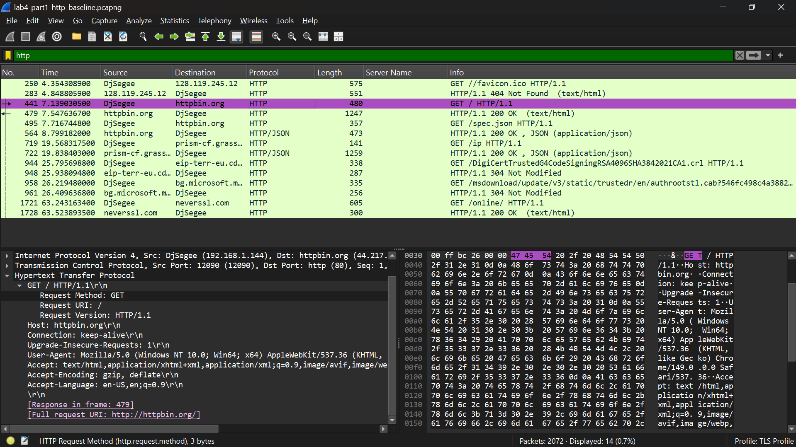

The capture showed two types of HTTP traffic. The first was the intentional browsing traffic to httpbin.org and neverssl.com. The second was background Windows system traffic. Windows was automatically contacting `crl4.digicert.com` and `ctldl.windowsupdate.com`, both returning 304 Not Modified responses.

This is a useful baseline observation for SOC analysts: Windows machines generate their own HTTP requests in the background even when no user is actively browsing. Understanding this normal behavior helps avoid flagging it as suspicious during an investigation.

### GET Request Analysis

**Filter used:** `http.request.method == "GET"` focused on Frame 1721, a GET request to neverssl.com.

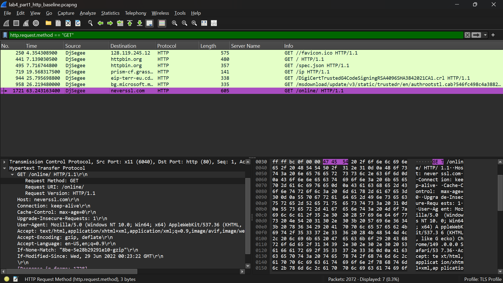

Frame 1721 shows a GET request to `neverssl.com/online/` with all headers visible in plain text:

- **Host:** neverssl.com
- **Request URI:** /online/
- **User-Agent:** Mozilla/5.0 (Windows NT 10.0; Win64; x64) AppleWebKit/537.36 (KHTML, like Gecko) Chrome/149.0.0.0 Safari/537.36

The User-Agent string alone tells an analyst the client is running Windows 10 or 11 on a 64-bit system using Chrome. No extra investigation is needed to identify the OS or browser. In normal traffic this is expected. In a suspicious scenario, a User-Agent that does not match the known device profile of the source IP is a reason to escalate.

### TCP Stream - Full Conversation in Plain Text

Analyzed using: Right-click on Frame 1721 > Follow > TCP Stream.

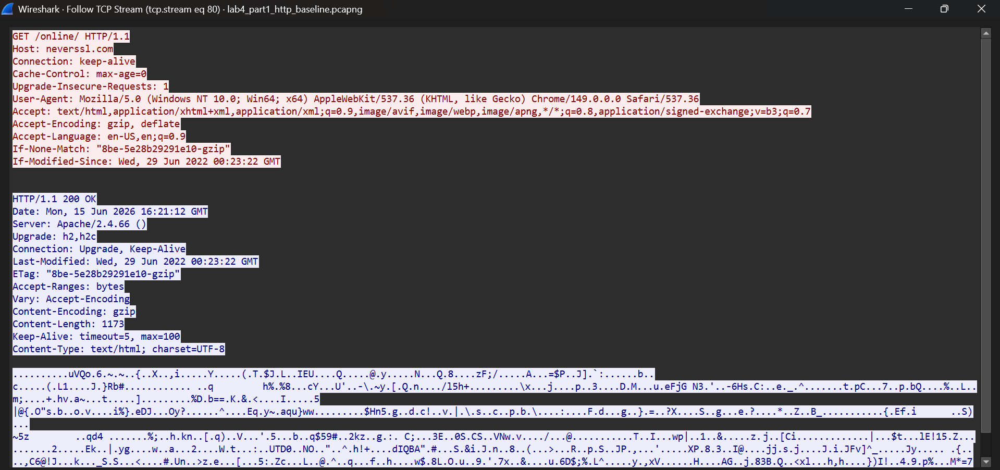

The TCP stream view shows the complete HTTP conversation between the Windows machine and neverssl.com. Request headers, response headers, and the full HTML response body are all readable in plain text. Nothing is hidden.

This is the most important finding in Part 1. Anyone with packet capture access on the same network path, whether a rogue device on the same Wi-Fi, a compromised router, or a man-in-the-middle position, can read every byte of this conversation with no effort. Any credentials, session tokens, or sensitive data sent over HTTP are fully exposed to anyone capturing traffic on that path.

### Response Codes Observed

**Filter used:** `http.response.code == 200` focused on Frame 479, an httpbin.org response.

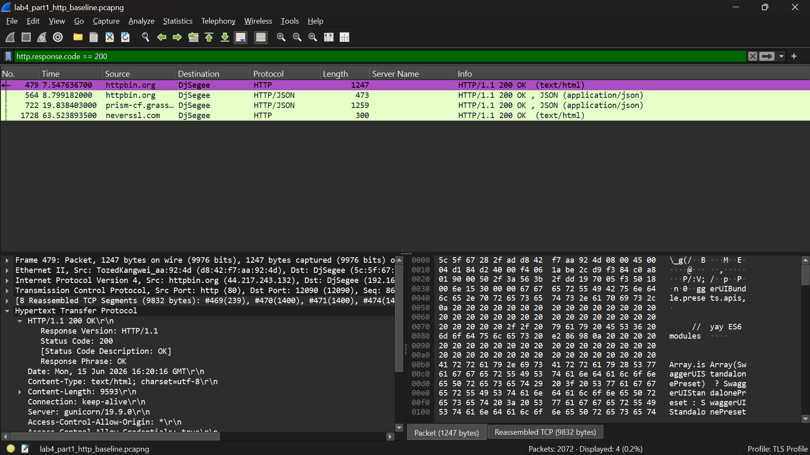

**Filter used:** `http.response` to view all response codes in the capture.

| Code | Type | Frames | Meaning |
|---|---|---|---|
| 200 | OK | 479, 564 (httpbin.org), 1728 (neverssl.com) | Request was successful, content was returned |
| 304 | Not Modified | 948, 961 (Windows background traffic) | Cached version is still valid, no content was returned |

A 200 OK means the server returned the requested resource with a full response body. A 304 Not Modified means the client already has a current cached copy so the server only sends the status code with no body. From an analyst perspective, a machine returning only 304 responses to a specific domain has visited that domain before. A machine receiving 200 responses from an unfamiliar domain with large response bodies is worth reviewing more closely.

### Why HTTP Is a Risk

Every part of an HTTP transaction is readable without any decryption tools: URLs, request headers, cookies, form data, response headers, and response bodies. Credentials or session tokens sent over HTTP can be captured by anyone on the network path. In a SOC context, HTTP traffic to internal applications or login pages is a finding on its own. Any authentication happening over plain HTTP is a policy violation and a credential exposure risk, regardless of whether an active attack is taking place.

---

## Part 2: HTTPS and TLS Analysis

**Capture:** `lab4_part2_https_tls.pcapng`

### Sites Visited

- `https://google.com`
- `https://github.com`
- `https://cloudflare.com`

All visits were made directly in the browser with no additional tools.

### TLS Handshake Overview

**Filter used:** `tls.handshake` focused on Frame 719, a Client Hello for github.com.

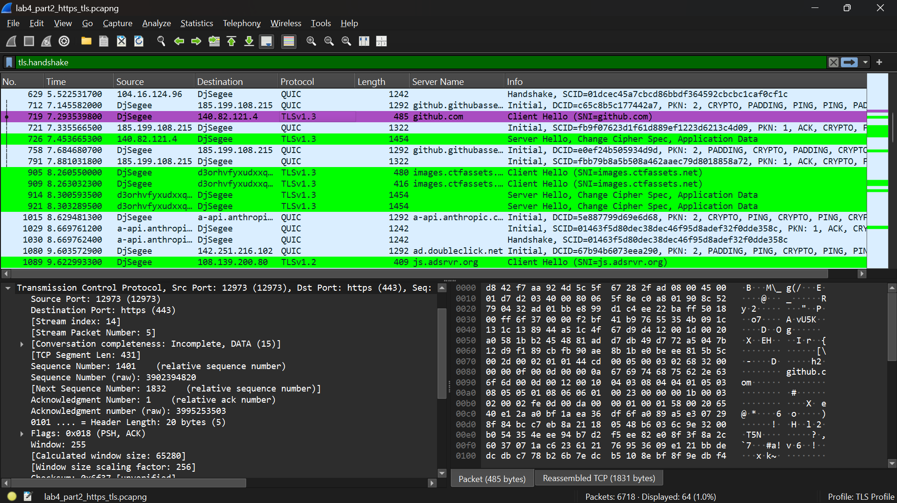

The TLS 1.3 handshake follows this structure:

| Step | Packet | Visibility |
|---|---|---|
| Client Hello | Visible in plain text | Contains SNI, cipher suites, TLS version |
| Server Hello | Visible in plain text | Selects cipher suite, confirms TLS version |
| Certificate | Encrypted in TLS 1.3 | Not directly visible, unlike in TLS 1.2 |
| Finished | Encrypted | Session keys are ready, handshake is complete |
| Application Data | Encrypted | All content after this point is unreadable |

After the handshake, every frame shows only TLS Application Data records. The content is fully encrypted and unreadable without the session keys.

### Client Hello: SNI and TLS Version

**Filter used:** `tls.handshake.type == 1` focused on Frame 719, Client Hello for github.com.

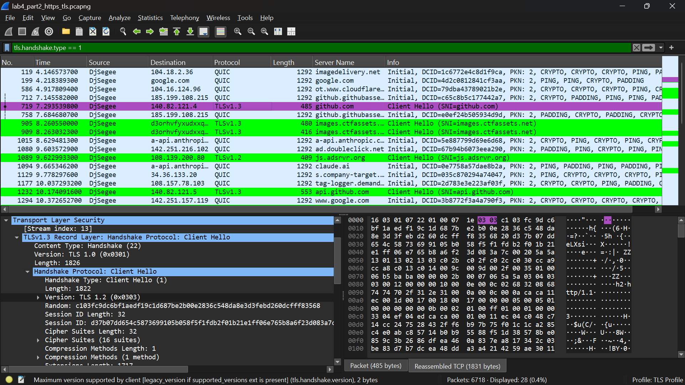

The Client Hello for github.com reveals two important findings.

**Server Name Indication (SNI):** The SNI field contains `github.com` in plain text, readable without any decryption. SNI is sent before encryption is established because the server needs to know which certificate to present. This means even on fully encrypted HTTPS traffic, an analyst can see every domain a host is connecting to. Firewalls and IDS systems use SNI to filter content and log connections on encrypted traffic.

**TLS Version:** The outer Version field in the Client Hello shows TLS 1.2 (0x0303), but Wireshark labels the session TLS 1.3 in the protocol column. This is not a mistake. TLS 1.3 keeps the outer Version field set to 0x0303 for compatibility with older network devices that might drop packets advertising TLS 1.3 directly. Wireshark reads the supported_versions extension inside the packet and correctly identifies it as TLS 1.3.

This matters for analysts because correctly identifying the TLS version from a packet capture requires reading the extensions, not just the outer header field. A detection rule that only checks the outer field will incorrectly label TLS 1.3 sessions as TLS 1.2.

### Certificates in TLS 1.3 vs TLS 1.2

In TLS 1.2, the Certificate message is sent in plain text during the handshake and is visible in Wireshark using `tls.handshake.type == 11`. It shows the certificate issuer, subject, validity dates, and public key without any decryption needed.

In TLS 1.3, the Certificate message is encrypted as part of the handshake. It does not appear as a readable record in Wireshark without session keys loaded. This is a deliberate security improvement in TLS 1.3: by encrypting the certificate, the connection metadata becomes less visible to passive observers.

For analysts, inspecting certificates on TLS 1.3 traffic requires either session key decryption (covered in Part 3) or using a tool like OpenSSL to retrieve the certificate directly from the server.

### What HTTPS Still Reveals Without Decryption

| Observable | How to See It | Why It Matters to Analysts |
|---|---|---|
| Destination domain | SNI field in Client Hello | Shows which sites a host is connecting to |
| TLS version | supported_versions extension | Flags outdated TLS 1.0 or 1.1 connections |
| Cipher suites | Client Hello | Used for JA3 fingerprinting to identify client software |
| Traffic volume and timing | Packet sizes and intervals | Helps detect beaconing or unusual behavior patterns |
| Certificate (TLS 1.2 only) | Certificate handshake record | Shows issuer, validity, and whether it is self-signed |

### HTTP vs HTTPS Visibility Comparison

| Component | HTTP (Part 1) | HTTPS (Part 2) |
|:---|:---|:---|
| **Request URL** | Fully visible | Domain visible via SNI only |
| **Request Headers** | Fully visible | Encrypted after handshake |
| **Response Body** | Fully visible | Encrypted Application Data |
| **User-Agent** | Fully visible | Not visible without decryption |
| **Credentials** | Fully visible | Not visible without decryption |
| **Destination Domain** | Fully visible | Visible via SNI |

---

## Part 3: HTTPS Decryption Using SSLKEYLOGFILE

**Capture:** `lab4_part2_https_tls.pcapng`

### What SSLKEYLOGFILE Is and How It Works

Modern browsers support an environment variable called `SSLKEYLOGFILE`. When this variable is set to a file path before the browser starts, the browser saves the temporary session keys it creates during each TLS handshake to that file. These are the same keys the browser uses to encrypt and decrypt the session.

Wireshark can read this file and use those keys to decrypt TLS sessions in any capture taken while those sessions were active. This works because the session keys come from the client side.

This method only works when you have access to the session keys from the client that made the connection. It cannot decrypt traffic from other machines or historical captures where no key log was running. In enterprise environments, security teams use this technique to inspect their own application traffic during authorized testing and debugging.

### Setup Steps

1. Created an environment variable on Windows pointing to a log file:

```
SSLKEYLOGFILE = C:\path\to\SSLKEYLOGFILE.log
```

2. Launched the browser after setting the variable so it picks up the environment on startup
3. Visited HTTPS sites. The browser saved session keys to the log file for each connection
4. In Wireshark: Edit > Preferences > Protocols > TLS > (Pre)-Master-Secret log filename, then pointed it to the SSLKEYLOGFILE.log path
5. Wireshark automatically decrypted all matching TLS sessions in the capture

### What Became Visible After Decryption

**Filter used:** `tls.handshake.type == 11` (Certificate records)

With the key log loaded, Certificate messages that were encrypted under TLS 1.3 are now decrypted and readable. Each certificate record shows:

- **Issuer:** The Certificate Authority that signed the certificate
- **Subject:** The domain the certificate was issued for
- **Validity Period:** Not Before and Not After dates
- **Public Key Algorithm and Size**

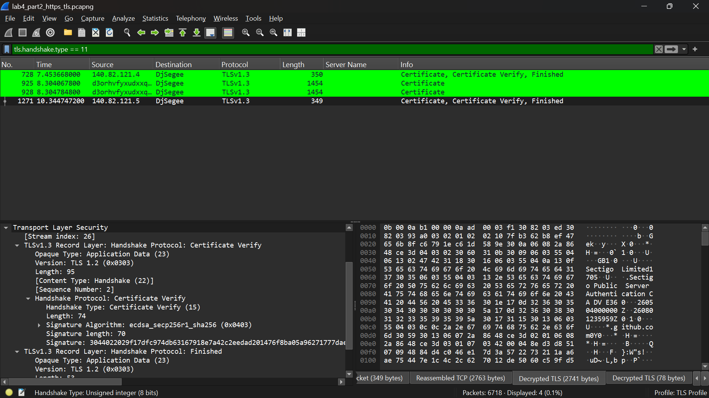

In Part 2 without the key log, the `tls.handshake.type == 11` filter returned no results for TLS 1.3 sessions. With the key log loaded in Part 3, the same filter now shows the certificate details that were previously hidden. This directly shows the difference between what is visible with and without client-side decryption.

**Decrypted HTTP/2 Traffic:**

After decryption, Wireshark relabels TLS Application Data frames as HTTP/2 or HTTP traffic. The previously encrypted records become readable request and response data, including URLs, headers, status codes, and response bodies. This is the same level of visibility as the plain HTTP traffic in Part 1, but for sessions that were fully encrypted on the wire.

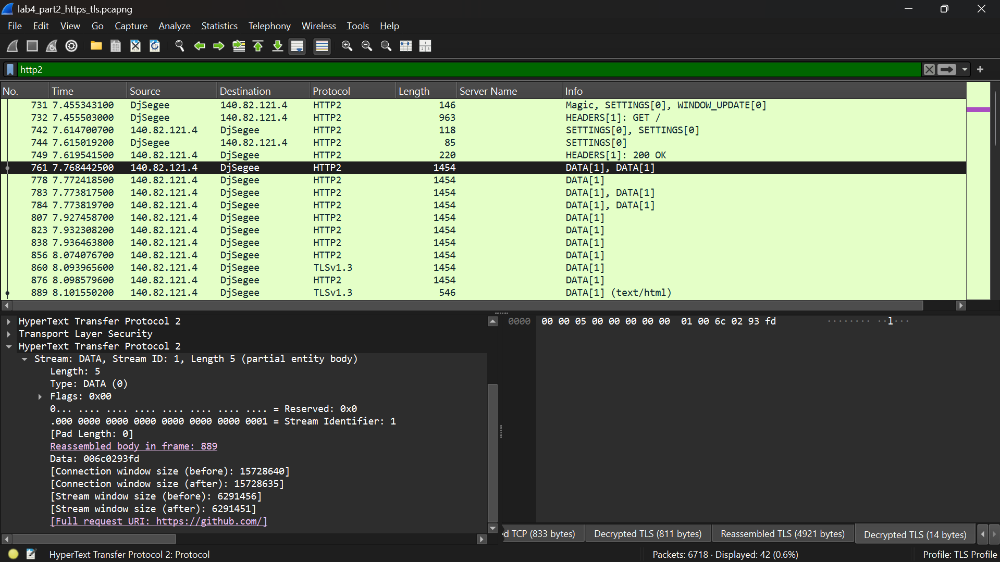

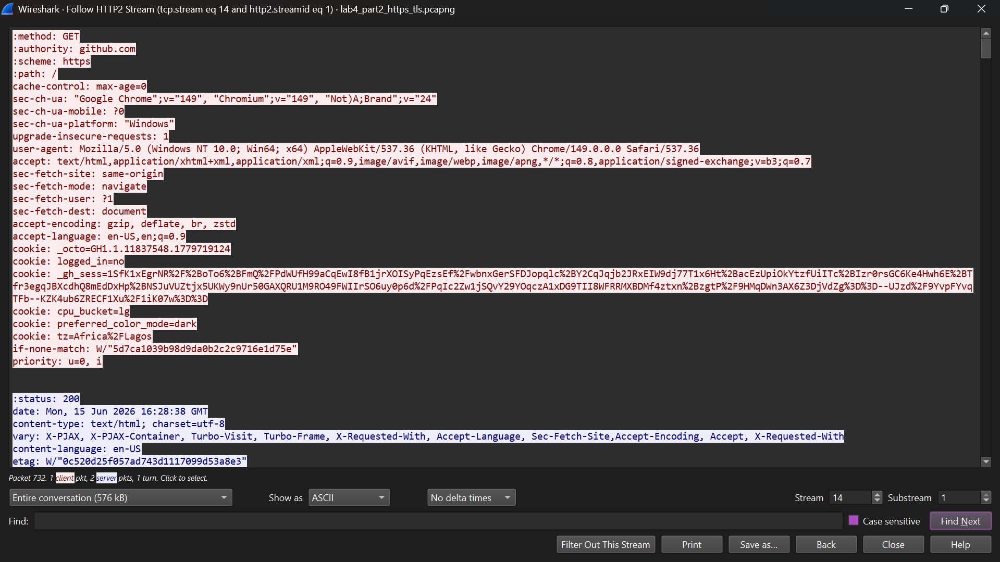

### What This Demonstrates About Encryption

Encryption protects data in transit from anyone who does not have the session keys. Once those session keys are accessible, whether through SSLKEYLOGFILE, a compromised endpoint, or an application that logs keys by mistake, the encryption offers no protection to someone with access to both the keys and the capture. This is why endpoint security is just as important as network encryption. An encrypted connection is only as secure as the device generating the keys.

### SOC Detection Note

In a SOC context, seeing an unusual process writing to a file path that matches a SSLKEYLOGFILE pattern, or a browser launched with that environment variable set by something other than a developer tool, is a potential indicator of credential harvesting or session interception. Legitimate use of SSLKEYLOGFILE is limited to developer debugging and authorized security testing.

---

## Part 4: Suspicious HTTP User-Agent Analysis

**Capture:** `lab4_part4_suspicious_useragents.pcapng`

### Why User-Agents Matter to Analysts

The User-Agent header is included in every HTTP request and identifies the software making the connection. Legitimate browsers produce consistent User-Agent strings that match the installed browser version and operating system. Malware, scanning tools, and automated scripts often produce User-Agent strings that stand out, either by using very old browser versions, tool-specific identifiers, or empty strings.

User-Agent analysis is one of the fastest triage methods for HTTP traffic. Anomalies are visible directly in the packet details pane in Wireshark without needing to follow streams or write complex filters.

### How the Traffic Was Simulated

Three categories of suspicious User-Agents were generated from Kali Linux using curl:

```bash
# Outdated browser User-Agent - Internet Explorer 6 from 2001
curl -s -A "Mozilla/4.0 (compatible; MSIE 6.0; Windows NT 5.1)" http://httpbin.org/headers > /dev/null && sleep 2 && \

# Scripted request User-Agent - identifies automated tooling
curl -s -A "python-requests/2.28.0" http://httpbin.org/headers > /dev/null && sleep 2 && \

# Empty User-Agent - no identification at all
curl -s -A "" http://httpbin.org/headers > /dev/null
```

### What the Capture Showed

**Filter used:** `ip.src == 192.168.1.118 && http`

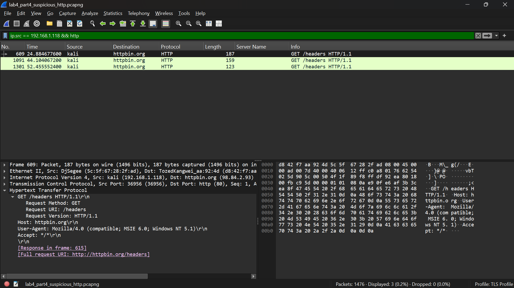

All three requests are visible originating from the Kali IP. The filter cleanly separates them from the background Windows HTTP traffic seen in Part 1.

**Filter used:** `http.user_agent contains "MSIE 6.0"`

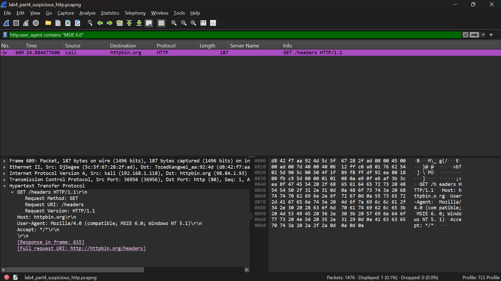

An MSIE 6.0 User-Agent (Internet Explorer 6, released in 2001) appearing in a modern network is an immediate red flag. No legitimate user is running Internet Explorer 6 today. This User-Agent string appears in traffic from malware that copies old strings to blend in, exploit tools targeting legacy systems, and automated scanners using outdated default settings. Seeing this on a production network warrants immediate investigation of the source IP.

**Filter used:** `http.user_agent contains "python-requests"`

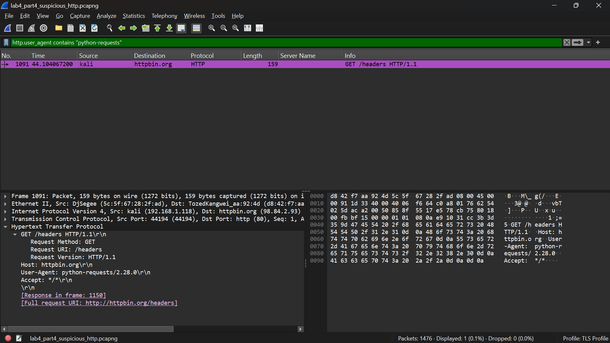

`python-requests/2.28.0` clearly identifies automated Python scripting. This is not always malicious as developers and security teams use Python requests for legitimate purposes. However, in a SOC context, an unknown internal host making HTTP requests to external destinations with a scripted User-Agent is worth reviewing. Combined with other suspicious indicators such as an unusual destination, a large POST body, or repeated requests at regular intervals, it becomes a reason to escalate.

### User-Agent Comparison Table

| User-Agent | Source | Analyst Assessment |
|---|---|---|
| Mozilla/5.0 (Windows NT 10.0; Win64; x64) Chrome/149 | Normal browser (Part 1) | Expected, matches known client OS and browser |
| Mozilla/4.0 (compatible; MSIE 6.0; Windows NT 5.1) | Kali simulation | Immediate red flag, IE6 has not been in active use for over a decade |
| python-requests/2.28.0 | Kali simulation | Scripted request, investigate the purpose and destination |

### Detection Workflow

In a real investigation, User-Agent analysis follows this process:

1. Filter `http.user_agent` in Wireshark or extract User-Agent fields from web proxy logs
2. Establish a baseline of known User-Agents for the environment, including which browsers and versions are deployed
3. Flag anything that does not match the baseline: outdated versions, scripted tools, empty strings, or strings that do not match the known hardware profile of the source IP
4. Correlate flagged User-Agents with destination domains, request volumes, and time patterns
5. Escalate if the combination of an unusual User-Agent plus suspicious destination or traffic volume suggests automated or malicious activity

---

## Key Findings Summary

| Part | Focus | Core Finding | Primary Wireshark Filter |
|---|---|---|---|
| Part 1: HTTP Baseline | Plain text traffic visibility | Full request, response, and body are readable without decryption. TCP stream follow exposes everything | `http` / `http.request.method == "GET"` / Follow TCP Stream |
| Part 2: HTTPS and TLS | Encrypted traffic analysis | SNI reveals the destination domain in plain text despite encryption. TLS 1.3 outer version field is misleading | `tls.handshake` / `tls.handshake.type == 1` |
| Part 3: Decryption | Client-side key log method | SSLKEYLOGFILE exposes certificates, HTTP/2 headers, and full content. Encryption is only as strong as key management | `tls.handshake.type == 11` with key log loaded |
| Part 4: User-Agents | Suspicious traffic patterns | MSIE 6.0, python-requests, and empty User-Agents each indicate different types of anomalous activity. None appear in legitimate modern traffic | `http.user_agent contains "MSIE 6.0"` / `http.user_agent == ""` |

---

## SOC Application

HTTP and HTTPS analysis is one of the most common tasks in a SOC. Each part of this lab maps to a real analyst workflow.

**HTTP baseline analysis** is often the first step when investigating a potentially compromised host. Following the TCP stream on any HTTP connection shows exactly what data left the machine and what came back, with no additional tools needed.

**TLS analysis without decryption** is the standard approach for HTTPS traffic. SNI fields, certificate inspection on TLS 1.2 sessions, cipher suite analysis, and traffic volume and timing are all accessible without breaking encryption. An analyst who knows how to extract this metadata can build a clear picture of a host's network behavior even when all content is encrypted.

**SSLKEYLOGFILE decryption** is used during authorized security testing and incident response on controlled endpoints. When an analyst needs to inspect exactly what an application is sending over HTTPS, such as during malware analysis on an isolated machine or application security testing, client-side key logging is the standard technique. It requires direct access to the machine generating the traffic.

**User-Agent triage** is one of the fastest ways to identify automated or malicious HTTP traffic in a large capture. Building a baseline of expected User-Agents for an environment turns anomaly detection into a straightforward comparison exercise. Any User-Agent that does not match the baseline becomes a starting point for further investigation.

---

## Skills Demonstrated

- HTTP request and response analysis including header inspection and TCP stream following
- HTTP response code identification and analyst interpretation (200, 304)
- Windows background system traffic identification and baseline documentation
- TLS handshake sequence analysis and packet level inspection
- SNI field extraction from Client Hello packets
- TLS 1.3 version field behavior and supported_versions extension analysis
- Certificate visibility differences between TLS 1.2 and TLS 1.3
- Client-side HTTPS decryption using SSLKEYLOGFILE session key export
- Post-decryption certificate inspection and HTTP/2 traffic analysis
- Suspicious User-Agent generation and detection across three categories
- User-Agent baseline comparison methodology
- Wireshark filter construction across HTTP, TLS, and combined protocol layers
