**Date completed:** 8th August 2026
**Exercise source:** malware-traffic-analysis.net, 2026-02-28 "Easy as 123"
**Malware family:** NetSupport Manager RAT
**PCAP file:** 2026-02-28-traffic-analysis-exercise.pcap

> **Note on PCAP distribution:** The packet capture is not included in this repository. It contains real malicious traffic from a live infection and is kept out as a deliberate best practice. The exercise is publicly available at malware-traffic-analysis.net for anyone who wants to replicate this analysis.

---

## Case Brief

**Alert source:** SIEM signature hits for NetSupport Manager RAT activity
**Alert detail:** Traffic from internal host to 45.131.214[.]85 over TCP port 443
**Activity start:** 2026-02-28 at approximately 19:55 UTC
**Task:** Identify the infected host and produce a full incident report

**Environment provided:**

| Field             | Value                   |
| ----------------- | ----------------------- |
| LAN segment       | 10.2.28.0/24            |
| Domain            | easyas123.tech          |
| AD environment    | EASYAS123               |
| Domain controller | 10.2.28.2, EASYAS123-DC |
| Gateway           | 10.2.28.1               |
| Broadcast         | 10.2.28.255             |

---

## Five Required Questions: Confirmed Answers

| Question | Answer |
|---|---|
| Infected client IP | 10.2.28.88 |
| Infected client MAC | 00:19:d1:b2:4d:ad (Intel NIC) |
| Hostname | DESKTOP-TEYQ2NR (FQDN: DESKTOP-TEYQ2NR.easyas123.tech) |
| Username | brolf |
| Full name | Becka Rolf |

---

## Investigation Methodology

**Tools used:** Wireshark, malware-traffic-analysis.net exercise page, VirusTotal

**Approach:**
1. Read the alert context and scenario before opening the PCAP
2. Initial triage using Statistics > Conversations to find the top talker
3. DNS investigation to rule out DNS based C2
4. HTTP investigation to identify the C2 traffic signature and beaconing pattern
5. TLS investigation to confirm there was no encrypted C2
6. Host identification using DHCP and Kerberos filters
7. IOC collection and threat intelligence cross-reference
8. Incident timeline and remediation planning

---

## Stage 1: Host Identification

**Total capture:** 15,512 frames over approximately 4.4 hours

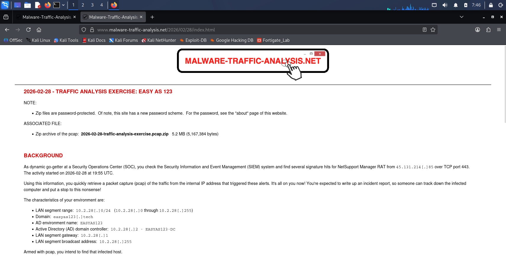

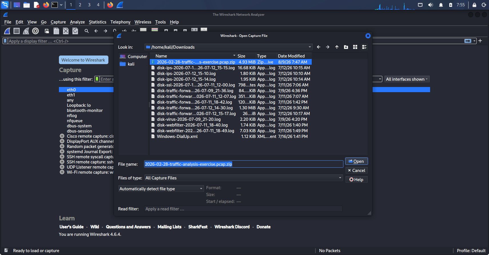

### IP and MAC Address

**Filter:** `ip.addr == 45.131.214.85`
Focused on Frame 2636 with the Ethernet II header expanded.

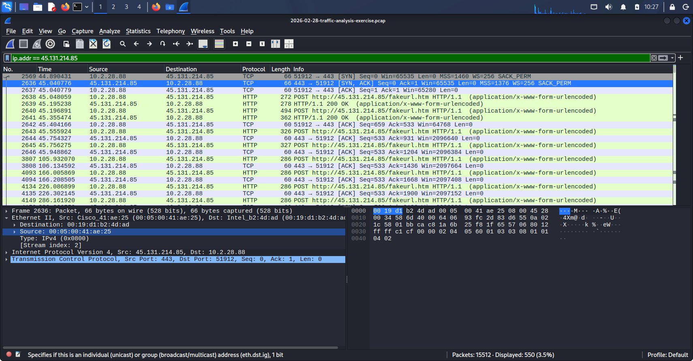

The Destination MAC address `00:19:d1:b2:4d:ad` in frame 2636 belongs to an Intel NIC, this is the internal host at 10.2.28.88 being reached. The Source MAC `00:05:00:41:ae:25` is a Cisco device and this is the local gateway, not the C2 server itself. For any external IP, the destination MAC in the Ethernet frame is always the next hop router on the local network. The actual MAC of the remote server is not visible in a local packet capture.

### Hostname

**Filter:** `dhcp`
Focused on Frame 103: DHCP Discover from 0.0.0.0.

Before the host even gets an IP address, the DHCP Discover already contains its hostname inside the client options:

- **DHCP Option 12 (Hostname):** DESKTOP-TEYQ2NR
- **DHCP Option 81 (FQDN):** DESKTOP-TEYQ2NR.easyas123.tech

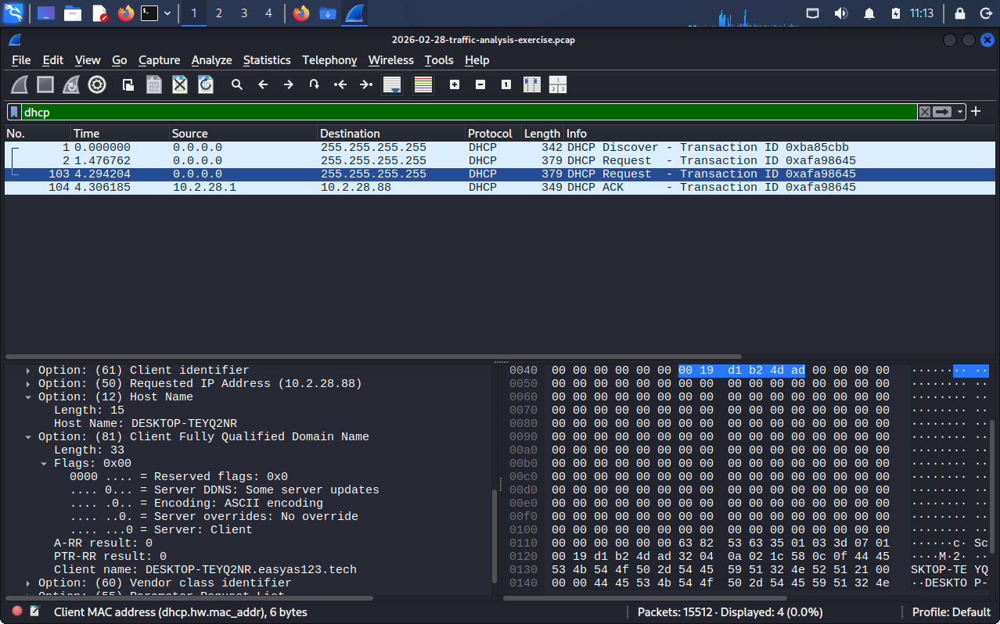

This is one of the most reliable ways to identify a machine in a corporate network capture. The hostname shows up in the very first frames, before any other activity.

### Username

**Filter:** `kerberos.CNameString`
Focused on Frame 251: Kerberos AS-REQ from 10.2.28.88 to DC 10.2.28.2.

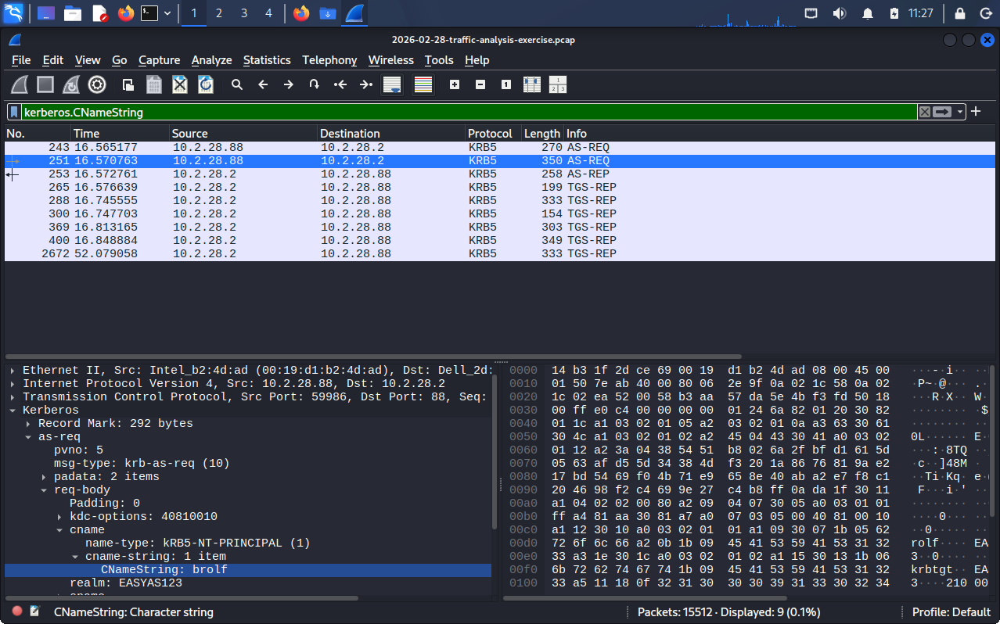

When a user logs into a Windows domain, the machine sends a Kerberos authentication request to the domain controller. The `cname-string` field inside that request contains the plaintext username: `brolf`. The `realm` field confirms the domain: `EASYAS123`.

The full name Becka Rolf was confirmed via the exercise answer key.

---

## Stage 2: Initial Triage

**Filter:** Statistics > Conversations > TCP tab, sorted by Bytes descending.

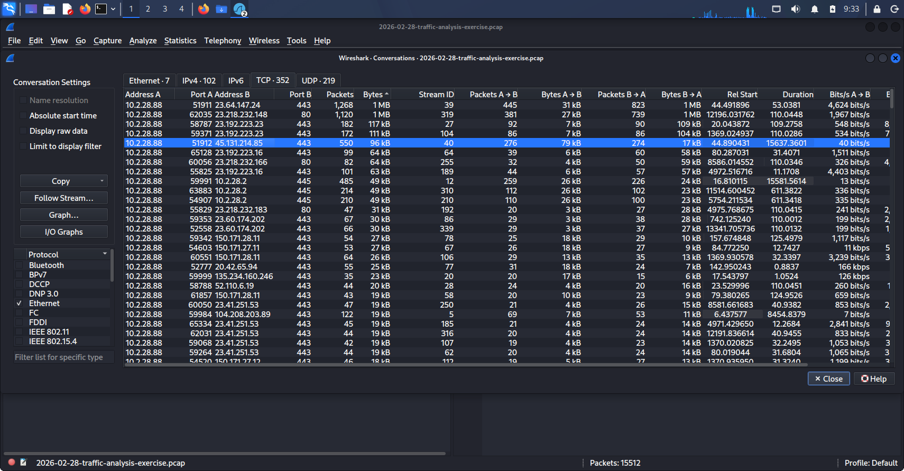

10.2.28.88 was the top internal talker. The highest volume conversation was between 10.2.28.88:51912 and 45.131.214.85:443, matching the SIEM alert exactly.

**Conversation filter applied:**
```
ip.addr==10.2.28.88 && tcp.port==51912 && ip.addr==45.131.214.85 && tcp.port==443
```

This narrowed the view to just the C2 session for detailed analysis.

---

## Stage 3: DNS Investigation

**Filter:** `ip.addr == 10.2.28.88 && dns`

### What Was Found

Two categories of DNS traffic came from the infected host. Internal queries for easyas123.tech are expected from any domain joined Windows machine. Standard external domain lookups were also present alongside them.

### False Positive: Microsoft Edge CDN

**Frames 10622 to 10626** showed DNS queries for `msedge.b.tlu.dl.delivery.mp.microsoft.com`, a long and unfamiliar domain worth investigating.

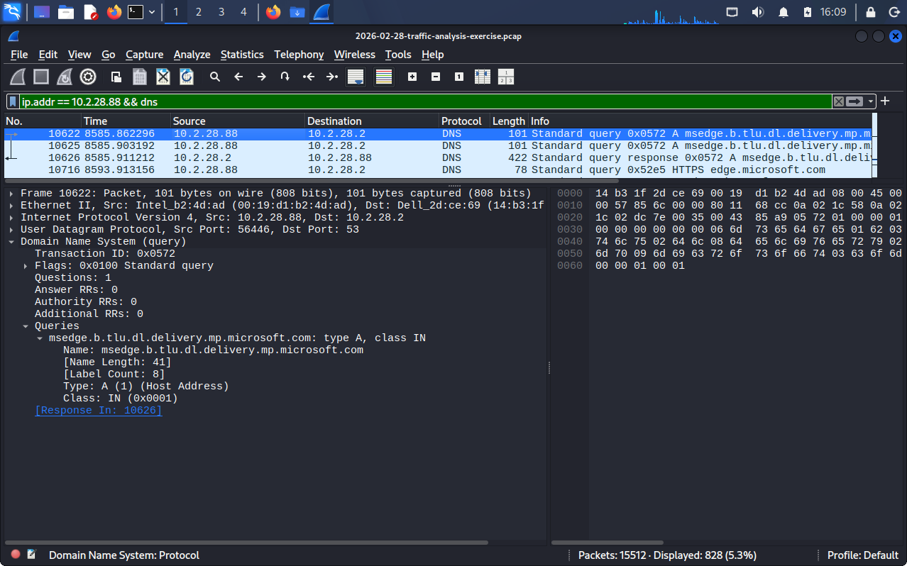

Research confirmed this is a legitimate Microsoft domain used by Windows to update Microsoft Edge through the Windows Update CDN. The long name, CNAME chain, and multiple IP resolutions are all normal for this service. Flagging and then clearing this as a false positive matters, it shows the discipline of checking before escalating rather than treating every long domain as suspicious.

### DNS Tunneling Check

**Filters applied:**

```
dns.qry.name.len > 40
dns.qry.type == 16    (TXT records)
dns.qry.type == 10    (NULL records)
```

Long queries were present but all of them matched standard Windows Active Directory service discovery patterns:
```
_ldap._tcp.Default-First-Site-Name._sites.dc._msdcs.easyas123.tech
```

No random character subdomains. No TXT or NULL record abuse. DNS tunneling is ruled out.

**Conclusion:** NetSupport RAT in this capture does not use DNS for C2. It connects directly by IP with no domain resolution needed for the C2 channel.

---

## Stage 4: HTTP Investigation

**Filter:** `http.request && ip.addr == 45.131.214.85`

### C2 Traffic Signature

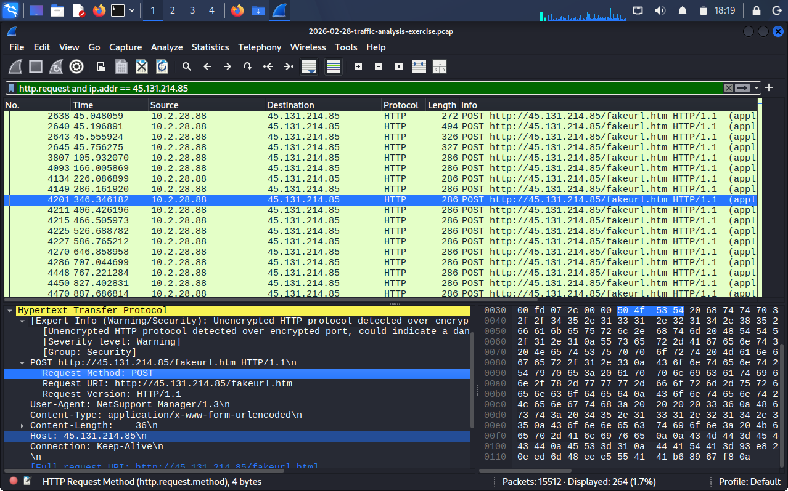

Frame 4201 shows the core C2 request:

- **Method:** POST
- **URI:** `/fakeurl.htm`
- **User-Agent:** `NetSupport Manager/1.3`
- **Content-Type:** `application/x-www-form-urlencoded`
- **Destination port:** 443

Wireshark flagged this session: *"Unencrypted HTTP protocol detected over encrypted port could indicate a dangerous misconfiguration."* This is exactly what is happening. The malware uses port 443 because most firewalls allow outbound 443 by default, but the traffic itself has no encryption at all.

### TCP Stream: Payload Content

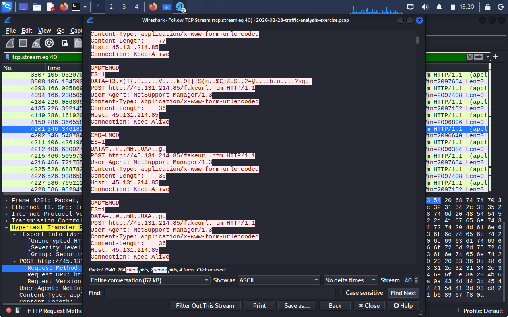

The POST body:
```
CMD=ENCD
ES=1
DATA=l3.<(T{.E.....V....k.9|||$(m..$Cj_...
```

`CMD=ENCD` is the NetSupport RAT command for sending encoded system telemetry back to the operator. This same pattern repeats across all 264 POST requests in the capture.

### File Export Check

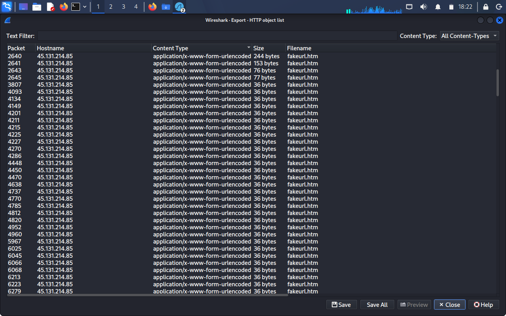

Checked File > Export Objects > HTTP. Only `fakeurl.htm` entries appeared. No secondary payload was delivered during the captured sessions, this was active C2 communication only.

### All HTTP User-Agents From 10.2.28.88

| User-Agent                | Count | Assessment                                                  |
| ------------------------- | ----- | ----------------------------------------------------------- |
| NetSupport Manager/1.3    | 264   | Malicious: C2 traffic                                       |
| Microsoft BITS/7.8        | 30    | Legitimate: Edge updating via Windows Delivery Optimization |
| Microsoft-CryptoAPI/10.0  | 11    | Legitimate: certificate revocation checks                   |
| Microsoft NCSI            | 1     | Legitimate: network connectivity check                      |
| Mozilla/5.0 ... Edg/145.0 | 1     | Legitimate: normal browser session                          |

The presence of normal user activity alongside the C2 traffic confirms this is an active workstation used by a real person, not a dedicated attacker machine.

### Beaconing Pattern

After the initial connection burst in frames 2638 to 2645, the RAT settled into a fixed rhythm. Every POST from frame 3807 onwards is exactly 60 seconds apart with a 36 byte content length, and this holds consistently for the entire 4.4 hours of the capture.

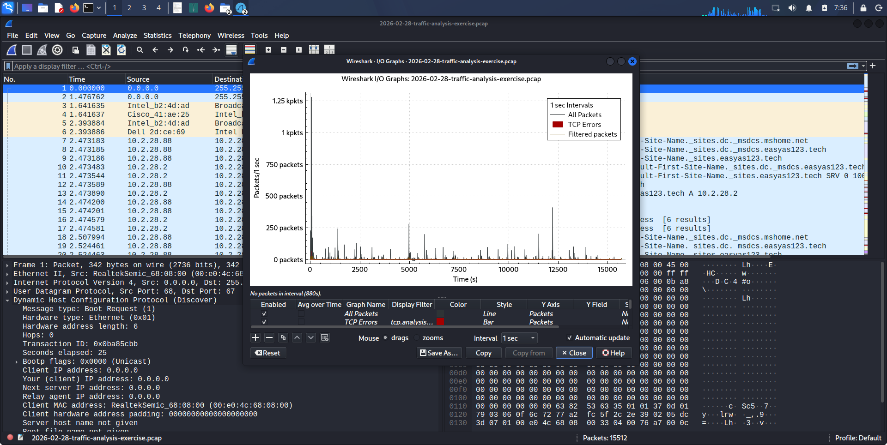

Fixed intervals with an identical payload size is the clearest sign of automated keep-alive traffic. No human is clicking every 60 seconds. The RAT is doing it on its own, maintaining the connection and confirming the host is still reachable.

**Filter to see the pattern:**
```
ip.dst == 45.131.214.85 && http.request.method == POST
```

Sort by time. The 60 second gaps between frames are visible immediately.

---

## Stage 5: TLS Investigation

**Filter:** `ip.addr == 45.131.214.85 && tls`

**Result: Zero packets returned.**

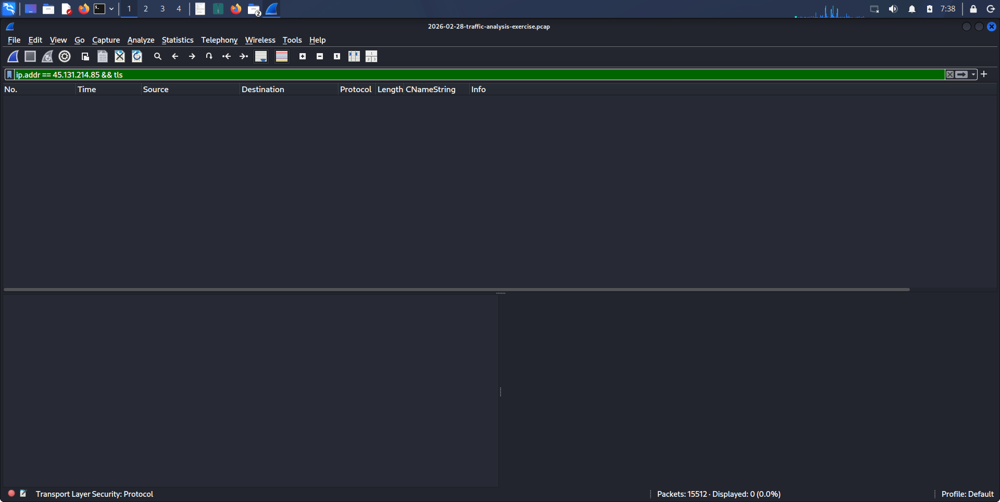

The C2 channel uses no TLS at all. Port 443 was chosen purely because firewalls rarely block it, not because the malware implements HTTPS. A normal HTTPS connection on port 443 produces TLS handshake records, a Client Hello, Server Hello, and encrypted Application Data frames. The complete absence of any TLS record here is itself the anomaly. Knowing what normal port 443 traffic looks like is what makes that absence meaningful.

---

## IOC Table

| Indicator | Type | Context | Assessment |
|---|---|---|---|
| 45.131.214[.]85 | IPv4 | External C2 destination, port 443 | NetSupport RAT C2 server |
| NetSupport Manager/1.3 | User-Agent | Outbound HTTP header | Signature User-Agent for NetSupport RAT |
| /fakeurl.htm | HTTP URI | POST destination path | Default NetSupport gateway script path |
| CMD=ENCD | Payload string | HTTP form body (DATA=...) | Encoded system telemetry command |
| 00:19:d1:b2:4d:ad | MAC address | Intel NIC on 10.2.28.88 | Victim host hardware interface |

---

## Incident Timeline

| Time (UTC)        | Frame   | Event                                                            |
| ----------------- | ------- | ---------------------------------------------------------------- |
| 19:55:00          | 1 to 2  | DHCP Discover and Request from 0.0.0.0, host assigned 10.2.28.88 |
| 19:55:02          | 103     | DHCP confirms DESKTOP-TEYQ2NR.easyas123.tech                     |
| 19:55:40          | 243     | Kerberos AS-REQ, brolf begins authenticating to EASYAS123        |
| 19:55:41          | 251     | Kerberos TGT issued to brolf                                     |
| 19:56:25          | 2569    | TCP SYN from 10.2.28.88:51912 to 45.131.214.85:443               |
| 19:56:25          | 2636    | TCP SYN-ACK from C2, session established                         |
| 19:56:25          | 2638    | First POST to /fakeurl.htm, CMD=ENCD initial beacon              |
| 19:56:25          | 2640    | Second POST, 244 byte payload, host fingerprint data sent        |
| 19:57:26          | 3807    | Third POST, 36 bytes, steady keep-alive beacon begins            |
| 19:57:26 onward   | 4093+   | POST every 60 seconds, 36 bytes, for remainder of capture        |
| ~00:22 (+4.4 hrs) | ~15,500 | Last frame, beaconing still active, no disconnect                |

---

## Malware Family Assessment

**Confidence: Confirmed**

NetSupport Manager is a legitimate remote administration tool that has been repurposed by threat actors. Four things in this capture confirm the family without needing any external tool:

- `NetSupport Manager/1.3` in the User-Agent is the default header for this tool
- `/fakeurl.htm` is the default C2 gateway path used in NetSupport RAT campaigns
- `CMD=ENCD` matches published behavioral analysis for this malware
- Plaintext HTTP on port 443 is a documented evasion pattern for this family
- 60 second beacon intervals match NetSupport RAT's default keep alive configuration

This was validated against the exercise answer key after completing the independent analysis.

---

## Recommended Remediation

**1. Isolate the host**
Disconnect 10.2.28.88 immediately via EDR isolation or physical disconnect. The C2 session ran for over 4.4 hours, meaning the operator had sustained access to the machine throughout that window.

**2. Reset credentials**
Force a password reset for `brolf` (Becka Rolf) and revoke all active Kerberos tickets across Active Directory. A session this long gives enough time for credential harvesting. Treat the account as compromised.

**3. Block the C2 IP**
Add 45.131.214[.]85 to firewall blocklists and web proxy deny lists immediately.

**4. Create detection rules**
Add IDS and SIEM rules to catch this pattern across the rest of the environment:

```
http.user_agent contains "NetSupport"
|| http.request.uri contains "fakeurl.htm"
|| (http && tcp.port == 443 && !tls)
```

The third condition catches HTTP traffic on port 443 with no TLS, this is a protocol anomaly that flags this evasion technique regardless of the specific malware family involved.

**5. Check other hosts**
Search all other machines on 10.2.28.0/24 for the same User-Agent, C2 destination, or `/fakeurl.htm` URI. NetSupport RAT campaigns frequently hit multiple machines from a single phishing email.

---

## Connection to Phases 1 Through 4

**Phase 1: Wireshark Fundamentals**
Every filter used in this investigation came from the foundational work in Phase 1. Isolating a single host across 15,512 frames using `ip.addr`, `http.request`, `kerberos.CNameString`, and `dhcp` depended entirely on knowing which filters to reach for and in what order.

**Phase 2: TCP Analysis**
Following the TCP stream on frame 4201 to read the CMD=ENCD payload used the same Follow > TCP Stream technique from Phase 2. That view revealed the full POST structure and the binary encoded data field that confirmed active beaconing.

**Phase 3: DNS Deep Dive**
The tunneling methodology from Phase 3 gave a structured way to rule out DNS based C2. Checking TXT and NULL record types, recognizing long AD SRV queries as normal, and understanding what negative results mean, all of that came directly from Phase 3.

**Phase 4: HTTP and HTTPS Analysis**
The User-Agent analysis that identified `NetSupport Manager/1.3` came from Phase 4's suspicious User-Agent work. The TLS filter returning zero results used the same approach from Phase 4's SNI work. The Wireshark warning about unencrypted HTTP on port 443 was only meaningful because Phase 4 established what normal HTTPS traffic looks like. Without that baseline, the warning is just noise.

---

## Key Findings Summary

| Stage                 | Finding                                              | Why It Matters                                                  |
| --------------------- | ---------------------------------------------------- | --------------------------------------------------------------- |
| Host identification   | 10.2.28.88, DESKTOP-TEYQ2NR, brolf (Becka Rolf)      | Full victim profile confirmed from DHCP, Kerberos, and Ethernet |
| DNS investigation     | No C2 DNS activity, direct IP used                   | NetSupport RAT avoids domain based detection entirely           |
| False positive        | Microsoft Edge CDN domain flagged and cleared        | Shows verification before escalation                            |
| HTTP C2 signature     | POST /fakeurl.htm, User-Agent NetSupport Manager/1.3 | Malware family confirmed from traffic alone                     |
| Plaintext HTTP on 443 | Zero TLS packets on C2 connection                    | Port evasion, passes through most firewalls undetected          |
| Beaconing pattern     | 264 POSTs at 60-second intervals over 4.4 hours      | Automated keep-alive, no human interaction needed               |
| Payload               | CMD=ENCD with binary encoded telemetry               | Active C2, host fully under RAT control                         |

