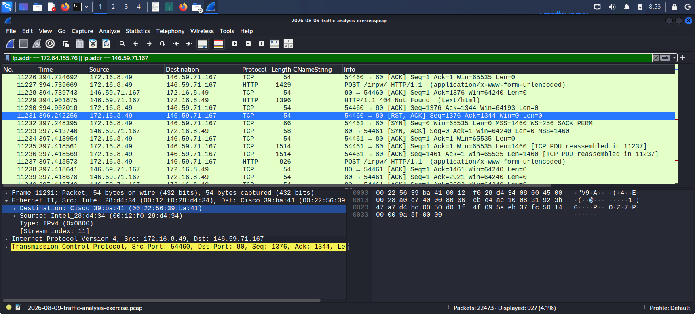
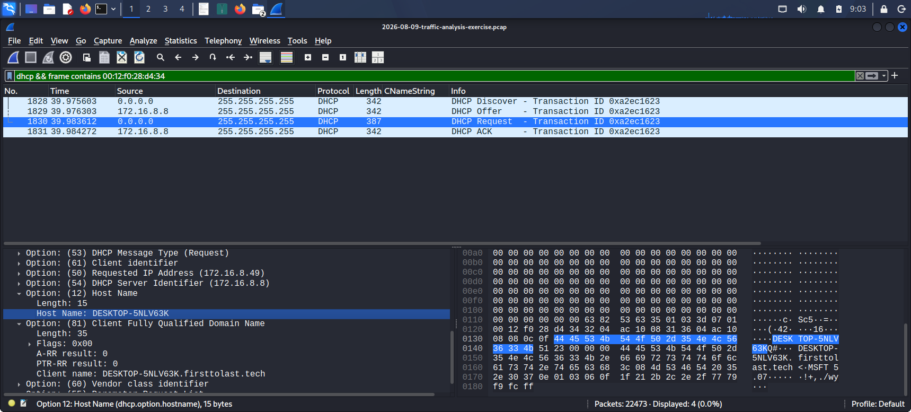
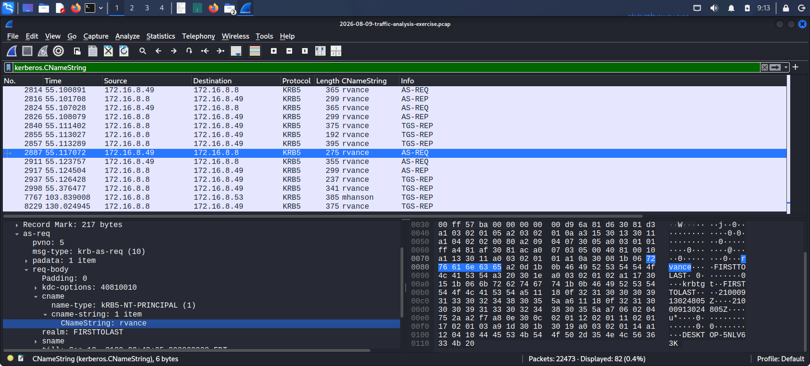
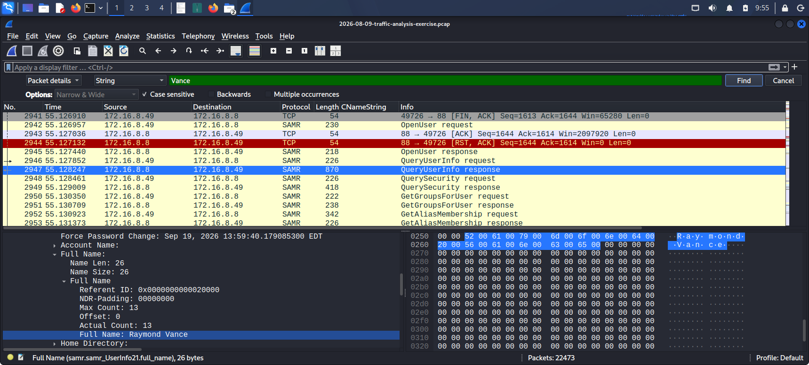
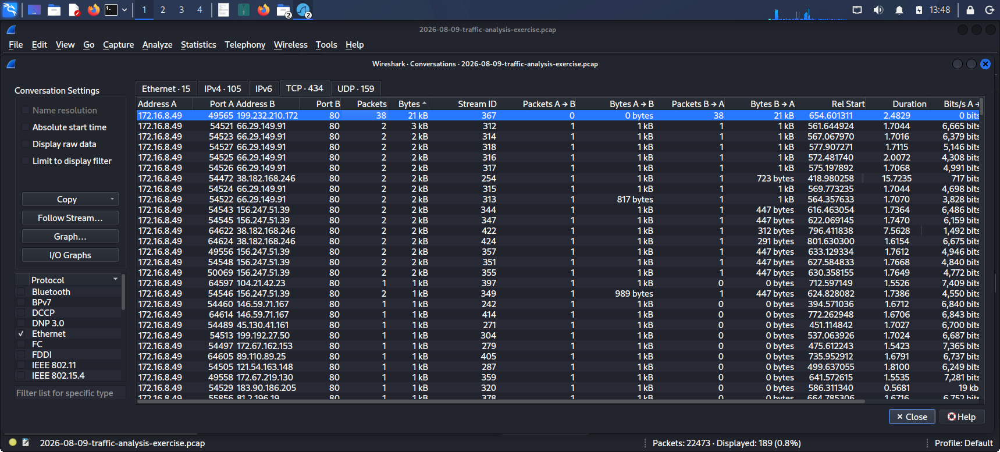
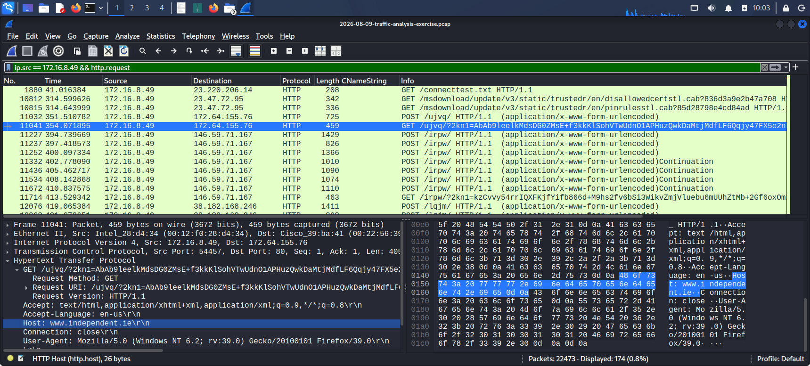
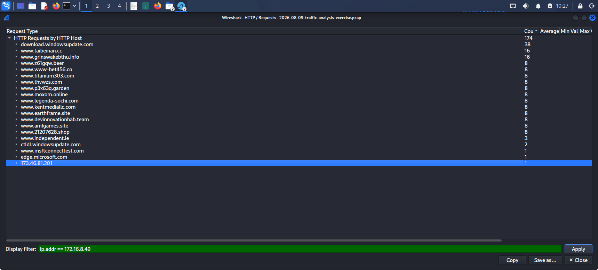
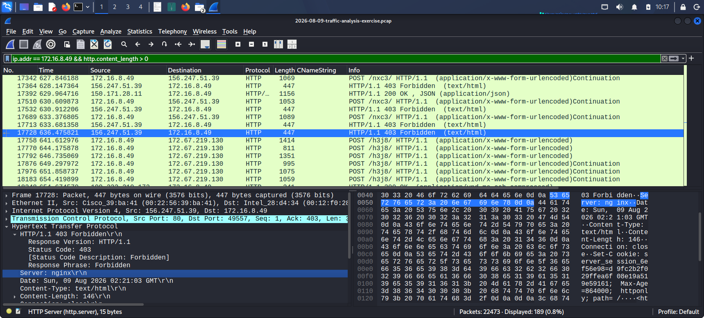

**Date completed:** August, 2026

**Exercise source:** malware-traffic-analysis.net, 2026-08-09 "First to Last"

**Malware family:** FormBook (also known as XLoader)

**PCAP file:** 2026-08-09-traffic-analysis-exercise.pcap

> **Note on PCAP distribution:** The original packet capture is not included in this repository. It contains real malicious traffic from a live infection and is kept out as a best practice decision. The exercise is publicly available at malware-traffic-analysis.net for anyone who wants to replicate this analysis.

---

## Case Brief

**Alert source:** SIEM, multiple ET MALWARE FormBook CnC Checkin signatures firing within minutes

**Alerts received:**

| Time (UTC) | Alert | Destination |
|---|---|---|
| 02:13 | ET MALWARE FormBook CnC Checkin (GET) | 172.64.155[.]76:80 |
| 02:14 | ET MALWARE FormBook CnC Checkin (GET) | 146.59.71[.]167:80 |
| 02:14 | ET MALWARE FormBook CnC Checkin (GET) | 38.182.168[.]246:80 |
| 02:15 | ET MALWARE FormBook CnC Checkin (GET) | 45.130.41[.]161:80 |
| 02:15 | ET MALWARE FormBook CnC Checkin (GET) | 172.67.162[.]153:80 |
| 02:16 | ET MALWARE FormBook CnC Checkin (GET) | 121.54.163[.]148:80 |

Six alerts firing across six different destination IPs within three minutes is the first indicator of FormBook's core evasion technique. It contacts multiple domains at the same time to flood the SOC alert queue and hide the single active C2 server inside a cluster of decoys.

**Task:** Identify the infected host and produce a full incident report

**Environment provided:**

| Field | Value |
|---|---|
| LAN segment | 172.16.8.0/24 |
| Domain | firsttolast.tech |
| AD environment | FIRSTTOLAST |
| Domain controller | 172.16.8.2, FIRSTTOLAST-DC |
| Gateway | 172.16.8.1 |
| Broadcast | 172.16.8.255 |

---

## Five Required Questions: Confirmed Answers

| Question | Answer |
|---|---|
| Infected client IP | 172.16.8.49 |
| Infected client MAC | 00:12:f0:28:d4:34 (Intel NIC) |
| Hostname | DESKTOP-5NLV63K (FQDN: DESKTOP-5NLV63K.firsttolast.tech) |
| Username | rvance |
| Full name | Raymond Vance |

---

## Investigation Methodology

**Tools used:** Wireshark, malware-traffic-analysis.net exercise page, VirusTotal

**Approach:**
1. Read the multi-alert SIEM context before opening the PCAP. Six IPs firing at once signals a known FormBook pattern before any packet analysis begins.
2. Initial triage using Statistics > Conversations to confirm the top internal talker
3. Host identification via DHCP, Kerberos, and SAMR, same sequence as Investigations 1 and 2
4. FormBook traffic signature identification: URI parameters, User-Agent, session token
5. 16-domain cluster analysis using Statistics > HTTP > Requests to map the full decoy network
6. Active C2 identification by response code and Set-Cookie behavior
7. False positive verification: confirmed legitimate Windows Update traffic before finalising the IOC table
8. IOC collection, timeline construction, and remediation planning

---

## Stage 1: Host Identification

### IP and MAC Address

**Filter:** `ip.addr == 172.64.155.76 || ip.addr == 146.59.71.167`
Focused on Frame 11231 with the Ethernet II header expanded.



The source MAC `00:12:f0:28:d4:34` identifies an Intel NIC and is the internal host at 172.16.8.49. The destination MAC belongs to a Cisco device, which is the local gateway, not the remote C2 servers.

### Hostname

**Filter:** `dhcp && Frame contains 00:12:f0:28:d4:34 `
Focused on Frame 1830, a DHCP Request from the victim host.



Frame 1830 contains DHCP Option 12 (Hostname): `DESKTOP-5NLV63K`. The FQDN `DESKTOP-5NLV63K.firsttolast.tech` was constructed from the hostname combined with the domain name in the environment brief. This is a valid approach when Option 81 is not present in the captured DHCP frame.

### Username: Machine Account vs User Account

**Filter:** `kerberos.CNameString`
Focused on Frame 2887, the Kerberos AS-REQ .



Frames 1939 through 2676 also contain Kerberos CNameString values but they show `DESKTOP-5NLV63K$` with a dollar sign at the end. This is the machine account authenticating to the domain, not a human user. Windows machines joined to an Active Directory domain have their own computer accounts that authenticate automatically at boot. Machine accounts are always identified by the trailing `$` character.

Frame 2887 shows `cname-string: rvance` with no dollar sign. This is the human user account. The `realm` field confirms `FIRSTTOLAST`. Knowing the difference between machine and user Kerberos traffic matters in any Windows AD environment investigation. Misreading a machine account as a user account would point the investigation at the wrong thing.

### Full Name: SAMR QueryUserInfo

**Filter:** Kerberos CNameString column added to Wireshark. Ctrl+F > Packet Details > String > Case Sensitive. Searched "Vance."
Focused on Frame 2947, a SAMR QueryUserInfo Response.



The SAMR QueryUserInfo Response in Frame 2947 returned the AD display name field: **Raymond Vance**. This is the same technique used in Investigation 2 to identify Gabriel Wyatt, confirming it works consistently across Windows AD environments regardless of which malware is present.

---

## Stage 2: Initial Triage

**Statistics > Conversations > TCP tab, sorted by Bytes descending**



172.16.8.49 was confirmed immediately as the top internal talker. The conversation list shows traffic going to multiple external IPs at the same time. This is the first visual confirmation of FormBook's multi-domain checkin behavior. Unlike Investigations 1 and 2 where the infected host had one or two high-volume external connections, the Conversations view here shows many short connections spread across many destination IPs at once. That pattern at a glance is what sets FormBook apart.

---

## Stage 3: FormBook Traffic Signature

**Filter:** `ip.src == 172.16.8.49 && http.request`
Focused on Frame 11041, a GET request carrying the FormBook URI parameters.



### URI Structure

Every FormBook GET request follows the same pattern:

```
GET /nxc3/?2kn1=<base64_encoded_data>&kbBSJ=Ep6t_fJ_ HTTP/1.1
```

| URI Component | Value | Significance |
|---|---|---|
| Path | `/nxc3/` or `/ujvq/` | Short 4-character subdirectory, FormBook landing path |
| `2kn1=` parameter | Base64 encoded payload | Encrypted keylogger data and system telemetry sent to C2 |
| `kbBSJ=` parameter | `Ep6t_fJ_` | Session token identifying this victim to the C2 panel |

The session token `kbBSJ=Ep6t_fJ_` is identical across every single request in the capture, to all 16 domains throughout the entire session. This confirms that all checkin requests come from the same FormBook instance. It is also a high-confidence detection signature: any HTTP request containing both `2kn1=` and `kbBSJ=` is FormBook traffic regardless of which domain it targets.

### User-Agent

```
Mozilla/5.0 (Windows NT 6.2; rv:39.0) Gecko/20100101 Firefox/39.0
```

Firefox 39 was released in 2015. No legitimate user in 2026 runs Firefox 39. This string is hardcoded into the FormBook client and sent with every request, to every domain, without variation. It is one of the most reliable IOCs for this malware family.

The contrast with Investigation 2 is worth noting. Lumma Stealer used a spoofed but modern-looking User-Agent, Chrome/144, a version that did not exist but looked current. FormBook uses a hardcoded string that is obviously outdated. Both are suspicious but for different reasons. One requires knowing current browser version numbers. The other is obvious to any analyst who recognises that Firefox 39 has not been in active use for a decade.

---

## Stage 4: 16-Domain Cluster Analysis and Active C2 Identification

**Method:** Statistics > HTTP > Requests, filtered to `ip.addr == 172.16.8.49`



FormBook contacted 16 domains at the same time during its checkin cycle. After filtering out confirmed Microsoft Windows Update infrastructure, 15 domains remained for analysis.

### Domain Classification Table

| Domain | Response Code | Classification |
|---|---|---|
| www.21207628.shop | 404 Not Found | Decoy |
| www.amlgames.site | 404 Not Found | Decoy |
| www.devinnovationhab.team | 404 Not Found | Decoy |
| www.earthframe.site | 404 Not Found | Decoy |
| www.independent.ie | 301 Moved Permanently | Legitimate site used as decoy, enforces HTTPS redirect |
| www.kentmediallc.com | 404 Not Found | Decoy |
| www.legenda-sochi.com | 404 Not Found | Decoy |
| www.moxom.online | 404 Not Found | Decoy |
| www.p3x63q.garden | 404 Not Found | Decoy |
| www.taibeinan.cc | 500 / 502 / 404 | Decoy, broken backend returning server errors before 404 |
| www.thvwzs.com | 404 Not Found | Decoy |
| www.titanium303.com | 404 Not Found | Decoy |
| www.www-bet456.co | 404 Not Found | Decoy |
| www.grinswakebthu.info | 404 Not Found | Decoy |
| **www.z61gqw.beer** | **403 Forbidden + Set-Cookie** | **ACTIVE C2 SERVER** |

### How the Active C2 Was Identified

The key question in this investigation was: with 15 domains returning 404 and similar responses, which one is the real C2?

**Decoy behavior:** Most decoys returned 404 Not Found because legitimate websites have no `/nxc3/` or `/ujvq/` path. The sites exist but have nothing at that path, so they return a standard page not found response. FormBook sends checkin requests to legitimate websites as cover traffic on purpose, making the real checkin harder to spot in a log full of 404s.

**www.independent.ie — 301 redirect decoy:**
Frames 11034 and 11043 show HTTP 301 Moved Permanently from 172.64.155[.]76. Independent.ie enforces HTTPS and redirects all HTTP traffic to its HTTPS equivalent. FormBook's client sends the URI pattern without handling the redirect, so the checkin to this decoy fails. The 301 is expected behavior for any site enforcing HTTPS.

**www.taibeinan.cc — broken backend decoy:**
Frames 12603, 12711, and 12814 show HTTP 500 Internal Server Error responses, and frame 12923 shows a 502 Bad Gateway before the domain switched to returning 404. A 500 means the server received the FormBook request and crashed trying to process it. A 502 means a proxy in front of the server failed. Unlike clean decoys that return 404 immediately, taibeinan.cc appears to have a live but broken backend. Most decoys return 404 without incident. This one behaved differently and is worth noting as an anomaly.

**www.z61gqw.beer — active C2 confirmed:**



Three things distinguished `www.z61gqw.beer` from every other domain:

**1. HTTP 403 Forbidden instead of 404**
A 403 means the server received the request and understood it but denied it specifically. The C2 panel is running and actively processing requests. It is rejecting unauthenticated requests rather than saying the path does not exist. Every decoy returned 404 or a redirect. Only the active C2 returned 403.

**2. Set-Cookie response header**
Frame 17728 shows a `Set-Cookie: server_session_6ef56e98=d9fc2b2f...` header in the 403 response. Active C2 panels track victim sessions using cookies. Legitimate websites returning 404 do not set session cookies on missing page requests. Only a running C2 panel would issue a tracking cookie even on a rejected checkin.

**3. Consistent source IP**
156.247.51[.]39 is the IP behind `www.z61gqw.beer` and is the source of every 403 response in the capture. Cross-referencing the response IP with the domain confirmed the C2 server identity.

The analytical point here is worth noting: Investigations 1 and 2 identified C2 servers by what the infected host sent. This investigation identified the C2 by how the server responded. Both sides of the conversation carry evidence.

---

## Stage 5: TLS Investigation

**Filter:** `ip.src == 172.16.8.49 && tls.handshake.type == 1`

FormBook's C2 communication in this capture runs entirely over plain HTTP on port 80. No TLS sessions were observed to the active C2 server or to any decoy domain. The malware uses encoded URI parameters (`2kn1=` carrying base64 data) rather than transport layer encryption to protect the payload in transit.

This is a third distinct approach compared to the previous two investigations. NetSupport RAT used plaintext HTTP on port 443 with no parameter encoding. Lumma Stealer used plain HTTP for fingerprinting and TLS for exfiltration. FormBook uses plain HTTP on port 80 with URI level encoding, choosing to obfuscate the payload content rather than encrypt the transport channel.

---

## IOC Table

| Indicator | Type | Context | Assessment |
|---|---|---|---|
| 172.16.8.49 | IPv4 | Compromised internal workstation | FormBook victim host |
| www.z61gqw[.]beer | FQDN | Active C2, 403 response and session cookie | FormBook C2 server |
| 156.247.51[.]39 | IPv4 | IP behind www.z61gqw.beer | FormBook C2 server IP |
| /nxc3/ | HTTP URI | C2 landing path on z61gqw.beer | FormBook C2 endpoint |
| kbBSJ=Ep6t_fJ_ | URI parameter | Consistent across all 16 domain requests | FormBook victim session token |
| 2kn1= | URI parameter | Base64 encoded keylog and telemetry | FormBook encrypted payload parameter |
| Mozilla/5.0 (Windows NT 6.2; rv:39.0) Gecko/20100101 Firefox/39.0 | User-Agent | Hardcoded in every FormBook GET request | FormBook client fingerprint, Firefox 39 from 2015 |

> **Removed from IOC table after verification:** 173.46.81[.]201, confirmed Windows Update CDN node serving legitimate Windows Defender signature updates. Not a C2 server.

---

## Incident Timeline

| Time | Frame | Event |
|---|---|---|
| 02:13 UTC | — | First SOC alert fires, FormBook CnC Checkin detected to 172.64.155[.]76 |
| Capture start | 1830 | DHCP Request, DESKTOP-5NLV63K (00:12:f0:28:d4:34) assigned 172.16.8.49 |
| Early session | 2799 | Kerberos AS-REQ, rvance authenticates to FIRSTTOLAST domain (first human user frame, not machine account) |
| Early session | 2947 | SAMR QueryUserInfo Response, Raymond Vance confirmed in AD |
| 02:13 UTC | 11027 | FormBook begins concurrent GET requests to 16 domains at the same time |
| 02:13 UTC | 11041 | HTTP GET with full FormBook URI, `2kn1=` and `kbBSJ=Ep6t_fJ_` visible, Firefox/39 User-Agent confirmed |
| 02:13 to 02:16 UTC | 11034 to 12923 | Decoy domains return 404, 301, 500, and 502 responses. No active C2 connection established with these |
| 02:16 UTC | 16930 | www.z61gqw.beer (156.247.51[.]39) begins returning 403 Forbidden responses |
| 02:16 UTC | 17728 | 403 response with Set-Cookie header confirmed, active C2 server identified |
| Background | 18967 | Windows Defender downloads am_delta_patch from 173.46.81[.]201 (Windows Update CDN, legitimate, not C2) |

---

## Malware Family Assessment

**Confidence: Confirmed**

FormBook (also distributed as XLoader) is a widely sold infostealer and keylogger active since 2016. The evidence that confirms this specific family:

- The multi-domain checkin with 15 decoys and 1 active C2 is a documented FormBook evasion technique
- The `/nxc3/` and `/ujvq/` path patterns with `2kn1=` and `kbBSJ=` URI parameters are documented FormBook C2 endpoint signatures
- The hardcoded Firefox/39 User-Agent is a well-known FormBook client fingerprint seen across campaigns
- The 403 plus Set-Cookie active C2 identification method is consistent with published FormBook infrastructure analysis
- The `.beer` TLD for the C2 domain is consistent with FormBook operators using unconventional TLDs to avoid category-based web filtering

This assessment was validated against the malware-traffic-analysis.net exercise answer key after completing the independent analysis.

---

## Recommended Remediation

**1. Immediate host isolation**
Disconnect 172.16.8.49 (DESKTOP-5NLV63K) from the network immediately. FormBook is a keylogger. Every keystroke typed on this machine after infection, including passwords, email content, and form data from any application, was captured and queued for exfiltration via the `2kn1=` parameter.

**2. Credential reset for rvance (Raymond Vance)**
- Force AD password reset immediately
- Revoke all active Kerberos TGTs
- Any password typed on this machine after infection is compromised, including email, web applications, VPN credentials, and any enterprise system the user authenticated to from this machine

**3. Perimeter blocks**
Block `www.z61gqw.beer` and 156.247.51[.]39 at the perimeter firewall. Add the `.beer` TLD to proxy alerting rules for unusual TLD monitoring.

**4. Detection rules**

```
# Highest confidence, exact FormBook User-Agent match
http.user_agent == "Mozilla/5.0 (Windows NT 6.2; rv:39.0) Gecko/20100101 Firefox/39.0"

# URI pattern, catches FormBook across domain rotations
http.request.uri matches "^/[a-z0-9]{4}/\?(2kn1=|kbBSJ=)"

# Parameter-based detection
http.request.uri contains "2kn1=" && http.request.uri contains "kbBSJ="
```

The URI pattern rule is particularly useful because FormBook rotates its C2 domain between campaigns. The domain changes but the URI structure and parameters stay consistent. A detection rule targeting the parameters catches FormBook variants regardless of which domain is active.

**5. Scope check**
Search all hosts on 172.16.8.0/24 for the Firefox/39 User-Agent or the `2kn1=` and `kbBSJ=` parameters in proxy or firewall logs. FormBook campaigns frequently target multiple users from the same phishing email, so checking only the flagged host may miss other infected machines on the same network.

---

## Three-Investigation Comparison: Same Methodology, Different Malware Behavior

Across all three Phase 5 investigations, the same core filter sequence was applied: conversations triage, DHCP for hostname, Kerberos for username, SAMR for full name, DNS investigation, HTTP investigation, TLS investigation. What changed each time was how the malware tried to blend into normal traffic, and what that meant for reading the results.

| Factor | Investigation 1: NetSupport RAT | Investigation 2: Lumma Stealer | Investigation 3: FormBook |
|---|---|---|---|
| C2 domains | None, direct IP only | 7 domains across 5 TLDs | 16 domains, 15 decoys + 1 active |
| C2 identification method | Self-identifying User-Agent and URI | Domain resolution and SNI | Response code and Set-Cookie behavior |
| TLS present | Zero, plaintext HTTP on port 443 | Dual channel, HTTP and TLS | Zero, plaintext HTTP on port 80 |
| Payload encryption | None, CMD=ENCD in cleartext | TLS transport encryption | URI parameter encoding (base64) |
| User-Agent | Self-identifying (NetSupport Manager/1.3) | Spoofed plausible version (Chrome/144) | Hardcoded outdated version (Firefox/39 from 2015) |
| Evasion technique | Port mimicry, HTTP on HTTPS port | Anti-sandbox checks and domain rotation | Decoy flood, 15 domains generating SOC alert noise |
| Key finding method | User-Agent and URI path | Canvas fingerprint POST and SNI | 403 vs 404 response code distinction |
| False positive encountered | Microsoft Edge CDN domain | None documented | Windows Defender update, 173.46.81[.]201 |

The consistent lesson across all three: the filter sequence does not change. What develops with practice is the ability to interpret what the filters return and to recognise when a negative result is itself a finding.

---

## Connection to Phases 1 Through 4

**Phase 1: Protocol Identification and Wireshark Fundamentals**
Every filter in this investigation came from Phase 1. The ability to pivot from conversations to DHCP to Kerberos to HTTP to TLS in a structured sequence across a multi-alert investigation depended on the foundational filtering work built across the early phases.

**Phase 2: TCP Handshake and Connection Analysis**
The MAC address identification from Ethernet II headers, and specifically the understanding that external destination IPs always show the gateway MAC rather than the remote server MAC, was first established in Phase 2 and applied consistently across all three investigations.

**Phase 3: DNS Traffic Analysis**
The DNS investigation methodology ruled out DNS-based C2 quickly. FormBook uses direct domain resolution via standard A record queries with no tunneling. Knowing what to look for from Phase 3 made the negative result a confirmed finding rather than an uncertainty.

**Phase 4: HTTP and HTTPS Traffic Analysis**
The User-Agent baseline methodology from Phase 4 identified Firefox/39 as an obvious anomaly immediately. The Statistics > HTTP > Requests workflow used to map the 16-domain cluster came from the HTTP analysis techniques developed in Phase 4. And the TLS filter returning zero results for the C2 IP, confirming FormBook uses URI level encoding rather than transport encryption, was interpreted correctly because Phase 4 established what TLS-bearing traffic looks like in comparison.

---

## Key Findings Summary

| Stage | Finding | Significance |
|---|---|---|
| Host identification | 172.16.8.49, DESKTOP-5NLV63K, rvance (Raymond Vance) | Full victim profile via DHCP, Kerberos, and SAMR |
| Machine vs user Kerberos | DESKTOP-5NLV63K$ (frames 1939 to 2676) vs rvance (frame 2799) | Machine account vs human account distinction documented |
| FormBook URI signature | /nxc3/?2kn1=...&kbBSJ=Ep6t_fJ_ across all 16 domains | Same session token confirms single FormBook instance |
| User-Agent | Firefox/39 from 2015, hardcoded in every request | Decade-old UA string is an immediate FormBook IOC |
| 16-domain cluster | 15 decoys returning 404/301/500 + 1 active C2 returning 403 | Response code behavior distinguished the active server from the noise |
| Active C2 confirmed | www.z61gqw.beer (156.247.51[.]39), 403 plus Set-Cookie | Session cookie on rejected request confirms running C2 panel |
| taibeinan.cc anomaly | 500 and 502 errors before 404 | Broken backend, different from clean 404 decoys |
| False positive cleared | 173.46.81[.]201, Windows Defender update, not C2 | IOC verification discipline, removed after URI confirmed legitimate |
| Windows Defender irony | AV update downloading while FormBook beaconed | Active infection running alongside the machine's own defense mechanism |


